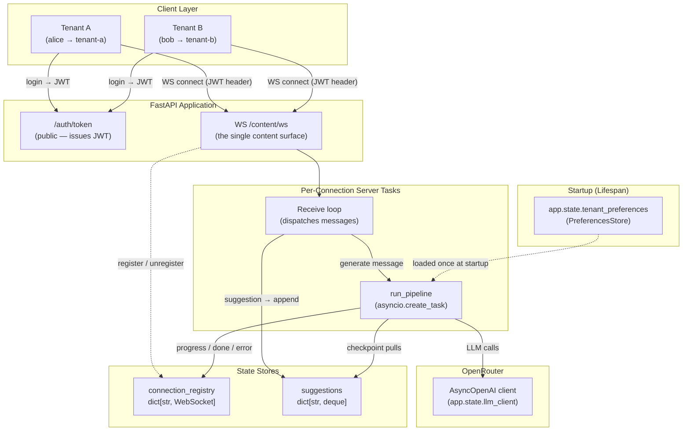
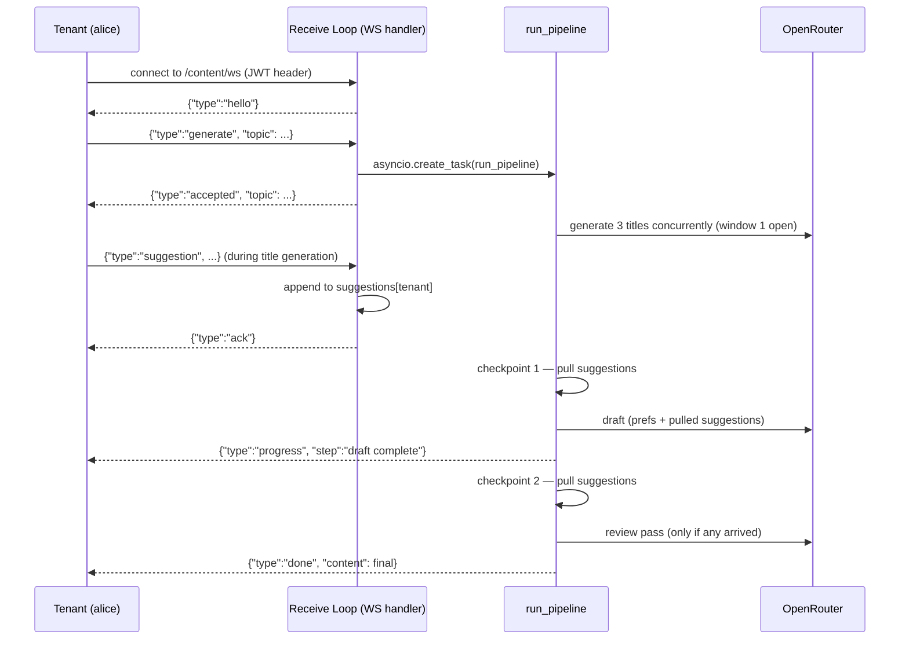

# Capstone — Multi-Tenant AI Content Generation Platform

Difficulty: Capstone | ~90 min | Synthesizes Labs 1–12

## 1. Overview: What This System Does and Why

A content team at a SaaS company needs to generate blog posts, social media copy, and marketing emails for multiple client accounts (tenants). Each tenant has different preferences — some want professional blog posts, others want casual social media captions. Tenants connect, start a generation, and steer it in real time by sending suggestions while the content is being written.

This capstone builds exactly that system. It is a **multi-tenant, AI-powered content generation platform** where:

- **Tenants authenticate** via JWT tokens (each token carries a `tenant_id`)
- **The whole content surface is one WebSocket**: `/content/ws` accepts `generate` messages, runs the pipeline as a concurrent task, and streams every event back on the same socket
- **A multi-step pipeline** generates content: title generation (3 concurrent LLM calls), draft creation, and an optional review pass — each making real LLM calls via OpenRouter
- **Tenants can send suggestions** that the pipeline picks up at two deliberate checkpoints: during title generation a suggestion lands in the draft; during drafting it triggers a dedicated review pass
- **Full tenant isolation** is enforced: alice never sees bob's events, and every tenant has their own suggestions deque and preferences
- **Failures are handled gracefully**: a controlled pipeline crash produces a clean `error` event on the socket — no silent crashes

The system combines many concept from Labs 1–12 into a single working application, demonstrating how individual FastAPI features compose into a production-shaped architecture.

---

## 2. System Architecture



**Diagram 1 — Full system architecture.** Tenants authenticate via the public `/auth/token` endpoint, then connect their WebSocket to `/content/ws` with a JWT in the `Authorization` header. `get_current_tenant` resolves the tenant before the route runs, and the socket is registered in `connection_registry` for the life of the connection. A single receive loop dispatches `generate` messages by spawning `run_pipeline` via `asyncio.create_task`, and appends `suggestion` messages to the tenant's deque. The pipeline and the receive loop run concurrently on the same event loop: the pipeline streams events through `connection_registry`, pulls suggestions at two checkpoints, and calls OpenRouter through the one shared `AsyncOpenAI` client.

---

## 3. How the Concepts Connect

This section maps each piece of the system back to the lab that introduced the concept, explaining **why** that concept is needed **here** — not just restating what the lab taught.

| System Component | Lab | Why It's Needed Here |
|---|---|---|
| `@asynccontextmanager` lifespan, `app.state` | Lab 12 (Lifespan) | The LLM client and tenant preferences must be built **once** at startup, not per-request. The preferences load includes a simulated slow database call (`asyncio.sleep(2)`) — the kind of genuinely heavy one-time cost that justifies lifespan over per-request initialization. The `is_loaded` flag on shutdown provides concrete, assertable proof that teardown ran. |
| `POST /auth/token`, `get_current_tenant` | Lab 5 (Security) | Every protected route needs to know **which tenant** is making the request. A simple OAuth2 password flow produces a JWT carrying `tenant_id`; the `get_current_tenant` dependency decodes it and returns the tenant. This identity layer makes tenant-scoped state (preferences, suggestions) possible. |
| `Depends(get_current_tenant)` on the WS route | Lab 11 (APIRouter) | The `/content` router applies the dependency per-endpoint, not via router-level `dependencies=[...]`, which does not inject a `WebSocket` into dependencies of WebSocket routes. The `get_current_tenant` function is transport-agnostic: it accepts `request: Request = None` and `websocket: WebSocket = None`, and reads the Authorization header from whichever object FastAPI injects — here always the `WebSocket`. |
| `GenerateMessage`, `SuggestionMessage` + `ValidationError` | Lab 1 (Pydantic) | Every WebSocket message is validated at the door. The `Literal["generate"]` / `Literal["suggestion"]` type field means a message with the wrong `type` fails validation instantly, and the `except` around the dispatch answers it with an `error` event — so the pipeline never misinterprets arbitrary data. |
| `asyncio.create_task` + `asyncio.gather` | Lab 2 (Async/Await) | The receive loop and the pipeline run concurrently on one event loop: the endpoint spawns `run_pipeline` with `asyncio.create_task`, and `generate_titles` fires 3 concurrent LLM calls via `asyncio.gather`. This concurrency is what makes mid-run suggestions physically possible — the pipeline awaits LLM latency while the receive loop keeps consuming messages. |
| `try/except` in the pipeline, safe `push_to_tenant` | Lab 3 (Exception Handling) | The pipeline wraps its whole body in `try/except` and relays failures as `error` events; `push_to_tenant` wraps WebSocket sends so a closed connection can't crash the pipeline. No silent crashes — every failure becomes a visible `error` event. |
| WebSocket `/content/ws` | Lab 8 (WebSockets) | The socket is the entire content surface: control messages in, events out, and the connection lives only as long as the tenant is interested. Disconnect removes the tenant from `connection_registry`, so events stop being routed to them. |

The pipeline runs as an `asyncio` task on the WebSocket connection: the endpoint spawns `run_pipeline` with `asyncio.create_task`, so it executes concurrently with the receive loop, which keeps accepting suggestions while the pipeline works. That concurrency is the entire design — the socket delivers live progress as phases finish, and a suggestion can arrive at any moment and get an `ack` while the pipeline is still mid-flight.

---

## 4. Code Walkthrough

### 4.1 Dependencies and Imports (Steps 0–1)

The first cell installs every pinned dependency in one line. The imports bring together FastAPI, Pydantic, OpenAI's async client, PyJWT, and standard-library modules for async context management and collections. Authorization happens over plain HTTP (`POST /auth/token`); the entire content flow happens over the one WebSocket.

### 4.2 Pydantic Models — the Message Protocol (Step 2)

Two models define the messages a client may send:

- `GenerateMessage`: `type: Literal["generate"]`, `topic` (required), `simulate_failure` (optional bool)
- `SuggestionMessage`: `type: Literal["suggestion"]` and `content` — a steering instruction

Both are instantiated from raw WebSocket messages with `Model(**data)` inside the endpoint. A message with the wrong `type` or missing fields raises `ValidationError`, which the endpoint catches and answers with an `error` event.

### 4.3 State Stores (Step 3)

Two module-level dictionaries hold per-tenant runtime state:

- `connection_registry`: maps tenant_id → WebSocket connection (registered on connect, removed on disconnect)
- `suggestions`: maps tenant_id → deque of pending suggestion strings (pulled once, exactly, at the checkpoints)

No external database — consistent with every prior lab's simplicity.

### 4.4 Lifespan (Step 4)

The `@asynccontextmanager` lifespan builds two resources at startup:

1. **`app.state.llm_client`**: an `AsyncOpenAI` client pointing at OpenRouter. Lightweight but represents a connection pool — creating once is good practice.
2. **`app.state.tenant_preferences`**: a `PreferencesStore` object containing per-tenant generation defaults (tone, length, style). The `asyncio.sleep(2)` simulates a slow database load — the genuinely heavy one-time cost that justifies lifespan.

On shutdown, `prefs.is_loaded = False` provides concrete, assertable proof that teardown ran.

### 4.5 Authentication (Step 5)

Authentication has two parts: a public token-issuing endpoint and a reusable tenant-extraction dependency.

- **`POST /auth/token`** (on the public `/auth` router) accepts OAuth2 form credentials and returns a JWT carrying `tenant_id`.
- **`get_current_tenant`** is a plain async dependency function. It reads the `Authorization` header, decodes the JWT, and returns `tenant_id` — or raises `401` on failure. It is written transport-agnostically: it declares both `request: Request = None` and `websocket: WebSocket = None` and reads the header from whichever object FastAPI injects. On a WebSocket route FastAPI provides the `WebSocket`; on an HTTP route it provides the `Request` — never the other way around, which is why a dependency that accepted only one of the two would be locked to that transport. In this platform the whole content surface is the one WebSocket, so every real call injects the `WebSocket` and the `Request` branch stays dormant — the `None` defaults cost nothing and mean the identical dependency would protect any HTTP route added later.

### 4.6 Content Router (Step 6)

The `/content` router is declared with `APIRouter()` and hosts a single WebSocket route, so the entire content surface is one authenticated socket. `Depends(get_current_tenant)` is applied at the endpoint because router-level `dependencies=[...]` does not inject `WebSocket` into dependencies of WebSocket routes. The auth router carries no dependency — it stays public.

### 4.7 The Content Generation Pipeline (Step 7)

The pipeline is the heart of the system. Three small building blocks back it up:

- **`llm_generate(client, prompt)`** — a single wrapper around `client.chat.completions.create()`. Every LLM call (titles, draft, review) funnels through it.
- **`push_to_tenant(tenant_id, message)`** — sends a message to the tenant's registered WebSocket, wrapping the send in `try/except` so a closed connection fails safely.
- **`pull_suggestions(tenant_id)`** — returns and clears the tenant's deque in one step, guaranteeing each suggestion is consumed exactly once.

`run_pipeline(tenant_id, topic, simulate_failure)` drives the flow:

1. **Title generation**: announces, then fires 3 concurrent LLM calls via `asyncio.gather()` and picks the first title
2. **Checkpoint 1**: announces the chosen title, then pulls any suggestions that arrived during step 1 — these are folded into the draft prompt, which is asked to open with the suggestion phrase
3. **Draft**: calls `llm_generate()` with tenant preferences and any pulled suggestions
4. **Checkpoint 2**: announces the draft, then pulls any suggestions that arrived during drafting
5. **Review pass**: only if step 4 found suggestions — a final `llm_generate()` rewrites the draft in light of them, then announces `review complete`
6. **Completion or failure**: pushes `done` with the final content, or catches any exception and pushes `error`

If `simulate_failure=True`, the pipeline raises at the review step; the `try/except` catches it and relays a clean `error` event — the run fails without crashing the connection.

### 4.8 The WebSocket Endpoint (Step 8)



**Diagram 2 — The generate/suggest/done flow.** The tenant connects and sends a `generate` message. The receive loop starts the pipeline with `asyncio.create_task` and replies `accepted` immediately. The pipeline and the receive loop now run concurrently, which is what makes steering possible: a suggestion sent *while titles are being generated* is pulled at checkpoint 1 and written into the draft, while a suggestion sent *after drafting started* is pulled at checkpoint 2 and answered with a review pass. Either way an `ack` comes back first, so the tenant knows their input was queued.

Every step — `generate`, `suggestion`, `hello`, `accepted`, `ack`, `progress`, `done`, `error` — is just a JSON message, which is what lets the whole platform rest on a single socket.

### 4.9 Demo Cells

The notebook's demos exercise the system end to end:

1. **Lifespan proof**: Confirm `app.state.llm_client` and `app.state.tenant_preferences` are populated once at startup
2. **Authentication**: Login as alice, get a JWT, decode and display the claims
3. **WebSocket + generation**: Open alice's WebSocket (receives `hello`), send a `generate` message, receive `accepted` immediately
4. **Real-time stream**: Read the events as they arrive, printing the elapsed time between them — the growing gaps (e.g. +13.5s titles, +18.6s draft) prove delivery is live, not buffered up front
5. **Checkpoint 1 — early suggestion**: Send a suggestion right after `generate`; every event prints live as it arrives (`event1: progress …` … `done`), the deque empties, and the final content opens with the suggestion
6. **Checkpoint 2 — late suggestion**: Wait until the title phase finishes, then send a suggestion; the events stream in live and a `review complete` event appears (proof checkpoint 2 ran), then the deque empties
7. **Tenant isolation**: alice stays connected while bob logs in and opens his own socket; both tenants then `generate` at the same time, and each receives exactly its own 5-event stream — nothing crosses between `connection_registry` entries or suggestion deques
8. **Controlled failure**: Send `generate` with `simulate_failure=True`; a clean `error` event arrives and the connection stays usable

Cleanup then closes the sockets (triggering the disconnect handler), and the proof cell asserts the lifespan shutdown actually ran.

---

## 5. Working Demonstration

The notebook runs all demos sequentially on a real OpenRouter model. Representative output from a clean run:

### Demo 4 — the events stream in real time

```
Reading events (elapsed between events):
  + 0.00s  [progress] generating titles 
  +13.52s  [progress] titles generated **Powering Tomorrow: The Renewable Energy Revolution**
  +18.62s  [progress] draft complete 
  + 0.00s  [done]  **Powering Tomorrow: The Renewable Energy Revolution**
...
4 events total; final content is 3659 chars
```

The increasing deltas between events are the proof: title generation and drafting each take real LLM time, and each progress event arrives the moment its phase finishes — the socket delivers live, rather than replaying a buffer after a blocking call returns.

### Demo 5 — the early suggestion became the opening line

```
accepted: Solar power innovations
event1: progress generating titles
event2: ack 
event3: progress titles generated
event4: progress draft complete
event5: done 
Suggestion ack: ['Focus specifically on solar energy in developing countries']
Suggestions deque after run: []
Final content (first 200 chars):
 # Solar Innovation: Beyond the Panel

Focus specifically on solar energy in developing countries, and a more nuanced story emerges—one not just about hardware, but about resilience, equity, and leapfr
Mentions the suggestion: True
```

The `ack` streams in live (event2, before the title phase even finished); the deque being empty after the run proves the suggestion was consumed exactly once; the content opening with the exact suggestion phrase proves checkpoint 1 fed it into the draft.

### Demo 6 — the late suggestion triggered a review pass

```
event1: ack 
event2: progress draft complete
event3: progress review complete
event4: done 
Events after the late suggestion: ['ack:', 'progress:draft complete', 'progress:review complete']
Review pass happened: True
Suggestions deque after run: []
```

`review complete` only appears when a suggestion arrived after the first checkpoint — the second window genuinely works.

### Demo 7 — two tenants, one server, zero crossover

```
registry before bob: ['tenant-a']
bob logged in, tenant_id: tenant-b
hello: registered as tenant-b
registry with both tenants: ['tenant-a', 'tenant-b']
Isolation step 1: one socket per tenant in the routing table
bob's ack: Focus on hydrothermal vents
alice's deque untouched: []
alice accepted: ['Renewable grid storage']
bob accepted: ['Deep sea exploration']
alice received 5 events, bob received 5 events
Isolation step 2: every event stayed on its tenant's own socket
```

Both tenants generate at the same moment and each receives exactly its own 5-event stream — `push_to_tenant` looks the socket up by tenant key, so nothing from bob's run ever lands on alice's socket.

### Demo 8 — failures are clean events, not crashes

```
Event types: ['accepted', 'progress', 'progress', 'progress', 'error']
Error event: Simulated pipeline failure during review step
```

Cleanup then closes the socket (the disconnect handler empties `connection_registry`), and the proof cell confirms `is_loaded` is `False` after lifespan shutdown.

---

## 6. What Was Learned

- **Composition over repetition.** One `get_current_tenant` dependency protects the whole platform after login, without repeating JWT decoding logic. Because it accepts `Request` or `WebSocket`, the same function works whether a route speaks HTTP or WebSocket — no transport-specific duplicate needed.

- **One socket can be the whole API.** With a client-to-server message protocol (`generate`, `suggestion`) and server events (`hello`, `accepted`, `ack`, `progress`, `done`, `error`), every capability lives on a single WebSocket. Connection state is per-session and cleaned up on disconnect, which keeps the tenant namespace tidy.

- **Concurrency is what makes steering possible.** `asyncio.create_task` runs the pipeline beside the receive loop, so a client can send a suggestion *while the pipeline is mid-flight*. The two checkpoint windows (title phase → draft, draft phase → review pass) are placed exactly where the pipeline yields to the network — the moments when a suggestion can actually slip in.

- **Lifespan is for genuinely heavy resources.** The `asyncio.sleep(2)` simulating a database load makes a stronger case for lifespan than a lightweight client object alone. The `is_loaded` flag on shutdown provides concrete proof teardown ran.

- **Pydantic works beyond HTTP.** Validating WebSocket messages with `Literal`-typed models catches bad `type` values at the door; the endpoint answers malformed input with an `error` event. One validation discipline across every transport.

- **Isolation is a routing table, not a feature.** `connection_registry` is a `dict[str, WebSocket]`, and `push_to_tenant` looks the tenant's socket up by key. Demo 7 proves it under load: both tenants generate at the same moment and each receives exactly its own 5-event stream — with a single global socket, the two runs would bleed into each other.

- **Defensive error handling prevents silent failures.** `push_to_tenant` swallows closed-connection errors, and the pipeline relays every failure as an `error` event. A tenant always finds out — and the connection stays usable afterward.