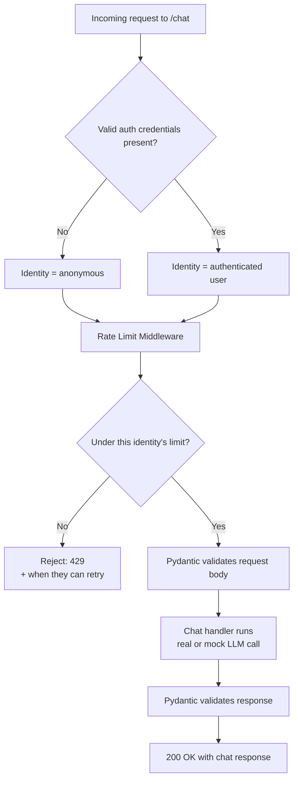
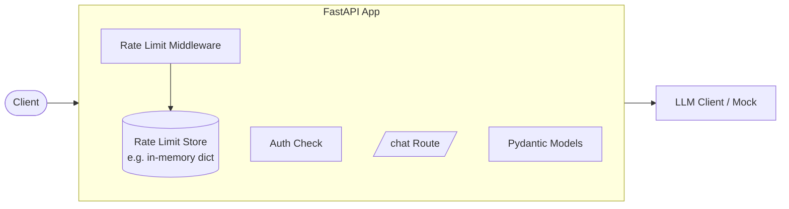

# Capstone — Tiered-Access AI Chat Gateway

Difficulty: Doable | ~1-2 hrs | Builds on Lab 1, Lab 5, Lab 6

---

## 1. Problem Statement / What You're Building

Almost every AI product you've used has this exact shape: try it for free with a few messages, then either wait a while or sign in to keep going. Under the hood, that's just a rate limiter that treats "anonymous" and "authenticated" traffic differently, sitting in front of an otherwise normal chat endpoint.

That's what you're building here — a small, single-file FastAPI app with one chat endpoint that behaves differently depending on who's calling it:

- **No credentials?** You're an anonymous caller. You get a handful of free requests, then you're locked out for a while.
- **Got valid credentials?** You're an authenticated caller. You get a noticeably better deal — more requests, a shorter wait if you do hit the limit.

You already have every piece you need from the labs. This document gives you the shape of the thing and what it has to do — the rest (how you structure it, what you name things, what extra touches you add) is yours to decide.

---

## 2. System Architecture & Flow

These diagrams show the shape of the system — not the exact code. How you implement each box is up to you.

**Request flow:**

**Component overview:**

The two tiers can live behind one `/chat` route that branches on identity, or two separate routes — either is fine. What matters is that the *middleware* is what's doing the limiting, and it's making that decision differently for anonymous vs. authenticated callers.

---

## 3. Functional Requirements

These are the behaviors your finished app needs to have. How you get there is entirely your call.

1. **Two access tiers exist on the chat functionality** — one reachable with no credentials, one that requires valid credentials.
2. **Anonymous callers get 3 requests, then a 5-hour cooldown.** Once the limit is hit, further requests from that same identity are rejected until the cooldown passes.
3. **Authenticated callers get a noticeably more generous limit and a shorter cooldown** than anonymous callers — exact numbers are your call, as long as it's a clear step up.
4. **A rejected (rate-limited) request tells the caller two things**: that they've been rate-limited, and when they'll be able to try again (a countdown, a reset timestamp — your choice of format).
5. **Rate-limit rejections use a status code that actually communicates "you're being throttled"** — not a silent 200 with an error buried in the body.
6. **The chat request and response bodies are Pydantic-validated contracts**, not loosely-typed dicts.
7. **The auth check actually gates access** — someone without valid credentials can't get authenticated-tier treatment by claiming to be authenticated.
8. **Rate-limit counters correctly reset** once an identity's cooldown window has passed — they're not permanently locked out.

---

## 4. Tech Stack

- `fastapi` + `pydantic` — same as every other lab.
- A `BaseHTTPMiddleware` subclass for the rate limiting — this lives comfortably in plain HTTP middleware, no need to reach for pure ASGI middleware here.
- Whatever auth mechanism you'd like for the authenticated tier — the JWT approach from Lab 5 works fine as-is, or simplify it to a static API key check if you'd rather keep this one lighter. Both are legitimate choices.
- Somewhere to track request counts per identity — an in-memory dict is completely sufficient here, no need for Redis or a database.
- An LLM client for the actual chat reply — reuse the client pattern from earlier labs, or keep it mocked like Lab 1 did. Either is fine; this capstone isn't really about the LLM call itself.

---

## 5. Relevant Concepts & Labs to Review

You've already built every concept this capstone needs:

- **Lab 1 (Pydantic Validation)** — for the chat request/response contracts.
- **Lab 5 (Security)** — for the authenticated tier's credential check.
- **Lab 6 (Middleware)** — for the rate limiter itself.

That said, treat this as a starting point, not a limit. If you want to pull in dependency injection for shared state, lifespan for setting things up once at startup, `APIRouter` to organize things, or proper exception handlers for a cleaner error response — go for it. This capstone is intentionally open to whatever else you want to bring in from the series; nothing here is meant to box you in.

---

## 6. Evaluation Checklist

Work through this once you think you're done — tick off what actually holds up when you test it, not just what you think you built.

- [ ] A caller with no credentials can make 3 requests successfully.
- [ ] That same anonymous caller's 4th request within the window is rejected, not served.
- [ ] The rejection response makes it clear *when* they can try again.
- [ ] Waiting out the cooldown and retrying afterward succeeds again (i.e. the reset actually works, not just the block).
- [ ] An authenticated caller gets a visibly higher request allowance than an anonymous one.
- [ ] An authenticated caller's cooldown, if triggered, is shorter than the anonymous one.
- [ ] Sending a malformed chat request body (missing field, wrong type) fails validation cleanly rather than crashing the app.
- [ ] Claiming to be authenticated without valid credentials does **not** grant the authenticated tier's limits.
- [ ] Two different anonymous callers (e.g. different IPs) are tracked independently of each other.

You can check all of this with `TestClient`, the same way you have in every other lab — or, if you'd rather see it behave like a real deployed service, spin up an actual `uvicorn` server and poke at the endpoints through the auto-generated `/docs` page. Both are valid ways to verify your work here.
