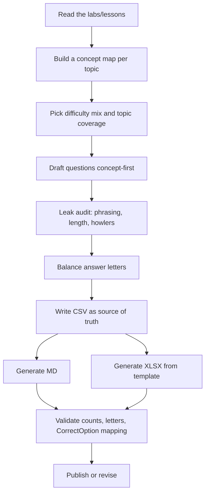

# Quiz Generation Guideline — How to Build a Grading Quiz

Disregard the other md files (Agents.md, constitution.md, TEST.md, GUIDELINES.md)
and build the quiz based on this. This guideline is **domain-agnostic**: it
works for any course delivered as a set of lessons/labs with written content
(e.g. FastAPI, Spring, SQL, Kubernetes, accounting, biology). References below
to "labs", "topics", and "concepts" are placeholders for your actual material.

## TL;DR

- Build the quiz **concept-first**, not lab-first.
- Test whether the learner understands the **subject** — never whether they
  remember how a specific lab/lesson was structured.
- One correct answer per question; 4 plausible options; an explanation for each.
- Pick a difficulty mix, then **count it** after finalizing.
- **Balance the answer letters**; don't let one letter dominate or starve.
- **Never leak the answer through phrasing**: no self-rejecting options, no
  meta-commentary inside options, no length tells, no obviously-absurd
  distractors (see "Answer-Leakage Prevention").
- Keep three artifacts in sync from **one source of truth** (the CSV).
- Import artifact must match `QuestionsImportTemplate-v4.xlsx` exactly.

## Deliverables (Three Artifacts, One Source)

| File | Purpose | Audience |
|------|---------|----------|
| `FINAL_GRADING_QUIZ.csv` | Source of truth: every question, option, answer, difficulty, explanation | Builder |
| `FINAL_GRADING_QUIZ.md` | Human-readable quiz grouped by topic + answer key table | Reviewer / instructor |
| `FINAL_GRADING_QUIZ.xlsx` | LMS import, in `QuestionsImportTemplate-v4.xlsx` format | LMS |

Rules:
- **Edit the CSV first**, then regenerate the MD and XLSX from it. Never
  hand-edit the XLSX — it will drift from the CSV.
- If the MD/CSV/XLSX disagree on any answer, the CSV is right (until you fix it).
- Optionally script the regeneration (a small Python generator that reads the
  CSV and writes MD + XLSX). Re-running it after any CSV edit is the reliable
  way to keep all three in sync.

### CSV columns

```
No, Question, Option A, Option B, Option C, Option D,
Correct Answer, Difficulty, Source Lab, Explanation
```

- `Correct Answer` = a single letter `A`–`D`.
- `Difficulty` = `Easy`, `Medium`, or `Tough` (mapped to the template's
  `EASY` / `MEDIUM` / `INTENSE`).
- `Source Lab` = the lab/lesson the concept came from (reference only — never
  reference lab names inside the question text itself).
- Quote every field that contains a comma. When writing the CSV by hand, double
  any embedded double quotes. Writing it via the `csv` module avoids both
  errors.

## The Import Template (`QuestionsImportTemplate-v4.xlsx`)

Key facts, verified against the real file:

- **The filename is plural**: `QuestionsImportTemplate-v4.xlsx` (not
  `QuestionImportTemplate-v4.xlsx`).
- Sheet name: **`QuestionFormat`** (only one sheet).
- Header row 1, 27 named columns, in this order:
  `SerialNo, SectionName, Tag, PositiveMark, NegativeMark, Level, AnswerTime,
  Instruction, AnswerExplanation, Question, QuestionType, CorrectOption,
  Option1, Option2, Option3, Option4, Option5, Criteria1, Percentage1,
  Criteria2, Percentage2, Criteria3, Percentage3, Criteria4, Percentage4,
  Criteria5, Percentage5`
- Import maps by **header name, not column letter**. (The template's own
  instruction text says Option1 is "column L" — that is stale; the actual
  `Option1` header is column M. Trust the headers.)
- `Level` accepts exactly **`EASY`, `MEDIUM`, `INTENSE`** — never `HARD` or
  `TOUGH`. Map internally if needed.
- `QuestionType` = `MULTI_CHOICE` for this quiz. `CorrectOption` is the
  **1-based option number** (`1`–`4`), or `1,3` for multi-select. `NUMERIC`
  takes the number, `FILL_IN_THE_BLANKS` the word, `ESSAY` stays blank.
- `Question` and each option are wrapped in `<p>...</p>`.
- Data rows sit directly under the header (rows 2+). Below the data is a
  warning row (`PLEASE DO NOT ENTER ANY QUESTIONS BEYOND THIS POINT...`,
  merged H:J) and a reference/instruction block. **Do not rename headers and
  do not move the instruction block above the questions.**
- `AnswerExplanation` is plain text only.
- Columns `Option5` and the `Criteria*`/`Percentage*` columns stay blank for
  single-choice questions.

### Reusable XLSX build recipe

Do not build the XLSX by hand. Read the template, write the questions, and
shift the instruction block below the data:

1. Load the template with `openpyxl`; capture header names and column widths.
2. Create a new workbook named `QuestionFormat`; copy the header row and widths.
3. Read the CSV and write one row per question, mapping by header name:
   `Level` via `Easy→EASY / Medium→MEDIUM / Tough→INTENSE`,
   `Question`/options as `<p>...</p>`, `CorrectOption` = letter index.
4. Copy the template's instruction block (rows 11 onward) and merged ranges
   down by `(data_end + 2) - 11` so it sits below your questions.
5. Save, then validate (see checklist below).

Tip: only the three structural rows are merged in the template — the warning
row, the "TEMPLATE INSTRUCTIONS" header, and the note row. The reference rows
between the header and the note are NOT merged; copy their H/I/J cells
individually, or the reference text is silently lost.

## Difficulty Mix

- Agree the mix up front. A 20-question quiz worked well as
  **5 Easy / 10 Medium / 5 Intense**.
- Stay inside requested bands — e.g. for 20 questions: Easy 4–6,
  Medium 10–12, Hard 4–6. Medium should carry the most weight.
- Weight question counts toward the **deepest / most-taught** topics, not
  evenly across labs.
- **Recount after finalizing.** A draft that claimed 10/12/8 was actually
  written as 11/12/7 — the labels drifted from the plan.

## Question Design Rules

**Do:**
- Build a **concept map first**: skim the source material, list the key
  concepts per topic, and test those — not "what was built in lab X".
- Use **scenario questions** where they test understanding better than a
  definition — e.g. a real-world symptom, a system constraint, or "two users
  see different results — why?".
- Include **cross-concept comparison** questions — e.g. two related
  mechanisms (full-duplex vs one-way, per-route vs app-wide vs once-per-app),
  or "when would you pick X over Y".
- Keep exactly **one correct answer** and **four plausible** options.
- Write an **explanation** for every answer — 1–2 sentences on *why*.
- Make each stem **self-contained** — no "as we did in the lab" or lookup
  required.
- Test the answer key: every answer must be verifiable from the source
  material, and every distractor must be *wrong for a specific reason* (write
  that reason down when drafting; it becomes the answer explanation).

**Don't:**
- **Don't test how a lab was built** — file names, cell order, section
  numbers, "which lab used X", or the lab's narrative. This is the single
  biggest failure mode.
- Don't put **lab/lesson references inside the stem** ("In Lab 5, ...").
  Rephrase standalone.
- Don't include **off-domain** material that merely appeared in the course
  (e.g. a hashing algorithm that belongs in a security course showing up in a
  web-framework quiz). Ask "is this actually a core concept of the subject?"
  before keeping it.
- Don't use **"all of the above" / "none of the above"**, double negatives, or
  trick wording.
- Don't exceed **5 options**; for a 4-option quiz leave `Option5` blank.
- Don't let one answer letter dominate or vanish.
- **Don't leak the answer through option phrasing** (see the dedicated section
  below — this is the part that most often undermines an otherwise good quiz).

## Answer-Leakage Prevention

A question is "leaking" when a learner can solve it by reading the options
instead of knowing the subject. Audit every option against these patterns:

**1. Self-rejecting options.** An option that states its own fatal limitation
instructs the reader to cross it out — no knowledge required.
- Bad: *"WebSockets - open a full-duplex persistent connection even though the
  client never sends."* (the tail says why it's the wrong fit)
- Bad: *"SSE - it keeps a connection open purely for server-to-client
  messages."* (states the limitation that fails the requirement)
- Good: *"WebSockets - a full-duplex persistent connection over which browser
  and server exchange messages freely."* (neutral; the learner must know it is
  overkill for one-way push)

**2. Meta-commentary / cross-references between options.** The correct option
must not editorialize about the others or print the deciding criterion.
- Bad: *"Server-Sent Events (SSE) - ...; full-duplex WebSockets are unnecessary
  here."* — names another option and hands over the reasoning.
- Good: *"Server-Sent Events (SSE) - a one-way HTTP stream the server pushes to
  the browser with automatic reconnection."* — describes itself; comparison is
  left to the learner.

**3. Only the correct option carries the mechanism.** If the four options claim
equally to describe reality, give all four the same granularity: terse wrong
assertions next to a fully-argued correct option make the correct one obvious.
Pad distractors with plausible-but-wrong specifics; trim the correct answer.

**4. Length tells.** If the longest (or shortest) option is consistently the
correct one, the quiz is solved by word count, not knowledge. Audit and rework
until the correct answer's length rank varies across the quiz (see
"Length-Balance Hygiene").

**5. "Howler" distractors.** Options that are transparently absurd / jokes
(*"adds deliberate latency so the service appears busier"*, *"a SyntaxError for
using await in a loop"*, *"the server polls the client"*) eliminate themselves.
Replace every howler with a serious, specific-sounding but wrong mechanism.

**6. Stem-vs-option elimination.** If the stem states a premise and two options
directly contradict it, the reader eliminates them from reading alone (e.g. a
stem saying "no server-side state" next to options that describe storing
server-side state). One such pair is a legitimate comprehension test; pairing
them with a length/mechanism tell makes the question solvable with zero domain
knowledge. Prefer distractors that are wrong for subtler reasons, or accept the
elimination trade-off but remove the other tells.

**7. Uniform "voice" across options.** Mixing one detailed, hedged option with
three terse ones reads as "the careful one is right". Keep all four in the same
style and register.

## Answer-Key Hygiene

- Target a near-even spread across `A/B/C/D` (20 questions → **5/5/5/5**).
- Achieve balance by **reordering options**, never by changing which answer is
  correct.
- Re-verify that `CorrectOption` still points at the right option text after
  any reorder — this is easy to break silently.

## Length-Balance Hygiene

- Audit every draft for a **length pattern**: is the correct option
  consistently the longest (or shortest) of the four? Statistical trends aside,
  learners notice this faster than almost any content tell.
- Keep all four options in a similar character-length band per question (a
  correct answer should not run ~1.5x+ the distractor average). Two moves,
  usually combined:
  - **Trim** the correct answer — cut redundancy and any clause that repeats
    the stem.
  - **Pad** the distractors — attach plausible, specific-sounding (but wrong)
    detail so they read as seriously as the correct answer.
- The goal: the correct answer lands at *different* length ranks across the
  quiz (sometimes longest, sometimes middle, sometimes shortest), so no
  pattern can be matched. Aim for the "correct is longest" case in **fewer than
  half** the questions.
- Quick audit (PowerShell):
  ```powershell
  python -c "import csv; rows=list(csv.DictReader(open('FINAL_GRADING_QUIZ.csv',encoding='utf-8'))); [print(r['No'], r['Correct Answer'], len(r['Option '+r['Correct Answer']]), [len(r['Option '+k]) for k in 'ABCD']) for r in rows]"
  ```
  Flag any question where the correct option's length is an obvious outlier
  versus the other three (roughly a 1.5x+ skew against the average of the
  distractors). The rank column (1=longest, 4=shortest) should not cluster on
  one value.

## Parameters to Confirm (Do Not Assume)

These were unspecified in the first iteration; sensible defaults were chosen
and flagged. Confirm them with the requester:

| Parameter | Default used | Notes |
|-----------|--------------|-------|
| `SectionName` | `<Course Name> Final Quiz` | Single section for all questions; use your actual course name |
| `PositiveMark` | `1.0` | Equal weight; adjust if grading scale differs |
| `NegativeMark` | `0.0` | No penalty; set >0 only if asked |
| `AnswerTime` | Easy 2 / Medium 3 / Intense 4 (min) | Reference only |
| `Tag` | Topic name (e.g. `Validation`, `Security`, `Testing`) | Enables topic-wise analysis |

## Recommended Workflow



## Validation Checklist

Run all of these before calling the quiz done:

- [ ] Row count matches the target (e.g. 20).
- [ ] Difficulty counts match the promised mix (e.g. 5 / 10 / 5).
- [ ] Every question has exactly one `Correct Answer` and four non-empty options.
- [ ] Answer-letter spread is balanced.
- [ ] Length audit passes — the correct option is not a consistent length
      outlier (see Length-Balance Hygiene).
- [ ] Leak audit passes — no self-rejecting options, no meta-commentary inside
      options, no howler distractors, no stem-vs-option elimination stacks
      (see Answer-Leakage Prevention).
- [ ] `CorrectOption` in the XLSX maps to the option text that the CSV marks correct (automate this).
- [ ] XLSX sheet name and all 27 header names match the template exactly.
- [ ] Levels are only `EASY` / `MEDIUM` / `INTENSE`.
- [ ] No lab-structure, lab-reference, or off-domain questions slipped in.
- [ ] CSV, MD, and XLSX agree on every answer and explanation.

Quick CSV sanity check (PowerShell):

```powershell
$rows = Import-Csv -Path "FINAL_GRADING_QUIZ.csv"
$rows.Count
$rows | Group-Object Difficulty | Select-Object Name, Count
$rows | Group-Object 'Correct Answer' | Select-Object Name, Count
```

XLSX sanity check: load with `openpyxl`, assert the sheet is `QuestionFormat`,
assert headers equal the template's, then for every row confirm
`Option<CorrectOption>` equals the CSV's correct option text.

## Iteration Lessons (Do Not Repeat These)

- **Lab-first quiz was rejected.** The first 30-question version leaned on how
  each lab was designed; it tested recall of the lab, not understanding of the
  subject. Rewriting concept-first fixed it.
- **Off-domain questions creep in** when you mine a lab too literally.
  Ask "is this actually a core concept of the subject?" before keeping it.
- **Lab numbers in stems** make questions unusable outside the course;
  rephrase them standalone.
- **Difficulty labels drift** from the plan — recount, don't trust intent.
- **Answer letters skew** unless you deliberately rebalance.
- **Option length leaks the answer.** The finished quiz had the longest option
  as the correct answer in nearly every question (some 2-4x the distractors).
  Rebalance lengths when drafting, then audit with the Length-Balance Hygiene
  script.
- **Option phrasing leaks the answer too — often worse than length.** A pass
  that only trimmed lengths still leaked: options ending in self-rejecting
  clauses ("even though the client never sends"), correct options printing the
  deciding criterion ("full-duplex WebSockets are unnecessary here"), and
  distractors that were jokes. The second pass removed these tails, replaced
  the joke distractors with plausible wrong mechanisms, and evened out option
  granularity — that removed the leak *and* raised the quiz's true difficulty.
- **Length fixes alone can leave a "second-longest is right" pattern.** After
  rebalancing, verify the correct answer's length rank actually varies across
  questions, not merely that it stopped being the longest.
- **The template filename is plural** (`Questions...`) and its column-letter
  hints can be stale — follow header names.
- **Unspecified grading parameters** (marks, negative marks, time, section)
  should be defaulted and surfaced, not silently invented.

## File Naming

- Quiz artifacts: `FINAL_GRADING_QUIZ.md`, `FINAL_GRADING_QUIZ.csv`,
  `FINAL_GRADING_QUIZ.xlsx` (same slug across all three).
- Keep the import workbook as the only `.xlsx` in the quiz set so there is no
  ambiguity about which file goes to the LMS.