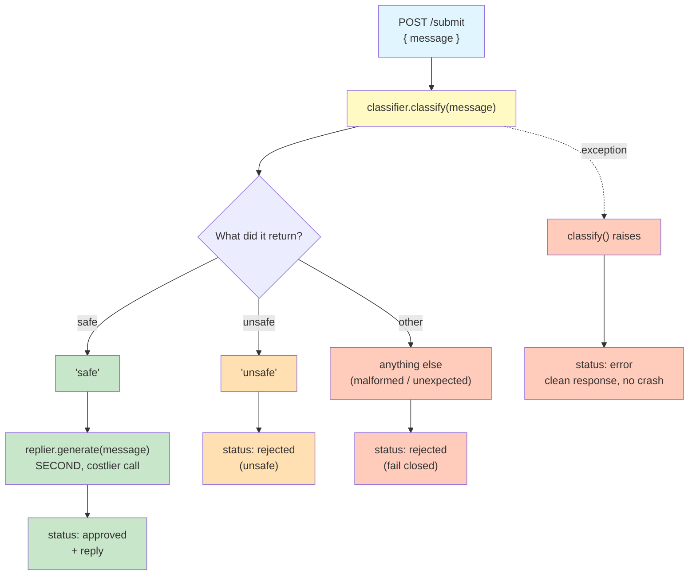

# Lab 10 — Testing Endpoints with dependency_overrides

**Difficulty: Intermediate | ~40 min | Requires Lab 4 (Dependency Injection)**

---

## 2. Problem Statement

When building an AI-powered endpoint that makes LLM calls, you inevitably face a testing problem: LLM calls cost real money, take real time, and are non-deterministic — you cannot reliably force a real model to produce a specific malformed or unexpected answer on demand just to verify your code handles it. A thorough test suite needs to exercise every branch of an application's logic, including edge cases and failure paths, often repeatedly. Doing that against a real model every time is slow, costly, and largely out of your control.

FastAPI's `app.dependency_overrides` solves this cleanly. It lets you swap the real LLM call for a fake, fully controllable one during tests, then swap back to the real implementation for production with zero changes to the endpoint code itself. This lab proves that concretely across four scenarios: a safe message that should be approved, an unsafe message that should be rejected, a malformed classification that should fail closed, and a classifier error that should return a clean response.

---

## 3. Input Data

No external data files. The lab operates on a single string field (`message`) sent as a JSON request body to a `POST /submit` endpoint. The lab uses a small handful of short test messages in the demos to keep things simple while still exercising every code path.

---

## 4. Processing

The endpoint processes messages through a two-step moderation pipeline:

1. **POST /submit** accepts a message string. It calls the classifier dependency (`classifier(message)`) via FastAPI's dependency injection.
2. If classification is exactly `"safe"`, a second, separate LLM call generates the actual reply via the replier dependency (`replier(message)`).
3. If classification is `"unsafe"`, or anything other than exactly `"safe"` or `"unsafe"` (malformed), the message is rejected immediately — the replier is never called.
4. If the classifier call raises an exception, a clean structured error response is returned.

Four tests verify each of these paths using fake clients and `app.dependency_overrides`.

---

## 5. Output

All four tests print "PASSED" on success. The output should look like:

```
Test 1: safe → approved
PASSED

Test 2: unsafe → rejected, replier not called
PASSED

Test 3: malformed → rejected (fail closed), replier not called
PASSED

Test 4: classifier error → clean error response
PASSED

All four tests passed.
```

Each test also prints a brief summary of what it verified before printing "PASSED".

---

## 6. Tech Stack

- **fastapi==0.112.2** — web framework, `Depends()` for dependency injection, `dependency_overrides` for test swapping
- **pydantic==2.8.2** — request model validation
- **httpx==0.28.1** — `TestClient` (from `starlette.testclient`, re-exported by FastAPI) for in-process HTTP testing without starting a real server
- **python-dotenv==1.2.3** — `.env` loading
- **openai==3.5.0** — OpenRouter client (OpenAI-compatible), async LLM calls for production implementations
- **Standard library:** `typing` — `Annotated` and `Depends` type hints

---

## 7. Underlying Concepts

### Why `dependency_overrides` Exists and Why It Matters

In Lab 4, you learned that `Depends()` lets FastAPI call a function to produce a value and inject it into your endpoint. The endpoint never calls the dependency directly — it receives the value as a parameter. `app.dependency_overrides` is a plain dictionary on the FastAPI app object that lets you say "when the endpoint asks for the value produced by `get_classifier_client`, give it this instead." The key is that the override is keyed on the **function object itself** — `app.dependency_overrides[get_classifier_client] = lambda: fake_classifier` — not on a string name. This means the endpoint code itself never changes. You don't add a parameter, a flag, or a conditional. The production code stays exactly as it is, and the test just swaps what comes out of the dependency. This is why `dependency_overrides` is a plain dict: it maps one function to another, and when a test is done, `app.dependency_overrides.clear()` removes all overrides so the next test (or production) gets the real implementation.

### Why `TestClient` Doesn't Need a Running Server

FastAPI's `TestClient` (built on Starlette's `TestClient` and `httpx`) makes HTTP requests directly to your endpoint functions **in-process**. There is no real TCP connection, no port binding, no uvicorn thread. This makes tests fast and deterministic — no port conflicts, no race conditions, no need to start and stop a server between tests. The `TestClient` acts like a real HTTP client (you call `.post()`, `.get()`, and get back a response with `.json()` and `.status_code`), but under the hood it is calling the same Python functions that a real server would call.

### Why `call_count` on Fakes Matters More Than Checking the Response Shape

A correct-looking response could theoretically happen for the wrong reason — the replier might have been called when it shouldn't have been, or the classifier might have been called twice. Asserting `call_count` directly proves the **code path** taken, not just the final output. For example, in the "unsafe" test, asserting that `fake_replier.call_count == 0` proves the costlier second call was correctly skipped — something you cannot reliably verify against a real, non-deterministic classifier on demand.

### Why Fail-Closed Is the Right Default for Moderation Pipelines

When a classifier returns something that is neither "safe" nor "unsafe" — say `"maybe"` or `"unsure"` — the system should reject the message, not let it through. This is "fail closed": if you don't know what the model means, you treat it as unsafe. The alternative (fail open) would let potentially harmful content through just because the model was confused, which is far worse than temporarily blocking a safe message. This is specifically hard to verify without a fake: you cannot reliably coax a real model into producing a specific malformed answer on demand to confirm your fail-closed logic actually works, but a fake makes this trivial and instant.

### The One-Sentence Pytest Note

The `def test_something(): ... assert ...` function shape used in this lab deliberately mirrors what a real pytest test function looks like, so the pattern transfers directly when you start writing tests with a proper test framework.

The second, more expensive LLM call only happens on one specific path. A real model rarely produces the malformed case on demand — but a fake can, every time, which is exactly what makes this branch testable at all:



Notice the second call only ever fires on the "safe" path — every other branch, including the malformed one, rejects before it's reached. Proving that skip actually happens, on every branch, every time, is what the tests below are for.

---

## 8. Prerequisites

- **Lab 4 (Dependency Injection)** — Familiarity with `Depends()` and how FastAPI resolves dependencies is assumed
- An OpenRouter API key (set in the `.env` file as `OPEN_ROUTER_KEY`)

**Compute & cost:** Runs entirely on a laptop CPU — no GPU needed. Most of the lab uses fake clients (zero cost). The one real LLM call (demonstrating the production classifier) uses OpenRouter's `openrouter/free` model, which is free. A full run-through costs effectively nothing.

---

## 9. Environment / Dependencies Setup

```bash
pip install fastapi==0.112.2 pydantic==2.8.2 httpx==0.28.1 python-dotenv==1.2.3 openai==3.5.0
```

Ensure a `.env` file exists in the project root containing:
```
OPEN_ROUTER_KEY=your-openrouter-api-key-here
```

---

## 10. Step-wise Development Instructions

### Cell 0: Dependency Installation

One cell installs every pinned dependency the lab needs. Run this first so all later cells have what they require.

```python
!pip install fastapi==0.112.2 pydantic==2.8.2 httpx==0.28.1 python-dotenv==1.2.3 openai==3.5.0
```

### Cell 1: Imports, API Key, and App Setup

Standard imports for the app. `Depends` is how FastAPI injects dependencies into endpoints. `TestClient` (re-exported by FastAPI from Starlette) lets us make HTTP requests in-process without starting a real server. The OpenRouter client is set up the same way as in previous labs.

```python
from fastapi import FastAPI, Depends
from fastapi.testclient import TestClient
from pydantic import BaseModel
from dotenv import load_dotenv
from openai import AsyncOpenAI
import os

load_dotenv()
api_key = os.getenv("OPEN_ROUTER_KEY") or input("Open Router API key: ")
client = AsyncOpenAI(api_key=api_key, base_url="https://openrouter.ai/api/v1")
app = FastAPI()
test_client = TestClient(app)
```

### Cell 2: classify_message — The Production Classifier

A single async function that makes a real LLM call asking the model to respond with exactly "safe" or "unsafe". Because it's a plain function, the dependency function (in Cell 3) can return it directly, and the endpoint can call it as `classifier(message)`.

```python
async def classify_message(message):
    response = await client.chat.completions.create(
        model="openrouter/free",
        messages=[{"role": "user", "content": (
            f"Classify this message as exactly one word: 'safe' or 'unsafe'. "
            f"Message: {message}"
        )}],
    )
    return response.choices[0].message.content.strip().lower()
```

### Cell 3: get_classifier_client — The Classifier Dependency

This is the dependency function that FastAPI will inject into the endpoint. It returns the `classify_message` function itself. During tests, `app.dependency_overrides[get_classifier_client]` replaces this with a lambda that returns a fake instead.

```python
async def get_classifier_client():
    return classify_message
```

### Cell 4: generate_reply — The Production Replier

A separate function that makes a real LLM call to produce the actual reply text. Having the replier as its own dependency — separate from the classifier — is what lets the tests prove the replier was or was not called independently.

```python
async def generate_reply(message):
    response = await client.chat.completions.create(
        model="openrouter/free",
        messages=[{"role": "user", "content": f"Generate a polite reply to: {message}"}],
    )
    return response.choices[0].message.content
```

### Cell 5: get_reply_client — The Replier Dependency

The dependency function for the replier, following the same pattern as the classifier.

```python
async def get_reply_client():
    return generate_reply
```

### Cell 6: The POST /submit Endpoint

This is the core of the lab. The endpoint receives a message, calls the classifier via its injected dependency, and branches on the result:

- **`"safe"`** → call the replier and return the approved reply
- **`"unsafe"`** → reject immediately, never call the replier
- **anything else** → fail closed (reject, never call the replier)
- **exception** → return a clean error, don't crash

The dependency-injected `classifier` and `replier` are each just a callable function, so the endpoint invokes them directly: `classifier(req.message)` and `replier(req.message)`. The `try/except` around `classifier(req.message)` ensures an unhandled LLM error becomes a structured JSON response, not a 500 crash.

```python
class MessageRequest(BaseModel):
    message: str

@app.post("/submit")
async def submit(
    req: MessageRequest,
    classifier=Depends(get_classifier_client),
    replier=Depends(get_reply_client),
):
    try:
        classification = await classifier(req.message)
    except Exception as exc:
        return {"status": "error", "detail": str(exc)}

    if classification == "unsafe":
        return {"status": "rejected", "reason": "unsafe"}
    if classification != "safe":
        return {"status": "rejected", "reason": "unrecognized classification"}

    reply = await replier(req.message)
    return {"status": "approved", "reply": reply}
```

### Cell 7: make_fake_classifier — The Fake Classifier

A factory that returns a "fake classifier": an async function that just returns a fixed string (or raises an exception if configured to). Python functions can carry attributes, so the returned function tracks its own `call_count` — incremented on every call, which lets us prove how many times the classifier was invoked.

```python
def make_fake_classifier(response=None, raise_error=False):

    async def fake_classify(message):
        fake_classify.call_count += 1
        if raise_error:
            raise RuntimeError("Classifier service unavailable")
        return response

    fake_classify.call_count = 0
    return fake_classify
```

### Cell 8: make_fake_replier — The Fake Replier

Same pattern: a factory returning a plain async function with a fixed return value and a `call_count` attribute that increments on every call. This is what makes it possible to prove the replier was or was not invoked — not just infer it from the response shape.

```python
def make_fake_replier(response="fake reply"):

    async def fake_generate(message):
        fake_generate.call_count += 1
        return response
        
    fake_generate.call_count = 0
    return fake_generate
```

### Cell 9: Test 1 — Safe Message Gets Approved and Replied

This test overrides both dependencies: the classifier fake returns `"safe"` and the replier fake returns a canned reply. The assertions check three things: the status is `"approved"`, the reply matches exactly, and `call_count == 1` on the replier — proving the second call genuinely fired, not just that the response happened to look right.

```python
def test_safe_message_gets_approved_and_replied():
    fake_replier = make_fake_replier(response="Hello! How can I help you today?")
    fake_classifier = make_fake_classifier(response="safe")
    
    app.dependency_overrides[get_classifier_client] = lambda: fake_classifier
    app.dependency_overrides[get_reply_client] = lambda: fake_replier

    response = test_client.post("/submit", json={"message": "Hello there"})
    data = response.json()

    assert data["status"] == "approved"
    assert data["reply"] == "Hello! How can I help you today?"
    assert fake_replier.call_count == 1
    print("Test 1: safe → approved")
    print("PASSED")
```

### Cell 10: Run Test 1

After every test, `app.dependency_overrides.clear()` removes all overrides so the next test starts clean. Without clearing, one test's fake could silently leak into the next test and produce a misleading result.

```python
test_safe_message_gets_approved_and_replied()
app.dependency_overrides.clear()
```

### Cell 11: Test 2 — Unsafe Message Rejected Without Reply Call

This is the important proof-of-skip test. The classifier returns `"unsafe"`, and we assert that the replier's `call_count` is 0 — proving the costlier second call was correctly skipped. You cannot reliably verify this against a real, non-deterministic classifier on a schedule.

```python
def test_unsafe_message_rejected_without_reply_call():
    fake_replier = make_fake_replier(response="This should never appear")
    fake_classifier = make_fake_classifier(response="unsafe")

    app.dependency_overrides[get_classifier_client] = lambda: fake_classifier
    app.dependency_overrides[get_reply_client] = lambda: fake_replier

    response = test_client.post("/submit", json={"message": "Dangerous content"})
    data = response.json()

    assert data["status"] == "rejected"
    assert data["reason"] == "unsafe"
    assert fake_replier.call_count == 0
    print("Test 2: unsafe → rejected, replier not called")
    print("PASSED")
```

### Cell 12: Run Test 2

```python
test_unsafe_message_rejected_without_reply_call()
app.dependency_overrides.clear()
```

### Cell 13: Test 3 — Malformed Classification Fails Closed

This is the standout case in the whole lab. You cannot reliably coax a real model into producing a specific malformed answer like `"maybe"` on demand to verify your fail-closed logic actually works — but a fake makes this trivial and instant. The classifier returns `"maybe"` (neither "safe" nor "unsafe"), and we assert the message is rejected with `"unrecognized classification"` and the replier was never called.

```python
ddef test_malformed_classification_fails_closed():
    fake_replier = make_fake_replier(response="This should never appear")
    fake_classifier = make_fake_classifier(response="maybe")

    app.dependency_overrides[get_classifier_client] = lambda: fake_classifier
    app.dependency_overrides[get_reply_client] = lambda: fake_replier

    response = test_client.post("/submit", json={"message": "Ambiguous content"})
    data = response.json()

    assert data["status"] == "rejected"
    assert data["reason"] == "unrecognized classification"
    assert fake_replier.call_count == 0
    print("Test 3: malformed → rejected (fail closed), replier not called")
    print("PASSED")
```

### Cell 14: Run Test 3

```python
test_malformed_classification_fails_closed()
app.dependency_overrides.clear()
```

### Cell 15: Test 4 — Classifier Failure Returns Clean Error

When the classifier raises an exception (simulating a service outage), the endpoint's `try/except` catches it and returns a structured error response instead of crashing with a 500. We verify the response has `"status": "error"` and a `"detail"` field containing the error message.

```python
def test_classifier_failure_returns_clean_error():
    fake_classifier = make_fake_classifier(raise_error=True)
    app.dependency_overrides[get_classifier_client] = lambda: fake_classifier

    response = test_client.post("/submit", json={"message": "Any message"})
    data = response.json()

    assert data["status"] == "error"
    assert "detail" in data
    assert "Classifier service unavailable" in data["detail"]
    print("Test 4: classifier error → clean error response")
    print("PASSED")
```

### Cell 16: Run Test 4 and Final Summary

```python
test_classifier_failure_returns_clean_error()
app.dependency_overrides.clear()

print("\nAll four tests passed.")
```

---

## 11. Optional Exercise

Change the assertion in `test_unsafe_message_rejected_without_reply_call` from `assert data["status"] == "rejected"` to `assert data["status"] == "approved"` — an intentionally wrong expectation. Run the test and observe the `AssertionError` output. Then fix it back to `"rejected"` and confirm it passes again.

---

## 12. What We Learnt

- **`app.dependency_overrides`** is a plain dict that maps dependency functions to replacement implementations — swapping behavior for tests requires zero changes to endpoint code
- **`TestClient`** makes HTTP requests in-process without starting a real server, keeping tests fast and deterministic
- **Separate dependency functions** for the classifier and replier let each be overridden and observed independently, which is what makes it provable that the second call correctly never fires on non-safe paths
- **`call_count` on fakes** proves the code path taken, not just the final output — a correct-looking response could happen for the wrong reason, but the call count doesn't lie
- **Fail-closed** (treating anything unexpected as unsafe) is the correct default for a moderation-style pipeline, and is specifically hard to verify without a fake input source
- **`app.dependency_overrides.clear()`** between tests prevents one test's fake from silently leaking into the next test and producing misleading results
- **`try/except` in the endpoint** converts unhandled exceptions into clean structured JSON responses instead of 500 crashes
- **The `def test_(): ... assert ...` shape** mirrors real pytest conventions, so the pattern transfers directly when you start using a proper test framework
