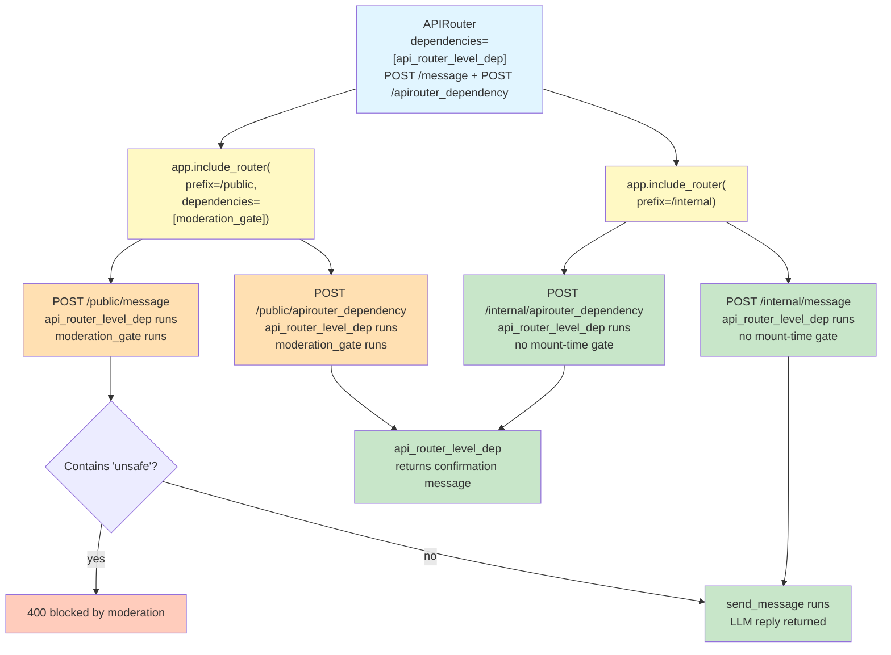

# Lab 11 — Modular Routing with APIRouter + include_router

Difficulty: Intermediate | ~35 min | Requires Lab 4

---

## 2. Problem Statement / Use Case Overview

As an AI application grows, the same underlying endpoint logic often needs to run under different trust levels — for example, a chat endpoint exposed to the public internet versus the same logic used internally for evaluation or testing traffic. Duplicating the endpoint function for each trust level is repetitive and risky: the two copies can drift apart over time, silently diverging in behavior. FastAPI's `include_router()` solves this cleanly: it lets the exact same router — the same function, defined once — be mounted more than once under different prefixes, with a different dependency attached at each mount. The enforcement lives entirely in how and where the router is mounted, not inside the endpoint function itself. This lab proves that concretely: one router, one endpoint, two mounts, two different enforced behaviours, and zero moderation code inside the endpoint function.

---

## 3. Input Data

The inputs are simple HTTP requests:

- **POST /message**: A JSON body with a `message` field (e.g., `"What is FastAPI?"`), validated by a Pydantic model.
- **POST /apirouter_dependency**: A JSON body with a `message` field (required so that the mount-level `MessageIn` dependency is satisfied on the `/public` route) — the endpoint ignores the message content and simply returns the value injected by the router-level dependency.

This lab calls the real OpenRouter API using a free-tier model. Cost per full run-through is approximately $0.

---

## 4. Processing

The pipeline runs through two endpoints on a single router, with the interesting behaviour happening at the routing layer:

1. **Request arrives** at either `/public/message`, `/internal/message`, `/public/apirouter_dependency`, or `/internal/apirouter_dependency`.
2. **Construction-time dependency resolution**: `api_router_level_dep` runs on every request because it is set at `APIRouter()` construction time — it follows the router wherever it goes.
3. **Mount-time dependency resolution**: If the public mount was hit, FastAPI also resolves `moderation_gate`. It parses the request body into a `MessageIn` instance and checks whether the text contains `unsafe`. If it does, the dependency raises a 400 and the endpoint never runs. If the internal mount was hit, no extra mount-time dependencies exist and the request proceeds directly.
4. **Endpoint runs**: The appropriate endpoint receives its injected parameters, executes, and returns.
5. **Response returned**: A JSON object.

The two mounts share all endpoint code between steps 4 and 5 — the only difference is whether step 3 happened at all.

---

## 5. Output

The notebook runs five proofs that demonstrate the two-mount behaviour and dependency placement:

1. **Proof 1** — POST to `/public/message` with `"this is unsafe content"` returns **400** with `{"detail": "blocked by moderation"}`. The mount-time moderation gate stops the request before the endpoint runs.
2. **Proof 2** — POST the exact same message to `/internal/message` returns **200** with a real LLM reply. The same message that was blocked on the public mount is fully processed on the internal mount.
3. **Proof 3** — The handler functions found on both routes are the **same function object in memory** (`is` returns `True`). This is not two look-alike endpoints — it is one function serving both paths.
4. **Proof 4** — POST a safe message (`"What is FastAPI?"`) to the public mount and confirm it returns **200** with a real reply. The public mount is not a blanket blocker — only the moderation dependency's own condition determines the outcome.
5. **Proof 5** — POST `/public/apirouter_dependency` and POST `/internal/apirouter_dependency` both return the same message from the construction-time dependency. The router-level dependency applies to both mounts because it was set at `APIRouter()` construction time, not at mount time.

---

## 6. Tech Stack

- `fastapi==0.112.2` — Web framework with APIRouter and dependency injection support
- `pydantic==2.8.2` — Request body validation (used by FastAPI internally and by our `MessageIn` model)
- `httpx==0.28.1` — HTTP client (used by TestClient under the hood)
- `openai==3.5.0` — OpenAI-compatible client for OpenRouter API
- `python-dotenv==1.2.3` — Loads API keys from `.env` files

---

## 7. Underlying Concepts

### APIRouter: Organising Routes Into Modules

`APIRouter()` creates a route container. Routes attached to it (via `@router.post(...)` or `@router.get(...)`) are not yet part of the application — they are only registered when you call `app.include_router(router)`. This separation is what makes modular routing possible: a router can be defined in its own file, tested independently, and mounted one or more times on different apps or under different prefixes.

### The `dependencies=` Parameter and Dual Placement

The `dependencies=` parameter can be passed in **two places**, and understanding when each one applies is essential:

- **At `APIRouter()` construction time** — e.g., `router = APIRouter(dependencies=[Depends(some_check)])`. These dependencies apply to every route on that router, no matter how or where it is later mounted. Use this when a check is universally required for every endpoint in the router.

- **At `include_router()` call time** — e.g., `app.include_router(router, prefix="/public", dependencies=[Depends(moderation_gate)])`. These dependencies apply only to that specific mount. Use this when the same router needs to behave differently depending on where it is attached.

This lab uses both: `api_router_level_dep` is set at construction time and applies everywhere, while `moderation_gate` is set at mount time and applies only to `/public`.



The diagram shows the single router — with `api_router_level_dep` baked in at construction time — feeding into two `include_router()` calls. The public mount adds the moderation gate; the internal mount adds nothing. Both resulting paths receive the construction-time dependency, but only the public mount also receives the mount-time gate.

### Why Construction-Time Dependencies Apply Everywhere

When `api_router_level_dep` is declared via `APIRouter(dependencies=[Depends(api_router_level_dep)])`, it is attached to the router object itself. Every `include_router()` call inherits it. This is why POSTing to `/public/apirouter_dependency` and `/internal/apirouter_dependency` both return the same confirmation message — the dependency runs on both mounts because it is part of the router, not part of any specific `include_router()` call.

### Why a Raising Dependency Stops the Request Entirely

When `Depends(moderation_gate)` is declared on a mount, FastAPI resolves it before running the endpoint function. If `moderation_gate` raises an `HTTPException`, FastAPI catches it and returns the corresponding error response immediately — the endpoint function is never entered. This is standard `Depends()` behaviour applied at the router level for the first time in this series: the blocking comes from the routing layer, not from any conditional logic inside the endpoint.

There is a subtle consequence worth noticing: because `moderation_gate` declares a `MessageIn` body model, the body requirement is enforced on **every** route in the `/public` mount — not just `/public/message`. That is why this lab's dependency-demonstration endpoint is a POST that carries a `message` body: it lets the request pass the mount-level body requirement while still demonstrating the construction-time dependency. This is standard FastAPI behaviour — a body-parameter dependency on a router or mount applies to all routes under it — and it is exactly the kind of interaction you must keep in mind when attaching dependencies at the mount level.

### Comparing Function Objects as Proof of Reuse

Proof 3 checks `public_handler is internal_handler` — a Python identity test (`is`), not equality (`==`). Two separate function definitions with identical code would pass `==` but fail `is`. By confirming that the object in memory is literally the same, we prove that both mounts share one function, not two look-alike copies that happen to behave the same way today but could diverge tomorrow.

---

## 8. Prerequisites

- A free OpenRouter API key, set in a `.env` file as `OPEN_ROUTER_KEY`. Get one at https://openrouter.ai/keys.
- Lab 4 (Dependency Injection) — familiarity with `Depends()` and how FastAPI resolves dependencies.

---

## 9. Environment / Dependencies Setup

To run this lab locally, perform the following commands in your shell:

```bash
# Create a fresh virtual environment
python -m venv venv

# Activate the virtual environment (Windows)
.\venv\Scripts\activate

# Install the dependencies
pip install fastapi==0.112.2 pydantic==2.8.2 httpx==0.28.1 python-dotenv==1.2.3 openai==3.5.0
```

Create a `.env` file in your project root with:

```
OPEN_ROUTER_KEY=your_openrouter_api_key_here
```

---

## 10. Step-wise Development Instructions

### Cell 1: Dependency Installation

Installs the exact pinned versions of every library this lab needs. Run this cell first so everything is available for the rest of the notebook.

```python
!pip install fastapi==0.112.2 pydantic==2.8.2 httpx==0.28.1 python-dotenv==1.2.3 openai==3.5.0
```

### Cell 2: Imports and App Setup

We import the standard modules, read the OpenRouter API key from the `.env` file, and create the FastAPI application instance.

```python
from fastapi import FastAPI, Depends, APIRouter, HTTPException
from pydantic import BaseModel
from dotenv import load_dotenv
from openai import AsyncOpenAI
import os

load_dotenv()
api_key = os.getenv("OPEN_ROUTER_KEY") or input("Open Router API key: ")
app = FastAPI()
```

### Cell 3: Shared LLM Client and Reply Dependency

We build one `AsyncOpenAI` client at module level and wrap it in a small dependency function. This dependency is used by the endpoint — it exists so the endpoint receives a ready-to-use client without creating one itself.

```python
client = AsyncOpenAI(
    api_key=api_key,
    base_url="https://openrouter.ai/api/v1"
)

def get_reply_client():
    return client
```

### Cell 4: Request Model and Router-Level Dependency

We define a Pydantic model for the request body — every POST to the endpoint must include a `message` string. We also define a construction-time dependency and attach it to the router via `APIRouter(dependencies=[...])`. Unlike the mount-time `moderation_gate` we will add later, this dependency is baked into the router itself and will apply to **every endpoint** registered on this router, no matter where or how the router is mounted.

```python
class MessageIn(BaseModel):
    message: str

def api_router_level_dep():
    return "This is a apirouter level dependency applied to every end point"

router = APIRouter(dependencies=[Depends(api_router_level_dep)])
```

### Cell 5: The Message Endpoint

This endpoint contains **no moderation or safety-checking logic whatsoever** — that is the entire point being proven later. It receives the validated `MessageIn` payload, calls the LLM via the injected reply client, and returns the reply. Because it is attached to the `router` object rather than directly to `app`, it can be mounted under different prefixes with different dependencies — the enforcement lives entirely in how and where the router is mounted, not inside this function.

```python
@router.post("/message")
async def send_message(payload: MessageIn, replier=Depends(get_reply_client)):
    reply = await replier.chat.completions.create(
        model="openrouter/free",
        messages=[{"role": "user", "content": payload.message}]
    )
    return {"status": "ok", "reply": reply.choices[0].message.content}
```

### Cell 6: The Router-Level Dependency Endpoint

This endpoint simply returns the value injected by `api_router_level_dep` — proving that the construction-time dependency runs on every request to this endpoint, regardless of which mount prefix was hit. It exists purely to demonstrate that construction-time dependencies apply to all endpoints on the router. It is declared as a **POST** (rather than a GET) so that the mount-level `MessageIn` body dependency is satisfied on the `/public` mount — more on that interaction in Cell 8.

```python
@router.post("/apirouter_dependency")
async def show_router_dep(dep_msg=Depends(api_router_level_dep)):
    return {"message": dep_msg}
```

### Cell 7: The Moderation Gate Dependency

This dependency accepts the same `MessageIn` body model as the endpoint — when both the dependency and the endpoint declare the same Pydantic parameter, FastAPI parses the request body once and both consumers see the same parsed data. If the message text contains the word `unsafe` (case-insensitive), the dependency raises a 400 `HTTPException`. When a dependency raises, FastAPI stops the request immediately and never enters the endpoint function — the blocking happens entirely before the endpoint runs.

```python
def moderation_gate(payload: MessageIn):
    if "unsafe" in payload.message.lower():
        raise HTTPException(status_code=400, detail="blocked by moderation")
```

### Cell 8: Mount the Same Router Twice with Different Dependencies

Here is the core of the lab. The same `router` object — the same function, defined once — is mounted **twice** on the app under different prefixes. The `dependencies=` parameter on `include_router()` is applied **at mount time**: it is not baked into the router itself when it is constructed. This is why the same router can behave differently under different mounts.

Both mounts still receive the router-level `api_router_level_dep` because it is set at construction time and follows the router everywhere.

One important interaction worth noting: because `moderation_gate` declares a `MessageIn` body model, it forces FastAPI to require a request body on **every** `/public` route — including `/public/apirouter_dependency`. That is why the dependency-demonstration endpoint is a POST that sends a `message` body: sending a body satisfies the mount-level dependency, and the endpoint silently ignores the message content.

```python
app.include_router(router, prefix="/public", dependencies=[Depends(moderation_gate)])
app.include_router(router, prefix="/internal")
```

### Cell 9: TestClient Setup

We create a `TestClient` to send simulated HTTP requests against the app directly in the notebook, without running a live server.

```python
from fastapi.testclient import TestClient

test_client = TestClient(app)
```

### Cell 10: Proof 1 — Public Mount Blocks Unsafe Input

We POST a message containing the word `unsafe` to the **public** mount. The `moderation_gate` dependency should reject it before the endpoint ever runs, producing a 400 response.

```python
res_public = test_client.post("/public/message", json={"message": "this is unsafe content"})
print(f"Public mount (unsafe message): status={res_public.status_code}")
print(f"Body: {res_public.json()}")
```

### Cell 11: Proof 2 — Internal Mount Passes the Same Payload Freely

We POST the **exact same** message to the **internal** mount. With no moderation dependency, the endpoint processes it normally and returns a 200 with a real LLM reply — the same message that was blocked on the public mount is fully processed here.

```python
res_internal = test_client.post("/internal/message", json={"message": "this is unsafe content"})
print(f"Internal mount (same message): status={res_internal.status_code}")
print(f"Reply: {res_internal.json()['reply'][:120]}...")
```

### Cell 12: Proof 3 — Same Function Object, Not Two Look-Alikes

We walk the app's route table, find the handler function for each mount, and check whether they are the **literal same function object in memory** — proving this is one function serving both paths, not two separate definitions that happen to share a name.

```python
public_handler = None
internal_handler = None

for route in app.routes:
    if getattr(route, "path", None) == "/public/message":
        public_handler = route.endpoint
    if getattr(route, "path", None) == "/internal/message":
        internal_handler = route.endpoint

print(f"Public handler:  {public_handler}")
print(f"Internal handler: {internal_handler}")
print(f"Same function object? {public_handler is internal_handler}")
```

### Cell 13: Proof 4 — Public Mount Lets Safe Messages Through

The public mount is not a blanket blocker. We send a safe message and confirm it returns 200 with a real generated reply — proving the moderation dependency's own condition is what determines the outcome, not the mount itself.

```python
res_safe = test_client.post("/public/message", json={"message": "What is FastAPI?"})
print(f"Public mount (safe message): status={res_safe.status_code}")
print(f"Reply: {res_safe.json()['reply'][:120]}...")
```

### Cell 14: Proof 5 — Construction-Time Dependency Applies to Both Mounts

The `/apirouter_dependency` endpoint was registered on the same router with `api_router_level_dep` set at construction time. We call it from both the `/public` and `/internal` prefixes to prove the construction-time dependency runs regardless of which mount is hit — it follows the router, not the mount. Each call sends a JSON body with a `message` field, which satisfies the `MessageIn` requirement that the mount-level `moderation_gate` imposes on every `/public` route.

```python
res_pub_dep = test_client.post("/public/apirouter_dependency", json={"message": "any text"})
res_int_dep = test_client.post("/internal/apirouter_dependency", json={"message": "any text"})

print(f"Public mount:  {res_pub_dep.json()}")
print(f"Internal mount: {res_int_dep.json()}")
print(f"Same response? {res_pub_dep.json() == res_int_dep.json()}")
```

---

## 11. Optional Exercise

Add a third mount of the same router under prefix `/beta`, with a dependency of your own design — for example, one that rejects any message longer than 50 characters with a 400 error. Then send one POST to `/beta/message` with a short message (under 50 characters, should succeed) and one with a long message (over 50 characters, should be blocked) to prove it behaves independently of the other two mounts.

---

## 12. What We Learnt

- **What `APIRouter()` does**: It creates a route container that can be mounted on the app one or more times under different prefixes, with different dependencies — keeping the endpoint definition separate from its deployment configuration
- **How `include_router()` works with `dependencies=`**: The `dependencies=` parameter supplied at mount time applies only to that specific mount, not to the router itself — this is what lets the same router behave differently under different prefixes
- **The difference between construction-time and mount-time dependencies**: Construction-time dependencies (set at `APIRouter()` construction) apply everywhere the router is used; mount-time dependencies (set at `include_router()` call time) apply only to a specific mount — both are valid, but they solve different problems
- **Why a construction-time dependency applies to all endpoints**: `api_router_level_dep` returned the same value on both `/public` and `/internal` because it was baked into the router at construction time — it follows the router, not the mount
- **Why raising a dependency stops a request before the endpoint runs**: FastAPI resolves dependencies in order; if any dependency raises, the endpoint function is never entered and the error response is returned immediately
- **How a body-parameter dependency affects every route on a mount**: Because `moderation_gate` declares a `MessageIn` body, FastAPI requires a body on every route in the `/public` mount — so the dependency-demonstration endpoint is a POST that sends a message body to pass the check
- **Why comparing function objects (`is`) is a stronger proof of reuse than two endpoints looking similar in code**: It confirms there is exactly one function in memory serving both paths, not two separate definitions that happen to behave the same way today
- **A real-world pattern for AI systems**: Public-facing traffic needs a safety gate; internal evaluation or testing traffic is already trusted and should not pay that cost — both can share the same endpoint code via mount-time dependency configuration
