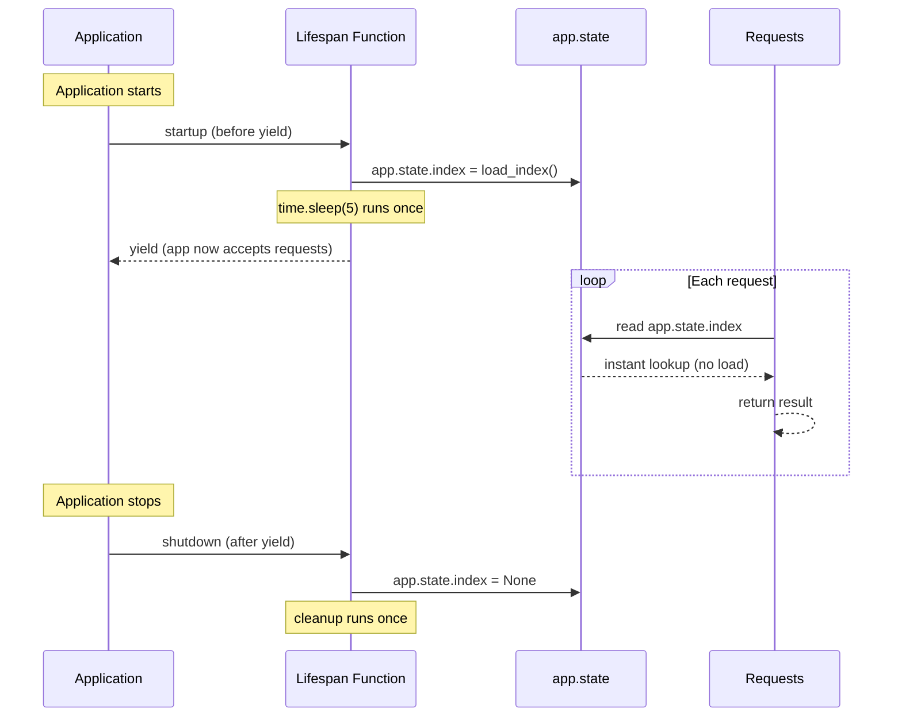

# Lab 12 — Lifespan Events

Difficulty: Intermediate | ~40 min | Requires Lab 4

---

## 2. Problem Statement / Use Case Overview

Some resources in an AI application are expensive to set up — loading an embedding model, building a retrieval index, opening a pool of connections to a vector database. If that setup happens inside a per-request dependency, every single request pays the full setup cost again, which is wasteful and, for anything nontrivial, disastrous for latency.

Lifespan events let that setup run exactly once — before the application starts accepting any requests — and exactly once more, for cleanup, after the application stops accepting requests. The result is stored on `app.state`, so every request can read it without ever redoing the work. This lab proves that difference concretely, with real timing, not just as a claim in prose.

---

## 3. Input Data

The inputs are simple HTTP requests:

- **GET /search-naive?q=doc1**: A query parameter that triggers a per-request expensive load in the naive path.
- **GET /search?q=doc1**: A query parameter that reads from the lifespan-loaded index.

No external data files, APIs, or LLM calls are used. The "expensive resource" is a simulated index (a plain Python dict) with a deliberate `time.sleep(5)` standing in for real load cost — this keeps the lab's timing proofs fast, fully deterministic, and repeatable with no network variability.

---

## 4. Processing

Two parallel pipelines demonstrate the same logical operation — loading an index and searching it — with fundamentally different timing:

**Naive path (the problem):**
1. Request arrives at `/search-naive`.
2. The `get_index_naive` dependency runs `load_index()`, which sleeps for 5 seconds and returns a fresh dict.
3. The endpoint searches the dict and returns the result.

**Lifespan path (the fix):**
1. Before any request is accepted, the lifespan function runs `load_index()` once and stores the result on `app.state.index`.
2. Request arrives at `/search`.
3. The `get_index` dependency reads `request.app.state.index` — no loading, no sleep, instant.
4. The endpoint searches the dict and returns the result.

---

## 5. Output

The notebook runs four proofs that demonstrate the lifespan mechanism and its timing advantage:

1. **Proof 1 — Naive cost, repeated:** Three sequential requests to `/search-naive`, each timed individually. All three take roughly the same ~5 second cost — proving the expensive load reruns on every single call.
2. **Proof 2 — Lifespan cost, paid once:** Inside a `with TestClient(app) as client:` block, three sequential requests to `/search`, each timed individually. All three are near-instant — because the index was already loaded before the first request was ever sent.
3. **Proof 3 — Loaded up front, not lazily:** Still inside the same `with` block, a direct check that `app.state.index` is already populated at the very start — reinforcing that the cost was paid once, up front, not on whichever request happened to arrive first.
4. **Proof 4 — Cleanup genuinely runs:** After the `with` block has closed, an assertion that `app.state.index` is now `None` — proving the code written after `yield` in the lifespan function actually executed.

---

## 6. Tech Stack

- `fastapi==0.112.2` — Web framework with lifespan event support
- `pydantic==2.8.2` — Required by FastAPI (used internally)
- `httpx==0.28.1` — HTTP client (used by TestClient under the hood)

No LLM provider SDK is needed for this lab.

---

## 7. Underlying Concepts

### Why Lifespan Events Exist

FastAPI (and the underlying Starlette framework) provides a mechanism to run code at two specific moments in an application's lifetime: once when the application is starting up (before it accepts any requests), and once when it is shutting down (after it stops accepting requests). These are called **lifespan events**.

The reason they exist is practical: many resources in a real application are expensive to create but cheap to reuse. Loading a 500MB embedding model, building a vector search index, or opening a database connection pool might take seconds or minutes — you do not want to pay that cost on every HTTP request. Lifespan events let you pay it exactly once, at startup, and store the result somewhere every request can reach it.

### The `lifespan` Parameter and `@asynccontextmanager`

When you create a FastAPI app, you can pass a `lifespan` argument:

```python
app = FastAPI(lifespan=lifespan)
```

The `lifespan` parameter expects an **async context manager** — a function decorated with `@asynccontextmanager` that yields exactly once. The code **before** the `yield` runs at startup; the code **after** the `yield` runs at shutdown.

```python
from contextlib import asynccontextmanager

@asynccontextmanager
async def lifespan(app: FastAPI):
    # --- startup: runs once, before any request ---
    app.state.index = load_index()
    yield
    # --- shutdown: runs once, after all requests are done ---
    app.state.index = None
```

This is why the decorator is essential: Python's `asynccontextmanager` turns a generator function into something that can be used in a `with` block, which is exactly how Starlette's lifecycle machinery drives startup and shutdown.

### `app.state` as the Shared Storage Location

Once the lifespan function stores the index on `app.state.index`, every request handler (and every dependency) can read it via `request.app.state.index`. This is the bridge between "loaded once at startup" and "available on every request" — the index lives on the app object for the entire lifetime of the application, so no request needs to reload it.

### The Same `load_index()` Function for Both Paths

This lab uses a single `load_index()` function for both the naive and lifespan paths. This matters because it keeps the comparison fair: both paths pay the exact same simulated cost (`time.sleep(5)` plus the same dict return). The only variable being measured is **when** the load runs — per-request or once at startup — not **how much** work is done.

### Dependencies vs. Lifespan: Call-Scoped vs. App-Scoped

A dependency declared with `Depends()` runs fresh for every single HTTP call and is not shared or cached between requests by default — that is the behaviour Proof 1 relies on. A lifespan function runs exactly once for the entire life of the application — once before it starts accepting any requests, and once after it stops — completely independent of how many requests happen in between.

In short: **dependencies are call-scoped, lifespan is app-scoped.**

### `TestClient(app)` vs. `with TestClient(app) as client:`

This distinction matters for this lab's proofs:

- **`TestClient(app)`** (plain instantiation): Creates a test client but does **not** trigger the lifespan startup or shutdown. This is what Proof 1 uses for the naive path — fair, minimal, no lifespan involvement.
- **`with TestClient(app) as client:`** (context manager): Entering the `with` block triggers the lifespan's startup code; exiting it triggers shutdown. This is what Proofs 2–4 use to demonstrate the lifespan path.

Proof 1 deliberately relies on the naive path never touching lifespan-backed state, so plain instantiation is appropriate there. Proofs 2–4 use the context manager specifically because the lifespan mechanism is what they are demonstrating.

### Production Behavior

> **Note:** The `with TestClient(app) as client:` pattern here is a notebook-only stand-in. In a real deployment, lifespan has nothing to do with the client — it's part of the ASGI protocol between the app and the server process (`uvicorn`, etc.). The server sends a startup event as part of its own boot sequence, before it opens its socket to accept any connections; only then does it start taking traffic. Shutdown works in reverse: on a termination signal, the server stops accepting new connections, lets in-flight requests finish, then sends a shutdown event, then exits. A real client (browser, `curl`, `httpx`) never triggers or knows about any of this — it only ever sees a server that's already fully started, or not running. `with TestClient(...)` exists only because this notebook has no real server process to run that sequence automatically.



The diagram contrasts the lifespan path with the naive alternative: in the naive path, `load_index()` would run inside every request arrow (the loop), paying the 5-second cost each time. With lifespan, the 5-second cost happens once at startup, and every request in the loop reads an already-populated `app.state.index` instantly.

---

## 8. Prerequisites

- Lab 4 (Dependency Injection) — familiarity with `Depends()` and how FastAPI resolves dependencies.
- No API keys or external services are required for this lab.

---

## 9. Environment / Dependencies Setup

To run this lab locally, perform the following commands in your shell:

```bash
# Create a fresh virtual environment
python -m venv venv

# Activate the virtual environment (Windows)
.\venv\Scripts\activate

# Install the dependencies
pip install fastapi==0.112.2 pydantic==2.8.2 httpx==0.28.1
```

No `.env` file or API keys are needed for this lab.

---

## 10. Step-wise Development Instructions

### Cell 1: Dependency Installation

Installs the exact pinned versions of every library this lab needs. Run this cell first so everything is available for the rest of the notebook.

```python
!pip install fastapi==0.112.2 pydantic==2.8.2 httpx==0.28.1
```

### Cell 2: Imports

We import the standard modules for this lab: `FastAPI` for the application, `Depends` and `Request` for dependency injection, `asynccontextmanager` to build the lifespan context manager, and `time` to simulate an expensive load.

```python
from fastapi import FastAPI, Depends, Request
from contextlib import asynccontextmanager
import time
```

### Cell 3: The Expensive Load Function

This function simulates what a real application would do at startup — load an embedding model, build a retrieval index, or open a database connection pool. The `time.sleep(5)` stands in for real load cost. Both the naive and lifespan paths call this same function, so the only variable being compared is **when** the cost is paid.

```python
def load_index():
    time.sleep(5)
    return {"doc1": "FastAPI is a modern Python web framework",
            "doc2": "Lifespan events run at startup and shutdown",
            "doc3": "app.state stores shared resources across requests"}
```

### Cell 4: The Naive Path (No Lifespan)

The naive dependency `get_index_naive` calls `load_index()` fresh on every single invocation. This is the flaw being demonstrated — every request pays the full 5-second cost again, even though the result is always the same dict. The endpoint does a trivial lookup and returns the result.

```python
from fastapi import HTTPException

def get_index_naive():
    return load_index()

app_naive = FastAPI()

@app_naive.get("/search-naive")
def search_naive(q: str, index=Depends(get_index_naive)):
    if q not in index:
        raise HTTPException(status_code=404, detail="not found")
    return {"query": q, "result": index[q]}
```

### Cell 5: The Lifespan Function

The lifespan function uses `@asynccontextmanager` to turn a generator into an async context manager. Code before `yield` runs at startup — this is where the expensive load happens exactly once. Code after `yield` runs at shutdown — here, we clean up by setting the index to `None`. The `app` parameter gives access to `app.state`, which is where the loaded index is stored so every request can reach it.

```python
@asynccontextmanager
async def lifespan(app: FastAPI):
    app.state.index = load_index()
    yield
    app.state.index = None
```

### Cell 6: The Lifespan-Backed App and Dependency

We create a new FastAPI app with the `lifespan` parameter — this is what tells FastAPI to run the lifespan function at startup and shutdown. The `get_index` dependency does **no loading at all**: it simply reads `request.app.state.index`, which was already populated by the lifespan function before any request was accepted.

```python
app = FastAPI(lifespan=lifespan)

def get_index(request: Request):
    return request.app.state.index
```

### Cell 7: The Lifespan-Backed Search Endpoint

This endpoint's logic is identical to `search_naive` — the only difference is that its dependency reads from `app.state` instead of calling `load_index()` on every request. The lookup is trivial on purpose: the lab is measuring when the load runs, not what the endpoint does with the result.

```python
@app.get("/search")
def search(q: str, index=Depends(get_index)):
    if q not in index:
        raise HTTPException(status_code=404, detail="not found")
    return {"query": q, "result": index[q]}
```

### Proof 1: Naive Cost, Repeated

We instantiate `TestClient(app_naive)`. We send three sequential requests, timing each one. All three should take roughly 5 seconds, proving that `load_index()` reruns on every single call.

```python
from fastapi.testclient import TestClient
import time

client_naive = TestClient(app_naive)

for i, query in enumerate(["doc1", "doc2", "doc3"], 1):
    start = time.time()
    res = client_naive.get(f"/search-naive?q={query}")
    elapsed = time.time() - start
    print(f"Request {i}: status={res.status_code}, time={elapsed:.2f}s, result={res.json()['result'][:40]}...")
```

### Proof 2: Lifespan Cost, Paid Once

We use `with TestClient(app) as client:` — entering the `with` block is what triggers the lifespan startup, including the 5-second `load_index()` call. Exiting the block triggers shutdown. Inside the block, we send three sequential requests, each of which reads from `app.state.index` instantly. All three should be near-instant.

```python
with TestClient(app) as client:
    for i, query in enumerate(["doc1", "doc2", "doc3"], 1):
        start = time.time()
        res = client.get(f"/search?q={query}")
        elapsed = time.time() - start
        print(f"Request {i}: status={res.status_code}, time={elapsed:.4f}s, result={res.json()['result'][:40]}...")
```

### Proof 3: Loaded Up Front, Not Lazily

Still inside the same `with` block, we check that `app.state.index` is already populated before any request is sent — the cost was paid once, at startup, not on whichever request happened to arrive first.

```python
with TestClient(app) as client:
    print(f"Index populated before first request? {client.app.state.index is not None}")
    print(f"Index keys: {list(client.app.state.index.keys())}")
    res = client.get("/search?q=doc1")
    print(f"Request after check: status={res.status_code}, result={res.json()['result'][:40]}...")
```

### Proof 4: Cleanup Genuinely Runs

After the `with` block has closed, we assert that `app.state.index` is now `None` — proving the code written after `yield` in the lifespan function actually executed, not just that it was syntactically present.

```python
assert app.state.index is None, "Expected app.state.index to be None after lifespan shutdown"
print("Cleanup verified: app.state.index is None after with block closed")
```

---

## 11. Optional Exercise

Add a second simulated resource — a fake "config" dict (e.g., `{"model": "gpt-4", "temperature": 0.7}`) — loaded in the same lifespan function alongside the index, stored as `app.state.config`. Write a small dependency `get_config(request: Request)` that reads `request.app.state.config`, and a new endpoint `GET /config` that returns it. Then prove via a request that it is available without being reloaded per call.

---

## 12. What We Learnt

- **What lifespan events are**: A mechanism to run code exactly once at startup (before the app accepts requests) and exactly once at shutdown (after the app stops accepting requests), defined via a function passed to `FastAPI(lifespan=...)`
- **Why `@asynccontextmanager` is needed**: It turns a generator function into an async context manager — code before `yield` runs at startup, code after `yield` runs at shutdown, and the `yield` itself marks the point where the app begins accepting requests
- **How `app.state` bridges startup and requests**: Resources loaded during the lifespan startup are stored on `app.state`, making them accessible to every request handler and dependency via `request.app.state` — without reloading per call
- **The difference between `TestClient(app)` and `with TestClient(app) as client:`**: Plain instantiation does not trigger lifespan events; entering the `with` block does — this distinction is critical for testing lifespan-backed applications
- **Dependencies vs. lifespan events**: Dependencies (`Depends()`) are call-scoped — they run fresh on every HTTP call. Lifespan events are app-scoped — they run once for the entire application lifetime, independent of how many requests arrive in between
- **Why the same `load_index()` function was used for both paths**: To keep the timing comparison fair — both paths pay the exact same cost, the only variable being measured is when the cost is paid
- **A real-world pattern**: Loading an embedding model, building a retrieval index, opening a connection pool, or warming a cache at startup — then reading it on every request — is exactly what lifespan events were designed for
