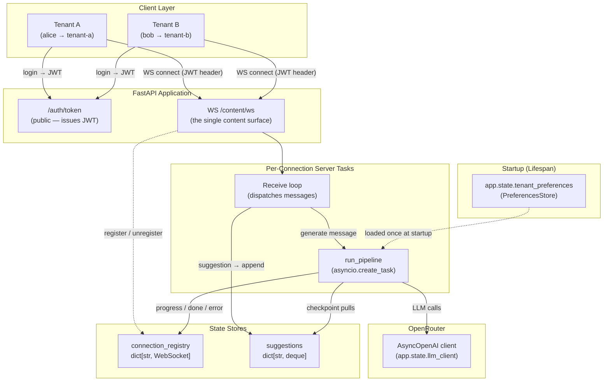
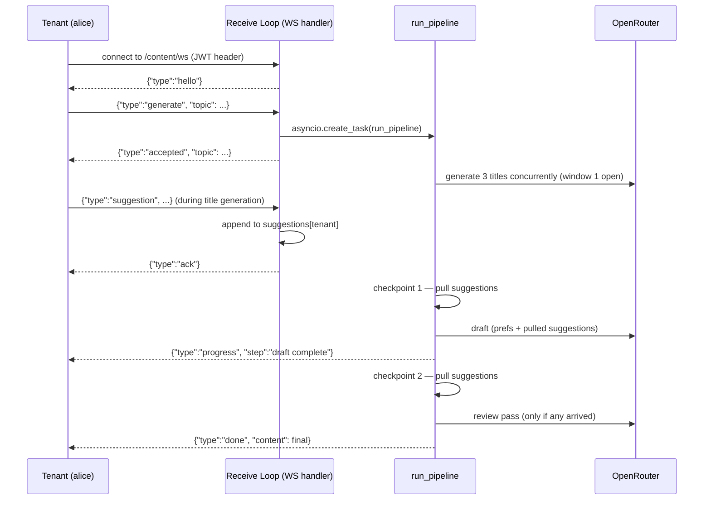

# Lab 13 — Multi-Tenant AI Content Generation Platform

Difficulty: Advanced | ~90 min | Synthesizes Labs 1–12

---

## 2. Problem Statement / Use Case Overview

A content team at a SaaS company needs to generate blog posts, social media copy, and marketing emails for multiple client accounts (tenants). Each tenant has different preferences — some want professional blog posts, others want casual social media captions. Tenants connect, start a generation, and steer it in real time by sending suggestions while the content is being written.

This lab builds exactly that system. It is a **multi-tenant, AI-powered content generation platform** where:

- **Tenants authenticate** via JWT tokens (each token carries a `tenant_id`)
- **The whole content surface is one WebSocket**: `/content/ws` accepts `generate` messages, runs the pipeline as a concurrent task, and streams every event back on the same socket
- **A multi-step pipeline** generates content: title generation (3 concurrent LLM calls), draft creation, and an optional review pass — each making real LLM calls via OpenRouter
- **Tenants can send suggestions** that the pipeline picks up at two deliberate checkpoints: during title generation a suggestion lands in the draft; during drafting it triggers a dedicated review pass
- **Full tenant isolation** is enforced: alice never sees bob's events, and every tenant has their own suggestions deque and preferences
- **Failures are handled gracefully**: a controlled pipeline crash produces a clean `error` event on the socket — no silent crashes

The system combines many concepts from Labs 1–12 into a single working application, demonstrating how individual FastAPI features compose into a production-shaped architecture.

### System Architecture at a Glance



**Diagram 1 — Full system architecture.** Tenants authenticate via the public `/auth/token` endpoint, then connect their WebSocket to `/content/ws` with a JWT in the `Authorization` header. `get_current_tenant` resolves the tenant before the route runs, and the socket is registered in `connection_registry` for the life of the connection. A single receive loop dispatches `generate` messages by spawning `run_pipeline` via `asyncio.create_task`, and appends `suggestion` messages to the tenant's deque. The pipeline and the receive loop run concurrently on the same event loop: the pipeline streams events through `connection_registry`, pulls suggestions at two checkpoints, and calls OpenRouter through the one shared `AsyncOpenAI` client.

---

## 3. Input Data

The platform consumes two kinds of input: HTTP form data for authentication, and JSON WebSocket messages for everything else.

- **Login form data** — `POST /auth/token` accepts `username` and `password` (OAuth2 password-form). Two hardcoded demo users exist: `alice` (`tenant-a`) and `bob` (`tenant-b`); any password is accepted for the demo.
- **`generate` WebSocket message** — `{"type": "generate", "topic": "...", "simulate_failure": false}`. `topic` is a required, non-empty string; `simulate_failure` is an optional boolean that forces the pipeline to fail at the review step (used by Demo 8).
- **`suggestion` WebSocket message** — `{"type": "suggestion", "content": "..."}`. `content` is a required, non-empty steering instruction queued for the next checkpoint.
- **`OPEN_ROUTER_KEY` environment variable** — the OpenRouter API key, read from `.env` (with an interactive `input()` fallback if it is missing).

No external data files, databases, or datasets are used. All content is generated live by the LLM at run time.

---

## 4. Processing

The platform is a single FastAPI app (one lifespan, two routers). Processing happens in five conceptual stages:

1. **Authenticate** — a tenant logs in via `POST /auth/token` and receives a JWT carrying their `tenant_id`.
2. **Connect** — the tenant opens `/content/ws` with the JWT in the `Authorization` header. `get_current_tenant` resolves the tenant before the route runs; the socket registers in `connection_registry` and an empty suggestions deque is created.
3. **Dispatch** — a single receive loop validates every message at the door with Pydantic and routes it:
   - `generate` → `asyncio.create_task(run_pipeline(...))`, then an `accepted` reply
   - `suggestion` → appended to the tenant's deque, then an `ack` reply
   - anything else → an `error` reply
4. **Generate** — `run_pipeline` streams events back through `push_to_tenant`: announce title generation → fire 3 concurrent title calls via `asyncio.gather()` → checkpoint 1 pulls any early suggestions into the draft prompt → write the draft with tenant preferences → checkpoint 2 pulls late suggestions → if any exist, run a review pass → emit `done` (or `error` on exception).
5. **Clean up** — on disconnect the tenant is removed from `connection_registry`; on shutdown the lifespan teardown flips `prefs.is_loaded` to `False`.

The receive loop and the pipeline run concurrently on the same event loop, which is what makes mid-run suggestions physically possible.

---

## 5. Output

The notebook runs all demos sequentially on a real OpenRouter model. Representative output from a clean run:

### Demo 4 — the events stream in real time

```
Reading events (elapsed between events):
  + 0.00s  [progress] generating titles 
  +13.52s  [progress] titles generated **Powering Tomorrow: The Renewable Energy Revolution**
  +18.62s  [progress] draft complete 
  + 0.00s  [done]  **Powering Tomorrow: The Renewable Energy Revolution**
...
4 events total; final content is 3659 chars
```

The increasing deltas between events are the proof: title generation and drafting each take real LLM time, and each progress event arrives the moment its phase finishes — the socket delivers live, rather than replaying a buffer after a blocking call returns.

### Demo 5 — the early suggestion became the opening line

```
accepted: Solar power innovations
event1: progress generating titles
event2: ack 
event3: progress titles generated
event4: progress draft complete
event5: done 
Suggestion ack: ['Focus specifically on solar energy in developing countries']
Suggestions deque after run: []
Final content (first 200 chars):
 # Solar Innovation: Beyond the Panel

Focus specifically on solar energy in developing countries, and a more nuanced story emerges—one not just about hardware, but about resilience, equity, and leapfr
Mentions the suggestion: True
```

The `ack` streams in live (event2, before the title phase even finished); the deque being empty after the run proves the suggestion was consumed exactly once; the content opening with the exact suggestion phrase proves checkpoint 1 fed it into the draft.

### Demo 6 — the late suggestion triggered a review pass

```
event1: ack 
event2: progress draft complete
event3: progress review complete
event4: done 
Events after the late suggestion: ['ack:', 'progress:draft complete', 'progress:review complete']
Review pass happened: True
Suggestions deque after run: []
```

`review complete` only appears when a suggestion arrived after the first checkpoint — the second window genuinely works.

### Demo 7 — two tenants, one server, zero crossover

```
registry before bob: ['tenant-a']
bob logged in, tenant_id: tenant-b
hello: registered as tenant-b
registry with both tenants: ['tenant-a', 'tenant-b']
Isolation step 1: one socket per tenant in the routing table
bob's ack: Focus on hydrothermal vents
alice's deque untouched: []
alice accepted: ['Renewable grid storage']
bob accepted: ['Deep sea exploration']
alice received 5 events, bob received 5 events
Isolation step 2: every event stayed on its tenant's own socket
```

Both tenants generate at the same moment and each receives exactly its own 5-event stream — `push_to_tenant` looks the socket up by tenant key, so nothing from bob's run ever lands on alice's socket.

### Demo 8 — failures are clean events, not crashes

```
Event types: ['accepted', 'progress', 'progress', 'progress', 'error']
Error event: Simulated pipeline failure during review step
```

Cleanup then closes the socket (the disconnect handler empties `connection_registry`), and the proof cell confirms `is_loaded` is `False` after lifespan shutdown.

---

## 6. Tech Stack

- `fastapi==0.112.2` — Web framework; lifespan events, APIRouter, WebSocket, dependencies
- `pydantic==2.8.2` — validates the WebSocket message protocol at the door
- `httpx==0.28.1` — HTTP client (used by TestClient under the hood)
- `openai==3.5.0` — `AsyncOpenAI` client pointed at OpenRouter (`base_url="https://openrouter.ai/api/v1"`)
- `PyJWT==2.12.0` — signs and decodes tenant JWTs (`HS256`)
- `python-multipart==0.0.32` — parses the OAuth2 password form on `/auth/token`
- `python-dotenv==1.2.3` — loads `OPEN_ROUTER_KEY` from `.env`
- `pwdlib[argon2]==0.3.1` — included in the pinned install (password-hashing runtime; not directly invoked in this notebook)

**Model:** `openrouter/free` (OpenRouter free tier) — one full run-through costs approximately $0.00 with a free API key.
**Compute:** runs on a laptop CPU; no GPU required.

---

## 7. Underlying Concepts

This lab teaches **composition over repetition**: every mechanism below is one you have already met in Labs 1–12, now working together in a production-shaped architecture. The concept map below shows which lab introduced each piece; the subsections that follow explain the two ideas that make this platform different from a stack of individual demos.

### Concept Map: Each Component's Home Lab

This table maps each piece of the system back to the lab that introduced the concept, explaining **why** that concept is needed **here** — not just restating what the lab taught.

| System Component | Lab | Why It's Needed Here |
|---|---|---|
| `@asynccontextmanager` lifespan, `app.state` | Lab 12 (Lifespan) | The LLM client and tenant preferences must be built **once** at startup, not per-request. The preferences load includes a simulated slow database call (`asyncio.sleep(2)`) — the kind of genuinely heavy one-time cost that justifies lifespan over per-request initialization. The `is_loaded` flag on shutdown provides concrete, assertable proof that teardown ran. |
| `POST /auth/token`, `get_current_tenant` | Lab 5 (Security) | Every protected route needs to know **which tenant** is making the request. A simple OAuth2 password flow produces a JWT carrying `tenant_id`; the `get_current_tenant` dependency decodes it and returns the tenant. This identity layer makes tenant-scoped state (preferences, suggestions) possible. |
| `Depends(get_current_tenant)` on the WS route | Lab 11 (APIRouter) | The `/content` router applies the dependency per-endpoint, not via router-level `dependencies=[...]`, which does not inject a `WebSocket` into dependencies of WebSocket routes. The `get_current_tenant` function is transport-agnostic: it accepts `request: Request = None` and `websocket: WebSocket = None`, and reads the Authorization header from whichever object FastAPI injects — here always the `WebSocket`. |
| `GenerateMessage`, `SuggestionMessage` + `ValidationError` | Lab 1 (Pydantic) | Every WebSocket message is validated at the door. The `Literal["generate"]` / `Literal["suggestion"]` type field means a message with the wrong `type` fails validation instantly, and the `except` around the dispatch answers it with an `error` event — so the pipeline never misinterprets arbitrary data. |
| `asyncio.create_task` + `asyncio.gather` | Lab 2 (Async/Await) | The receive loop and the pipeline run concurrently on one event loop: the endpoint spawns `run_pipeline` with `asyncio.create_task`, and `generate_titles` fires 3 concurrent LLM calls via `asyncio.gather`. This concurrency is what makes mid-run suggestions physically possible — the pipeline awaits LLM latency while the receive loop keeps consuming messages. |
| `try/except` in the pipeline, safe `push_to_tenant` | Lab 3 (Exception Handling) | The pipeline wraps its whole body in `try/except` and relays failures as `error` events; `push_to_tenant` wraps WebSocket sends so a closed connection can't crash the pipeline. No silent crashes — every failure becomes a visible `error` event. |
| WebSocket `/content/ws` | Lab 8 (WebSockets) | The socket is the entire content surface: control messages in, events out, and the connection lives only as long as the tenant is interested. Disconnect removes the tenant from `connection_registry`, so events stop being routed to them. |

### Concurrency Is the Design That Enables Steering

The single most important concept in this platform is that the pipeline is **not awaited** by the receive loop. The endpoint fires `run_pipeline` with `asyncio.create_task`, so both run concurrently on one event loop: the receive loop keeps consuming messages — including suggestions — while the pipeline awaits LLM latency. Without that, a tenant could never steer a run in progress; they would have to wait for the whole pipeline to finish before their next message was even read.

The two checkpoints are placed exactly where the pipeline yields to the network — right after the title call and right after the draft call — the moments when a suggestion sent mid-run can actually slip in.



**Diagram 2 — The generate/suggest/done flow.** The tenant connects and sends a `generate` message. The receive loop starts the pipeline with `asyncio.create_task` and replies `accepted` immediately. The pipeline and the receive loop now run concurrently, which is what makes steering possible: a suggestion sent *while titles are being generated* is pulled at checkpoint 1 and written into the draft, while a suggestion sent *after drafting started* is pulled at checkpoint 2 and answered with a review pass. Either way an `ack` comes back first, so the tenant knows their input was queued.

Every step — `generate`, `suggestion`, `hello`, `accepted`, `ack`, `progress`, `done`, `error` — is just a JSON message, which is what lets the whole platform rest on a single socket.

### Two Supporting Ideas That Make the Design Clean

- **One dependency that speaks both transports.** `get_current_tenant` declares both `request: Request = None` and `websocket: WebSocket = None` and reads the Authorization header from whichever object FastAPI injects. Here the `WebSocket` branch is the one that runs — on the platform's single content surface — but the `Request` branch costs nothing and would protect any HTTP route added later without a duplicate function.
- **Isolation is a routing table, not a feature.** `connection_registry` is a `dict[str, WebSocket]` and `push_to_tenant` looks the tenant's socket up by key. Demo 7 proves it under load: both tenants generate at the same moment and each receives exactly its own 5-event stream — with a single global socket, the two runs would bleed into each other.

---

## 8. Prerequisites

- Labs 1–12 — in particular Lab 12 (lifespan), Lab 11 (APIRouter), Lab 8 (WebSockets), Lab 5 (security/JWT), Lab 4 (async/await), Lab 1 (Pydantic), and Lab 2 (exception handling).
- A free OpenRouter API key (cost: ~$0.00 per full run on the `openrouter/free` model).
- Comfort with `asyncio.create_task`/`asyncio.gather` and JWT concepts.
- No GPU required; runs on any laptop CPU.

---

## 9. Environment / Dependencies Setup

To run this lab locally, perform the following commands in your shell:

```bash
# Create a fresh virtual environment
python -m venv venv

# Activate the virtual environment (Windows)
.\venv\Scripts\activate

# Install the dependencies (pinned, matching Section 6 and the notebook's first cell)
pip install fastapi==0.112.2 pydantic==2.8.2 httpx==0.28.1 python-dotenv==1.2.3 openai==3.5.0 PyJWT==2.12.0 "pwdlib[argon2]==0.3.1" python-multipart==0.0.32
```

Create a `.env` file in your project root with your OpenRouter key:

```
OPEN_ROUTER_KEY=your_openrouter_api_key_here
```

`JWT_SECRET` is optional — the notebook falls back to a fixed lab-only default (`lab13-dev-secret-not-for-production`) so the lab runs without extra configuration. In production the secret would come from a secrets manager.

---

## 10. Step-wise Development Instructions

The notebook mirrors the steps below exactly; run cells from top to bottom, one step per cell.

### Step 0: Dependency Installation

The first cell installs every pinned dependency in one line, matching Section 9. Run it first so everything is available for the rest of the notebook.

```python
!pip install fastapi==0.112.2 pydantic==2.8.2 httpx==0.28.1 python-dotenv==1.2.3 openai==3.5.0 PyJWT==2.12.0 "pwdlib[argon2]==0.3.1" python-multipart==0.0.32
```

### Step 1: Imports, API Key, and App Setup

The imports bring together FastAPI, Pydantic, OpenAI's async client, PyJWT, and standard-library modules for async context management and collections. Authorization happens over plain HTTP (`POST /auth/token`); the entire content flow happens over the one WebSocket. The API key is loaded from `.env` with an `input()` fallback — the same pattern used in every prior lab. `JWT_SECRET` has a lab-only default; in production it would come from a secrets manager.

```python
from fastapi import (
    FastAPI, Depends, HTTPException, WebSocket, WebSocketDisconnect, Request, APIRouter,
)
from fastapi.security import OAuth2PasswordRequestForm
from fastapi.testclient import TestClient
from pydantic import BaseModel, Field, ValidationError
from typing import Annotated, Literal
from contextlib import asynccontextmanager
from dotenv import load_dotenv
from openai import AsyncOpenAI
from collections import deque
import jwt, os, time, asyncio, json, contextlib

load_dotenv()

api_key = os.getenv("OPEN_ROUTER_KEY")
if not api_key:
    api_key = input("Open Router API key: ")

# Lab-only convenience default. In production, always read from env/secrets manager.
JWT_SECRET = os.getenv("JWT_SECRET", "lab13-dev-secret-not-for-production")
```

### Step 2: Pydantic Models — the WebSocket Message Protocol

Two models define the messages a client may send:

- `GenerateMessage`: `type: Literal["generate"]`, `topic` (required), `simulate_failure` (optional bool)
- `SuggestionMessage`: `type: Literal["suggestion"]` and `content` — a steering instruction

Both are instantiated from raw WebSocket messages with `Model(**data)` inside the endpoint. A message with the wrong `type` or missing fields raises `ValidationError`, which the endpoint catches and answers with an `error` event.

```python
class GenerateMessage(BaseModel):
    type: Literal["generate"]
    topic: str = Field(min_length=1, description="The content topic to generate about")
    simulate_failure: bool = Field(default=False, description="If True, the pipeline fails at the review step")

class SuggestionMessage(BaseModel):
    type: Literal["suggestion"]
    content: str = Field(min_length=1, description="A steering instruction incorporated at the next checkpoint")
```

### Step 3: Module-Level State Stores

Two module-level dictionaries hold per-tenant runtime state:

- `connection_registry`: maps tenant_id → WebSocket connection (registered on connect, removed on disconnect)
- `suggestions`: maps tenant_id → deque of pending suggestion strings (pulled once, exactly, at the checkpoints)

No external database — consistent with every prior lab's simplicity.

```python
connection_registry: dict[str, WebSocket] = {}
suggestions: dict[str, deque] = {}
```

### Step 4: Lifespan — One-Time Startup and Shutdown

The `@asynccontextmanager` lifespan builds two resources at startup:

1. **`app.state.llm_client`**: an `AsyncOpenAI` client pointing at OpenRouter. Lightweight but represents a connection pool — creating once is good practice.
2. **`app.state.tenant_preferences`**: a `PreferencesStore` object containing per-tenant generation defaults (tone, length, style). The `asyncio.sleep(2)` simulates a slow database load — the genuinely heavy one-time cost that justifies lifespan.

On shutdown, `prefs.is_loaded = False` provides concrete, assertable proof that teardown ran.

```python
class PreferencesStore:
    def __init__(self):
        self.is_loaded = False
        self.data: dict[str, dict] = {}

async def load_tenant_preferences():
    """Simulates a slow database/index load — the reason lifespan exists here."""
    await asyncio.sleep(2)
    return {
        "tenant-a": {"tone": "professional", "length": "medium", "style": "blog"},
        "tenant-b": {"tone": "casual", "length": "short", "style": "social"},
    }

@asynccontextmanager
async def lifespan(app: FastAPI):
    # --- startup ---
    app.state.llm_client = AsyncOpenAI(
        api_key=api_key,
        base_url="https://openrouter.ai/api/v1",
    )
    prefs = PreferencesStore()
    prefs.data = await load_tenant_preferences()
    prefs.is_loaded = True
    app.state.tenant_preferences = prefs
    yield
    # --- shutdown ---
    app.state.tenant_preferences.is_loaded = False

app = FastAPI(lifespan=lifespan)
```

### Step 5: Authentication — Token Issuing and Tenant Extraction

Authentication has two parts: a public token-issuing endpoint and a reusable tenant-extraction dependency.

- **`POST /auth/token`** (on the public `/auth` router) accepts OAuth2 form credentials and returns a JWT carrying `tenant_id`.
- **`get_current_tenant`** is a plain async dependency function. It reads the `Authorization` header, decodes the JWT, and returns `tenant_id` — or raises `401` on failure. It is written transport-agnostically: it declares both `request: Request = None` and `websocket: WebSocket = None` and reads the header from whichever object FastAPI injects. On a WebSocket route FastAPI provides the `WebSocket`; on an HTTP route it provides the `Request` — never the other way around, which is why a dependency that accepted only one of the two would be locked to that transport. In this platform the whole content surface is the one WebSocket, so every real call injects the `WebSocket` and the `Request` branch stays dormant — the `None` defaults cost nothing and mean the identical dependency would protect any HTTP route added later.

```python
# Hardcoded users for this demo. In production, hashed passwords live in a database.
users = {
    "alice": {"tenant_id": "tenant-a"},
    "bob":   {"tenant_id": "tenant-b"},
}

def create_token(username: str, tenant_id: str) -> str:
    payload = {
        "sub": username,
        "tenant_id": tenant_id,
        "exp": time.time() + 3600,
    }
    return jwt.encode(payload, JWT_SECRET, algorithm="HS256")

def _extract_tenant_from_headers(headers) -> str:
    """Read the Authorization header, decode the JWT, return tenant_id."""
    auth = headers.get("authorization", "")
    if not auth.startswith("Bearer "):
        raise HTTPException(status_code=401, detail="Missing or malformed Authorization header")
    token = auth[7:]
    try:
        payload = jwt.decode(token, JWT_SECRET, algorithms=["HS256"])
    except jwt.PyJWTError:
        raise HTTPException(status_code=401, detail="Invalid or expired token")
    return payload["tenant_id"]

async def get_current_tenant(
    request: Request = None,
    websocket: WebSocket = None,
) -> str:
    """Extract tenant_id from either an HTTP request or a WebSocket connection.

    FastAPI injects Request for HTTP routes and WebSocket for WS routes.
    Accepting either with a default of None lets one function cover both.
    """
    source = request or websocket
    if source is None:
        raise HTTPException(status_code=401, detail="No request context")
    return _extract_tenant_from_headers(source.headers)
```

```python
auth_router = APIRouter()

@auth_router.post("/token")
async def login(form_data: Annotated[OAuth2PasswordRequestForm, Depends()]):
    user = users.get(form_data.username)
    if not user:
        raise HTTPException(status_code=401, detail="Invalid credentials")
    token = create_token(form_data.username, user["tenant_id"])
    return {"access_token": token, "token_type": "bearer"}

app.include_router(auth_router, prefix="/auth")
```

### Step 6: The Content Router

The `/content` router is declared with `APIRouter()` and hosts a single WebSocket route, so the entire content surface is one authenticated socket. `Depends(get_current_tenant)` is applied at the endpoint because router-level `dependencies=[...]` does not inject `WebSocket` into dependencies of WebSocket routes. The auth router carries no dependency — it stays public.

```python
content_router = APIRouter()
```

### Step 7: The Content Generation Pipeline

The pipeline is the heart of the system. Three small building blocks back it up:

- **`llm_generate(client, prompt)`** — a single wrapper around `client.chat.completions.create()`. Every LLM call (titles, draft, review) funnels through it.
- **`push_to_tenant(tenant_id, message)`** — sends a message to the tenant's registered WebSocket, wrapping the send in `try/except` so a closed connection fails safely.
- **`pull_suggestions(tenant_id)`** — returns and clears the tenant's deque in one step, guaranteeing each suggestion is consumed exactly once.

```python
async def llm_generate(client: AsyncOpenAI, prompt: str) -> str:
    """Send a prompt to the LLM and return the response text."""
    resp = await client.chat.completions.create(
        model="openrouter/free",
        messages=[{"role": "user", "content": prompt}],
    )
    return resp.choices[0].message.content.strip()

async def push_to_tenant(tenant_id: str, message: dict):
    """Send a message to the tenant's WebSocket if connected. Fails safely if not."""
    ws = connection_registry.get(tenant_id)
    if ws:
        try:
            await ws.send_json(message)
        except Exception:
            pass  # Connection closed unexpectedly — don't crash the pipeline

def pull_suggestions(tenant_id: str) -> list[str]:
    """Return and clear the tenant's pending suggestions."""
    pending = list(suggestions.get(tenant_id, []))
    suggestions[tenant_id] = deque()
    return pending
```

`run_pipeline(tenant_id, topic, simulate_failure)` drives the flow:

1. **Title generation**: announces, then fires 3 concurrent LLM calls via `asyncio.gather()` and picks the first title
2. **Checkpoint 1**: announces the chosen title, then pulls any suggestions that arrived during step 1 — these are folded into the draft prompt, which is asked to open with the suggestion phrase
3. **Draft**: calls `llm_generate()` with tenant preferences and any pulled suggestions
4. **Checkpoint 2**: announces the draft, then pulls any suggestions that arrived during drafting
5. **Review pass**: only if step 4 found suggestions — a final `llm_generate()` rewrites the draft in light of them, then announces `review complete`
6. **Completion or failure**: pushes `done` with the final content, or catches any exception and pushes `error`

If `simulate_failure=True`, the pipeline raises at the review step; the `try/except` catches it and relays a clean `error` event — the run fails without crashing the connection.

```python
async def generate_titles(client: AsyncOpenAI, topic: str) -> list[str]:
    """Generate 3 candidate titles concurrently using asyncio.gather()."""
    prompts = [
        f"Give me one short, catchy article title about: {topic}",
        f"Give me one informative article title about: {topic}",
        f"Give me one engaging blog post title about: {topic}",
    ]
    return await asyncio.gather(*[llm_generate(client, p) for p in prompts])

async def run_pipeline(tenant_id: str, topic: str, simulate_failure: bool):
    client: AsyncOpenAI = app.state.llm_client
    prefs: PreferencesStore = app.state.tenant_preferences
    tenant_prefs = prefs.data.get(tenant_id, {})

    try:
        # --- Step A: Announce, then generate titles concurrently ---
        await push_to_tenant(tenant_id, {"type": "progress", "step": "generating titles"})
        titles = await generate_titles(client, topic)
        chosen_title = titles[0]

        # --- Step B: Announce the chosen title (first checkpoint window is now closed) ---
        await push_to_tenant(tenant_id, {
            "type": "progress",
            "step": "titles generated",
            "chosen_title": chosen_title,
        })

        # --- Step C: Checkpoint 1 — fold in suggestions sent during title generation ---
        pending = pull_suggestions(tenant_id)
        suggestion_text = "\n".join(pending) if pending else "None"

        draft_prompt = (
            f"Write a short article draft titled '{chosen_title}'. "
            f"Tone: {tenant_prefs.get('tone', 'neutral')}. "
            f"Length: {tenant_prefs.get('length', 'medium')}. "
            f"Style: {tenant_prefs.get('style', 'blog')}. "
        )
        if pending:
            draft_prompt += f" Begin with the exact phrase of this user suggestion: {suggestion_text}"
        draft = await llm_generate(client, draft_prompt)

        # --- Step D: Announce the draft (second checkpoint window is now closed) ---
        await push_to_tenant(tenant_id, {"type": "progress", "step": "draft complete"})

        # --- Step E: Checkpoint 2 — suggestions that arrived while drafting get a review pass ---
        new_suggestions = pull_suggestions(tenant_id)

        if simulate_failure:
            raise RuntimeError("Simulated pipeline failure during review step")

        if new_suggestions:
            review_prompt = (
                f"Review and improve this draft based on the feedback: {new_suggestions}. "
                f"If it already covers the feedback, keep it. Draft: {draft}"
            )
            draft = await llm_generate(client, review_prompt)
            await push_to_tenant(tenant_id, {
                "type": "progress",
                "step": "review complete",
                "feedback": new_suggestions,
            })

        # --- Step F: Done ---
        await push_to_tenant(tenant_id, {"type": "done", "content": draft})

    except Exception as exc:
        await push_to_tenant(tenant_id, {"type": "error", "content": str(exc)})
```

### Step 8: The WebSocket Endpoint

`/content/ws` is the entire content surface. On connect the dependency resolves the tenant, the socket is registered, and a `hello` event confirms registration. Then a single receive loop dispatches incoming messages, validating each at the door:

- **`generate`** — validated with `GenerateMessage`, then `asyncio.create_task(run_pipeline(...))` starts the pipeline concurrently. The handler replies `accepted` instantly; events stream back through the same socket.
- **`suggestion`** — validated with `SuggestionMessage` and appended to the tenant's deque. An `ack` event confirms it was queued.
- **Anything else** — missing `type`, wrong `type`, missing fields — raises a Pydantic `ValidationError` (or `KeyError`/`ValueError`), which is caught and answered with an `error` event.

On disconnect the tenant is removed from `connection_registry`, so no further events are routed to them.

```python
@content_router.websocket("/ws")
async def websocket_endpoint(
    websocket: WebSocket,
    tenant_id: Annotated[str, Depends(get_current_tenant)],
):
    await websocket.accept()
    connection_registry[tenant_id] = websocket
    suggestions[tenant_id] = deque()

    await websocket.send_json({"type": "hello", "content": f"registered as {tenant_id}"})
    try:
        while True:
            data = await websocket.receive_json()
            try:
                if data["type"] == "generate":
                    msg = GenerateMessage(**data)
                    asyncio.create_task(run_pipeline(tenant_id, msg.topic, msg.simulate_failure))
                    await websocket.send_json({"type": "accepted", "topic": msg.topic})
                elif data["type"] == "suggestion":
                    msg = SuggestionMessage(**data)
                    suggestions[tenant_id].append(msg.content)
                    await websocket.send_json({"type": "ack", "content": msg.content})
                else:
                    raise ValueError(f"Unknown message type: {data['type']}")
            except (ValidationError, KeyError, ValueError) as exc:
                await websocket.send_json({"type": "error", "content": f"Invalid message: {exc}"})
    except WebSocketDisconnect:
        connection_registry.pop(tenant_id, None)

app.include_router(content_router, prefix="/content")
```

### Step 9: Enter the Lifespan Context

Creating `TestClient(app)` without a context manager does **not** trigger lifespan startup. In a normal script you would write `with TestClient(app) as client:`. In a notebook, cells run independently, so we use `contextlib.ExitStack` to enter the TestClient's context manager once and keep the lifespan active across every cell that follows.

```python
_stack = contextlib.ExitStack()
client = _stack.enter_context(TestClient(app))
print("Lifespan startup complete — app.state resources are now available")
```

### Demo 1: Lifespan — Resources Built Once at Startup

We confirm that both `app.state.llm_client` and `app.state.tenant_preferences` exist and are populated — proving these resources were built once at startup, not per-request.

```python
print("LLM client exists:", client.app.state.llm_client is not None)
prefs = client.app.state.tenant_preferences
print("Preferences loaded:", prefs.is_loaded)
print("Tenant preferences:", prefs.data)
```

### Demo 2: Authentication — Login as alice, Get a JWT

POST `/auth/token` with alice's credentials as form data. The returned JWT contains `tenant_id: tenant-a`. We will use this token for all of alice's subsequent requests.

```python
res = client.post("/auth/token", data={"username": "alice", "password": "any"})
alice_token = res.json()["access_token"]
alice_headers = {"Authorization": f"Bearer {alice_token}"}

print("Status:", res.status_code)
print("Token (first 30 chars):", alice_token[:30] + "...")
claims = jwt.decode(alice_token, JWT_SECRET, algorithms=["HS256"])
print("Tenant ID from token:", claims["tenant_id"])
```

### Demo 3: Open the WebSocket and Start a Generation

alice opens her WebSocket to `/content/ws` with her JWT in the `Authorization` header. The dependency resolves `tenant-a` before the route runs, and the socket sends a `hello` event to confirm registration. Then a `generate` message starts the pipeline — the server replies `accepted` immediately and runs the pipeline as its own concurrent task.

```python
ws = client.websocket_connect("/content/ws", headers=alice_headers).__enter__()
print("hello:", ws.receive_json())

print("tenant-a registered:", "tenant-a" in connection_registry)

ws.send_json({"type": "generate", "topic": "The future of renewable energy"})
print("accepted:", ws.receive_json())
```

### Demo 4: Read Events as They Stream In

The pipeline pushes `progress` events, then a `done` event. Because the client is no longer waiting on an HTTP call, the events arrive one by one on the socket — the elapsed time between them reflects real work, proving delivery is live and incremental, not buffered up front.

```python
events = []
last = time.perf_counter()
print("Reading events (elapsed between events):")
while True:
    event = ws.receive_json()
    now = time.perf_counter()
    dt = now - last
    last = now
    events.append(event)
    shown = event.get("content") or event.get("chosen_title") or ""
    print(f"  +{dt:5.2f}s  [{event['type']}] {event.get('step', '')} {shown[:80]}")
    if event["type"] == "done":
        break

print(f"\n{len(events)} events total; final content is {len(events[-1]['content'])} chars")
```

### Demo 5: Suggestion Sent Early — Draft Incorporates It (Checkpoint 1)

A fresh run: this time a suggestion is sent right after `generate`, while the pipeline is still producing titles — the slowest phase, three concurrent LLM calls. The suggestion is therefore sitting in the deque when checkpoint 1 runs, and the draft prompt is asked to open with it. When the run finishes, the deque is empty: the suggestion was consumed exactly once.

```python
suggestions["tenant-a"] = deque()  # start the demo with a clean buffer


ws.send_json({"type": "generate", "topic": "Solar power innovations"})
print("accepted:", ws.receive_json()["topic"])

# Sent while the title phase (3 concurrent LLM calls) is still running:
ws.send_json({"type": "suggestion", "content": "Focus specifically on solar energy in developing countries"})

events5 = []
while True:
    event = ws.receive_json()
    events5.append(event)
    print(f"event{len(events5)}: {event['type']} {event.get('step', '')}")
    if event["type"] == "done":
        break

acks = [e["content"] for e in events5 if e["type"] == "ack"]
print("Suggestion ack:", acks)
print("Suggestions deque after run:", list(suggestions.get("tenant-a", [])))
assert not suggestions["tenant-a"], "The pipeline should have consumed the suggestion"

final5 = events5[-1]["content"]
print("Final content (first 200 chars):\n", final5[:200])
print("Mentions the suggestion:", "developing countries" in final5.lower())
```

### Demo 6: Suggestion Sent After Drafting Started — Review Pass (Checkpoint 2)

A suggestion sent *after* the first checkpoint has already run cannot reach the draft — that window closed. Instead it is picked up by checkpoint 2, which triggers a dedicated review pass that rewrites the draft in light of the feedback. Watch for the `review complete` event: it only appears when a late suggestion arrived.

```python
suggestions["tenant-a"] = deque()  # clean buffer again


ws.send_json({"type": "generate", "topic": "Urban air quality monitoring"})

# Wait until the first checkpoint has closed, then send a suggestion mid-draft.
while True:
    event = ws.receive_json()
    if event.get("step") == "titles generated":
        break
ws.send_json({"type": "suggestion", "content": "Emphasize low-cost sensors for developing cities"})

events6 = []
while True:
    event = ws.receive_json()
    events6.append(event)
    print(f"event{len(events6)}: {event['type']} {event.get('step', '')}")
    if event["type"] == "done":
        break

steps = [f"{e['type']}:{e.get('step', '')}" for e in events6 if e["type"] != "done"]
print("Events after the late suggestion:", steps)
print("Review pass happened:", any(e.get("step") == "review complete" for e in events6))
print("Suggestions deque after run:", list(suggestions.get("tenant-a", [])))
assert not suggestions["tenant-a"], "The late suggestion should have been consumed by checkpoint 2"
```

### Demo 7: Tenant Isolation — Two Tenants, One Server

alice's socket stays open while bob logs in and opens his own, so both tenants are live on the same server at once. The proof is structural: `connection_registry` holds a distinct socket per tenant; bob's suggestion is acked on *his* socket and lands in *his* deque; and — the strongest check — both tenants send `generate` at the same moment and each receives exactly its own 5-event stream.

```python
# alice's socket stays open — isolation has to hold with BOTH tenants connected.
print("registry before bob:", list(connection_registry.keys()))

# Login as bob
res_bob = client.post("/auth/token", data={"username": "bob", "password": "any"})
bob_token = res_bob.json()["access_token"]
bob_headers = {"Authorization": f"Bearer {bob_token}"}
print("bob logged in, tenant_id:", jwt.decode(bob_token, JWT_SECRET, algorithms=["HS256"])["tenant_id"])

# Open bob's WebSocket while alice's is still open
ws_bob = client.websocket_connect("/content/ws", headers=bob_headers).__enter__()
print("hello:", ws_bob.receive_json()["content"])
print("registry with both tenants:", list(connection_registry.keys()))

# The routing table holds a distinct socket per tenant
assert len(connection_registry) == 2
assert connection_registry["tenant-a"] is not connection_registry["tenant-b"]
print("Isolation step 1: one socket per tenant in the routing table")

# bob's suggestion is acked on HIS socket and lands in HIS deque
ws_bob.send_json({"type": "suggestion", "content": "Focus on hydrothermal vents"})
print("bob's ack:", ws_bob.receive_json()["content"])
print("alice's deque untouched:", list(suggestions.get("tenant-a", [])))
assert not suggestions.get("tenant-a"), "bob's suggestion must not touch alice's buffer"

# Now BOTH tenants generate at the same time, on the same server.
ws.send_json({"type": "generate", "topic": "Renewable grid storage"})
ws_bob.send_json({"type": "generate", "topic": "Deep sea exploration"})

alice_events, bob_events = [], []
alice_done, bob_done = False, False
while not (alice_done and bob_done):
    if not alice_done:
        event = ws.receive_json()
        alice_events.append(event)
        alice_done = event["type"] == "done"
    if not bob_done:
        event = ws_bob.receive_json()
        bob_events.append(event)
        bob_done = event["type"] == "done"

print("alice accepted:", [e["topic"] for e in alice_events if e["type"] == "accepted"])
print("bob accepted:", [e["topic"] for e in bob_events if e["type"] == "accepted"])
assert [e["topic"] for e in alice_events if e["type"] == "accepted"] == ["Renewable grid storage"]
assert [e["topic"] for e in bob_events if e["type"] == "accepted"] == ["Deep sea exploration"]

# If events were routed through a single global socket, each side would have received the
# other's progress/done events too. Exactly 5 events each means nothing crossed.
print(f"alice received {len(alice_events)} events, bob received {len(bob_events)} events")
assert len(alice_events) == 5 and len(bob_events) == 5
print("Isolation step 2: every event stayed on its tenant's own socket")
```

### Demo 8: Controlled Failure — the Handled Error Path

alice (still connected from the earlier demos) triggers a generation with `simulate_failure=True`. The pipeline runs normally through the draft, then raises at the review step. The exception is caught inside `run_pipeline` and relayed to the socket as an `error` event — the run fails cleanly and the connection stays usable.

```python
# Close bob's WS; alice's socket from the earlier demos is still connected
ws_bob.__exit__(None, None, None)
# bob's disconnect handler removes tenant-b from connection_registry

suggestions["tenant-a"] = deque()  # clean buffer for the failure run

ws.send_json({"type": "generate", "topic": "Quantum computing basics", "simulate_failure": True})

fail_events = []
while True:
    event = ws.receive_json()
    fail_events.append(event)
    if event["type"] == "error":
        break

print("Event types:", [e["type"] for e in fail_events])
print("Error event:", fail_events[-1]["content"])
```

### Cleanup: Close WebSocket Connections

Close the open WebSocket connections. This triggers the `WebSocketDisconnect` handler, which removes the entries from `connection_registry`.

```python
ws.__exit__(None, None, None)
print("Connections after cleanup:", list(connection_registry.keys()))
```

```python
ws_bob.__exit__(None, None, None)
print("Connections after cleanup:", list(connection_registry.keys()))
```

### Proof: Teardown Ran

Exiting the ExitStack triggers the TestClient's `__exit__`, which triggers the lifespan shutdown code. We then assert that `is_loaded` is `False` — concrete proof that teardown genuinely executed.

```python
_stack.close()  # triggers lifespan shutdown
assert not client.app.state.tenant_preferences.is_loaded, "Expected is_loaded=False after shutdown"
print("Teardown verified: tenant_preferences.is_loaded is False after lifespan shutdown")
```

---

## 11. Optional Exercise

Add a new HTTP route to the content router — `GET /content/preferences` — that returns the current tenant's generation preferences from `app.state.tenant_preferences`. Protect it with the **same** `Depends(get_current_tenant)` dependency already used on the WebSocket route (declare it at the endpoint, as in Step 8), then prove it works: log in as alice, call the route with her JWT in the `Authorization` header, and verify it returns `{"tone": "professional", "length": "medium", "style": "blog"}` — and returns `401` when the header is missing. For the first time, FastAPI injects the `Request` object into `get_current_tenant`, exercising the otherwise-dormant `Request` branch — confirming the dependency really is transport-agnostic with zero changes.

---

## 12. What We Learnt

- **Composition over repetition.** One `get_current_tenant` dependency protects the whole platform after login, without repeating JWT decoding logic. Because it accepts `Request` or `WebSocket`, the same function works whether a route speaks HTTP or WebSocket — no transport-specific duplicate needed.

- **One socket can be the whole API.** With a client-to-server message protocol (`generate`, `suggestion`) and server events (`hello`, `accepted`, `ack`, `progress`, `done`, `error`), every capability lives on a single WebSocket. Connection state is per-session and cleaned up on disconnect, which keeps the tenant namespace tidy.

- **Concurrency is what makes steering possible.** `asyncio.create_task` runs the pipeline beside the receive loop, so a client can send a suggestion *while the pipeline is mid-flight*. The two checkpoint windows (title phase → draft, draft phase → review pass) are placed exactly where the pipeline yields to the network — the moments when a suggestion can actually slip in.

- **Lifespan is for genuinely heavy resources.** The `asyncio.sleep(2)` simulating a database load makes a stronger case for lifespan than a lightweight client object alone. The `is_loaded` flag on shutdown provides concrete proof teardown ran.

- **Pydantic works beyond HTTP.** Validating WebSocket messages with `Literal`-typed models catches bad `type` values at the door; the endpoint answers malformed input with an `error` event. One validation discipline across every transport.

- **Isolation is a routing table, not a feature.** `connection_registry` is a `dict[str, WebSocket]`, and `push_to_tenant` looks the tenant's socket up by key. Demo 7 proves it under load: both tenants generate at the same moment and each receives exactly its own 5-event stream — with a single global socket, the two runs would bleed into each other.

- **Defensive error handling prevents silent failures.** `push_to_tenant` swallows closed-connection errors, and the pipeline relays every failure as an `error` event. A tenant always finds out — and the connection stays usable afterward.