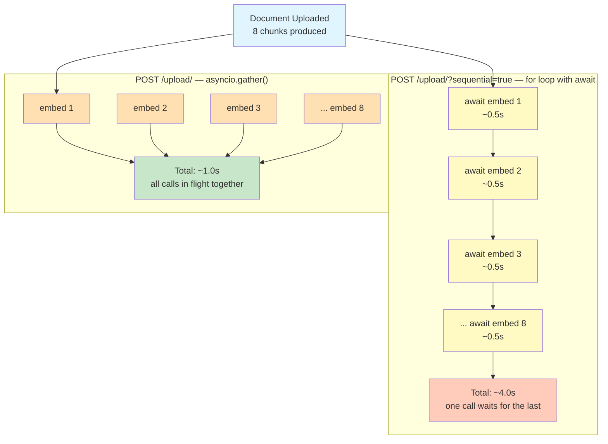

# Lab 2 — Async/Await and File Upload for a Document Q&A Pipeline

Difficulty: Beginner | ~35-40 min

---

## 2. Problem Statement / Use Case Overview

When building AI-powered document Q&A systems, you upload a file and split it into chunks, then embed each chunk into a vector for later search. FastAPI's `UploadFile` type handles the upload — it gives you a file-like object with async read, so even large files arrive without blocking the event loop. Embedding is a network call to an external API — each call takes a few hundred milliseconds to several seconds. If you embed 8 chunks one after another, the total wait is the sum of all 8 calls. But each call is independent — there is no reason to wait for one to finish before starting the next.

FastAPI lets you declare an endpoint with `async def`, which means it runs on the event loop and can handle concurrent I/O. Inside that endpoint, `asyncio.gather()` launches all the embedding calls at once. The total time drops to roughly the duration of the slowest single call, not the sum. This lab demonstrates the difference with real API calls so you can measure it.

---

## 3. Input Data

- **Source**: A plain text file (`sample_text_file.txt`) read from disk
- **Chunk size**: 200 characters (no overlap), producing exactly 8 chunks
- **File type**: `.txt` only — no PDF parsing. This is a deliberate scoping choice to keep the focus on async behavior rather than file-format parsing.
- **Real API calls**: This lab uses Google AI Studio's free tier. Embedding and chat calls cost ~$0 but are subject to Google's rate limits. You will need a free API key (see Section 9).

---

## 4. Processing

The pipeline executes the following steps:

1. **File Upload**: The user uploads a `.txt` file to the `/upload/` endpoint with a `sequential` query parameter.
2. **Chunking**: The file text is split into fixed-size chunks of 200 characters (no overlap, no external library).
3. **Embedding**: Each chunk is converted into a vector (embedding) using Google's `gemini-embedding-001` model. This is the step where sequential and concurrent diverge — one calls the API 8 times in a row, the other launches all 8 at once.
4. **Storage**: Each chunk and its embedding are stored in a plain module-level list.
5. **Query**: When a question arrives, it is embedded, compared against all stored embeddings using cosine similarity, and the top 5 most similar chunks are retrieved.
6. **Answer Generation**: The retrieved chunks are passed as context to `gemini-3.6-flash`, which generates an answer based on the document.

---

## 5. Output

The notebook produces a combined demonstration in a single cell:

```
Sequential: 8 chunks in 4.21s
Concurrent: 8 chunks in 0.97s

Concurrent was 4.3x faster for 8 chunks

Question: What advantage does asyncio.gather provide for document processing?

Retrieved sources:

Answer: Based on the provided context, `asyncio.gather` allows multiple requests to launch simultaneously so that the total wall time approaches that of a single request (without blocking the server).
```

Actual timings depend on network latency and Google API response times. The exact numbers in the Mermaid diagram (Section 7) are illustrative — your real output may differ.

---

## 6. Tech Stack

- `fastapi` — Web framework with native async support
- `pydantic` — Data validation (required by FastAPI)
- `httpx` — HTTP client (powers FastAPI's TestClient)
- `google-genai==1.29.0` — Google GenAI SDK (async client via `client.aio`)
- `python-dotenv` — Load API keys from `.env` file
- `python-multipart` — Required by FastAPI for `UploadFile` form data parsing
- `numpy` — Vector math for cosine similarity
- **Embedding model**: `gemini-embedding-001` (Google AI Studio free tier, ~$0 cost)
- **Chat model**: `gemini-3.6-flash` (Google AI Studio free tier, ~$0 cost)
- **No external vector database** — stored in a plain Python list

---

## 7. Underlying Concepts

### The `async def` vs `def` Choice in FastAPI

When you declare a path operation function in FastAPI, you choose between `def` and `async def`. This is not just a syntax preference — it determines how FastAPI executes your code:

- **`def`**: FastAPI runs your function in a **threadpool**. The function blocks its thread while waiting on I/O, but the event loop stays free to handle other requests on different threads.
- **`async def`**: FastAPI runs your function **directly on the event loop**. The function can `await` other async operations (like database queries or API calls) without blocking anything — the event loop switches to other tasks while waiting.

For endpoints that spend most of their time **waiting on external resources** (network calls, database queries) rather than doing CPU computation, `async def` is the right choice. It lets the endpoint cooperate with the event loop instead of monopolizing a thread.

### From `async def` to Actual Concurrency

Declaring an endpoint as `async def` opens the door to concurrency — but it does not automatically make your code concurrent. Consider two patterns inside an `async def` endpoint:

**Pattern 1: Sequential await in a loop**
```python
for chunk in chunks:
    embedding = await embed(chunk)   # blocks until this call finishes
```
Each `await` pauses the function until the API responds. The next call does not start until the previous one finishes. This is technically correct (you are using `await`), but it is **sequential** — the total time is the sum of all calls.

**Pattern 2: `asyncio.gather()`**
```python
embeddings = await asyncio.gather(*[embed(c) for c in chunks])
```
`asyncio.gather()` takes multiple awaitable objects and **starts them all at once** on the event loop. While one call is waiting on a network response, the event loop starts the next one, and the next, and so on. All calls are in flight simultaneously. The total time is close to the duration of the slowest single call.

**The takeaway**: FastAPI gives you the `async def` door. `asyncio.gather()` is what you do once you walk through it. Using `await` alone in a loop does not produce concurrency — it just produces sequential code that happens to be async-compatible.

### Why This Matters for AI Engineering

Document ingestion for AI apps — uploading a file, chunking it, embedding each chunk — involves multiple independent, slow API calls. Calling them one at a time wastes real time waiting on each response before starting the next. An async FastAPI endpoint with `asyncio.gather()` lets these independent calls run concurrently, cutting wall-clock time substantially with no change to what is actually computed.

### Vector Embeddings and Cosine Similarity

A **vector embedding** converts text into a list of numbers (a vector) that captures its meaning. Similar texts produce similar vectors. **Cosine similarity** measures how close two vectors point in the same direction — a score near 1.0 means very similar meaning, near 0.0 means unrelated. We use this to find the document chunks most relevant to a user's question.

### UploadFile and TestClient

FastAPI's `UploadFile` type lets you accept file uploads directly in a path operation. When a client sends a `multipart/form-data` request, FastAPI parses the form data and hands you an `UploadFile` object — a file-like interface with an async `read()` method. Internally, `UploadFile` uses a **spooled file**: small uploads stay in memory for speed, while larger ones are automatically spilled to a temporary disk file so you never run out of RAM. This means your endpoint can handle everything from a few KB of text to multi-GB images without running out of memory. Because `read()` is async, even the disk-backed path cooperates with the event loop. `TestClient` (built on HTTPX) lets you send requests to your FastAPI app inside a notebook without starting a live server — useful for testing and demos.

### The Timing Comparison Visualized

Both the sequential and concurrent modes embed the exact same 8 chunks using the exact same `embed` function — the only difference is how the await calls are arranged. Here's what that arrangement changes:



The sequential mode is still async def, and it's still using await correctly — but each await blocks the next one from starting. asyncio.gather() starts all the calls before waiting on any of them, so the total time is close to the slowest single call, not the sum of all of them. This is the difference between an endpoint that's technically async and one that's actually concurrent.

The illustrative numbers above (~4.0s vs ~1.0s) depend on network latency and Google API response times — your real timings will differ.

---

## 8. Prerequisites

- **A free Google AI Studio API key** — get one at https://aistudio.google.com/apikey
- The key must be set in a `.env` file as `GOOGLE_API_KEY`, or you will be prompted to enter it at runtime (see Section 9)
- Basic familiarity with Python async/await syntax (helpful but not required — the lab explains it)

---

## 9. Environment / Dependencies Setup

To run this lab locally, perform the following steps:

```bash
# Create a fresh virtual environment
python -m venv venv

# Activate the virtual environment (Windows)
.\venv\Scripts\activate

# Install the dependencies
pip install fastapi pydantic httpx google-genai==1.29.0 python-dotenv python-multipart numpy
```

Then create a `.env` file in the same folder as this notebook:

```
GOOGLE_API_KEY=your_key_here
```

Get a free key at https://aistudio.google.com/apikey. If you are using version control, add `.env` to your `.gitignore` to avoid committing your key.

If no `GOOGLE_API_KEY` is found in the environment or `.env` file, the notebook will prompt you to enter it at runtime.

---

## 10. Step-wise Development Instructions

### Cell 1: Dependency Installation

Installs every library this lab needs in a single command. Run this first.

```python
!pip install fastapi pydantic httpx google-genai==1.29.0 python-dotenv python-multipart numpy
```

### Cell 2: Imports and Client Setup

We import the modules we need, load the API key from `.env` (or prompt for it), and initialize the Google GenAI client. NumPy is used for cosine similarity calculations.

```python
import time
import os
import asyncio
from dotenv import load_dotenv
from fastapi import FastAPI, UploadFile
from fastapi.testclient import TestClient
from google import genai
import numpy as np

# Load GOOGLE_API_KEY from .env file in the current directory
load_dotenv()

api_key = os.getenv("GOOGLE_API_KEY")

if not api_key:
    api_key = input("Enter your Google API key: ")

# The client picks up GOOGLE_API_KEY from the environment automatically
client = genai.Client(api_key=api_key)
```

### Cell 3: Text Chunking

Before embedding, we split the document into fixed-size character chunks. Each chunk becomes one embedding vector. We use 200 characters with no overlap — simple, no external library needed.

```python
def chunk_text(text, chunk_size = 200):
    """Split text into fixed-size chunks with no overlap."""
    chunks = []
    for i in range(0, len(text), chunk_size):
        chunks.append(text[i:i + chunk_size])
    return chunks
```

### Cell 4: Embed a Single Chunk

This is the core API call. We use the **async** client (`client.aio`) to embed a single text chunk. This is what makes real concurrency possible — the `await` yields control back to the event loop while the network call is in flight.

```python
async def embed(text):
    """Embed text using the async Google GenAI client."""
    # Use the async client — this is what makes real concurrency possible
    response = await client.aio.models.embed_content(
        model="gemini-embedding-001",
        contents=text,
    )
    # response.embeddings is a list; for one input, take the first (and only) item
    return response.embeddings[0].values
```

### Cell 5: Sequential Embedding

This function embeds every chunk **one at a time**. We wrap the loop with `time.time()` to measure the total time. Even though the function is `async def`, using `await` inside a `for` loop still runs calls sequentially.

```python
async def embed_all_sequential(chunks):
    """Embed chunks one at a time. Returns (embeddings, elapsed_seconds)."""
    embeddings = []
    start = time.time()
    for chunk in chunks:
        embedding = await embed(chunk)
        embeddings.append(embedding)
    elapsed = time.time() - start
    return embeddings, elapsed
```

### Cell 6: Concurrent Embedding

This is the key difference. `asyncio.gather()` **starts all the embed calls at once** before waiting on any of them. All 8 network requests are in flight simultaneously, so the total time is close to the duration of the slowest single call, not the sum of all 8.

```python
async def embed_all_concurrent(chunks):
    """Embed all chunks concurrently. Returns (embeddings, elapsed_seconds)."""
    start = time.time()
    # Launch all embed calls at once — they all run in parallel
    embeddings = await asyncio.gather(*[embed(c) for c in chunks])
    elapsed = time.time() - start
    return list(embeddings), elapsed
```

### Cell 7: Cosine Similarity

Cosine similarity measures how close two vectors point in the same direction, regardless of their length. A score near 1.0 means very similar; near 0.0 means unrelated. We use NumPy for efficient vector math.

```python
def cosine_similarity(a, b):
    similarity = np.dot(a, b) / (np.linalg.norm(a) * np.linalg.norm(b))
    return similarity
```

### Cell 8: Retrieve Top-K Chunks

Given a query embedding and a list of stored chunks (each with their precomputed embeddings), we score every chunk against the query and return the top `k` matches. This is the retrieval step of a RAG pipeline.

```python
def retrieve_top_k(query_embedding, stored_chunks, k=3):
    """Return the k chunks most similar to the query embedding."""
    scored = []
    for chunk in stored_chunks:
        score = cosine_similarity(query_embedding, chunk["embedding"])
        scored.append((score, chunk))
    scored.sort(key=lambda pair: pair[0], reverse=True)
    return [chunk for score, chunk in scored[:k]]
```

### Cell 9: Generate an Answer

We build a prompt combining the retrieved context chunks with the user's question, then send it to the LLM. The model reads the context and answers based on it — this is the generation step of a RAG pipeline.

```python
async def generate_answer(question, context_chunks):
    """Generate an answer using retrieved context chunks."""

    context = "\n\n".join([c["text"] for c in context_chunks])
    prompt = f"Context:\n{context}\n\nQuestion: {question}\n\nAnswer based on the context:"

    response = await client.aio.models.generate_content(
        model="gemini-3.6-flash",
        contents=prompt
    )
    return response.text
```

### Cell 10: Upload Endpoint

This endpoint accepts a file upload with an optional `sequential` query parameter. When `sequential=true`, chunks are embedded one at a time. Otherwise, `asyncio.gather()` embeds all chunks concurrently.

```python
# Simple in-memory store — each entry holds a text chunk and its embedding vector
document_store = []

app = FastAPI()

@app.post("/upload/")
async def upload(file: UploadFile, sequential: bool = False):
    """Upload a file and embed its chunks one at a time."""

    text = (await file.read()).decode("utf-8")
    chunks = chunk_text(text)
    
    if sequential:
        embeddings, elapsed = await embed_all_sequential(chunks)
    else:
        embeddings, elapsed = await embed_all_concurrent(chunks)

    # Store each chunk paired with its embedding
    for chunk_text_val, emb in zip(chunks, embeddings):
        document_store.append({"text": chunk_text_val, "embedding": emb})
        
    return {"chunk_count": len(chunks), "elapsed_seconds": round(elapsed, 2)}
```

### Cell 11: Query Endpoint

The query endpoint ties everything together: embed the question, retrieve the most relevant chunks, pass them as context to the LLM, and return the answer along with source texts.

```python
@app.post("/query")
async def query(question: str):
    """Answer a question using stored document chunks."""
    q_emb = await embed(question)
    top_chunks = retrieve_top_k(q_emb, document_store, k=5)

    answer = await generate_answer(question, top_chunks)
    
    return {"answer": answer, "sources": [c["text"] for c in top_chunks]}
```

### Cell 12: Demo — Sequential vs Concurrent Upload + Query

We use `TestClient` as a context manager (`with` statement) to test all endpoints. This ensures the event loop is managed correctly across multiple async requests. We upload to the endpoint sequentially and concurrently with the same text — the timing difference is the core lesson. Finally, we test the full RAG pipeline with a question.

```python
# Read the sample document from disk
with open("sample_text_file.txt", "rb") as f:
    file_bytes = f.read()

with TestClient(app) as test_client:
    # Sequential: each await blocks the next call
    files = {"file": ("sample_text_file.txt", file_bytes, "text/plain")}
    seq_data = test_client.post("/upload/?sequential=true", files=files).json()
    print(f"Sequential: {seq_data['chunk_count']} chunks in {seq_data['elapsed_seconds']}s")

    # Concurrent: all calls launched at once via asyncio.gather()
    files = {"file": ("sample_text_file.txt", file_bytes, "text/plain")}
    con_data = test_client.post("/upload/", files=files).json()
    print(f"Concurrent: {con_data['chunk_count']} chunks in {con_data['elapsed_seconds']}s")

    speedup = seq_data['elapsed_seconds'] / con_data['elapsed_seconds']
    print(f"\nConcurrent was {speedup:.1f}x faster for {seq_data['chunk_count']} chunks")

    # Query: ask a question answerable from the uploaded document
    question = "What advantage does asyncio.gather provide for document processing?"
    query_data = test_client.post(f"/query?question={question}").json()

print("\nQuestion:", question)
print("\nRetrieved sources:")
print(f"\nAnswer: {query_data['answer']}")
```

---

## 11. Optional Exercise

Change `chunk_size` from 200 to 100 (this roughly doubles the number of chunks). Embed all chunks both sequentially and concurrently, then compare how each approach scales. You should find that sequential time roughly doubles while concurrent time barely changes.

---

## 12. What We Learnt

- Why the `async def` vs `def` choice on a FastAPI path operation matters — it determines whether the endpoint runs on the event loop or in a threadpool
- How `UploadFile` lets FastAPI accept file uploads directly, testable via TestClient without a real server
- Why using `await` alone in a sequential loop does not produce concurrency by itself
- How `asyncio.gather()` achieves real concurrency for independent I/O calls once you're inside an async endpoint
- Why this distinction matters specifically for AI ingestion pipelines with many independent embedding calls
