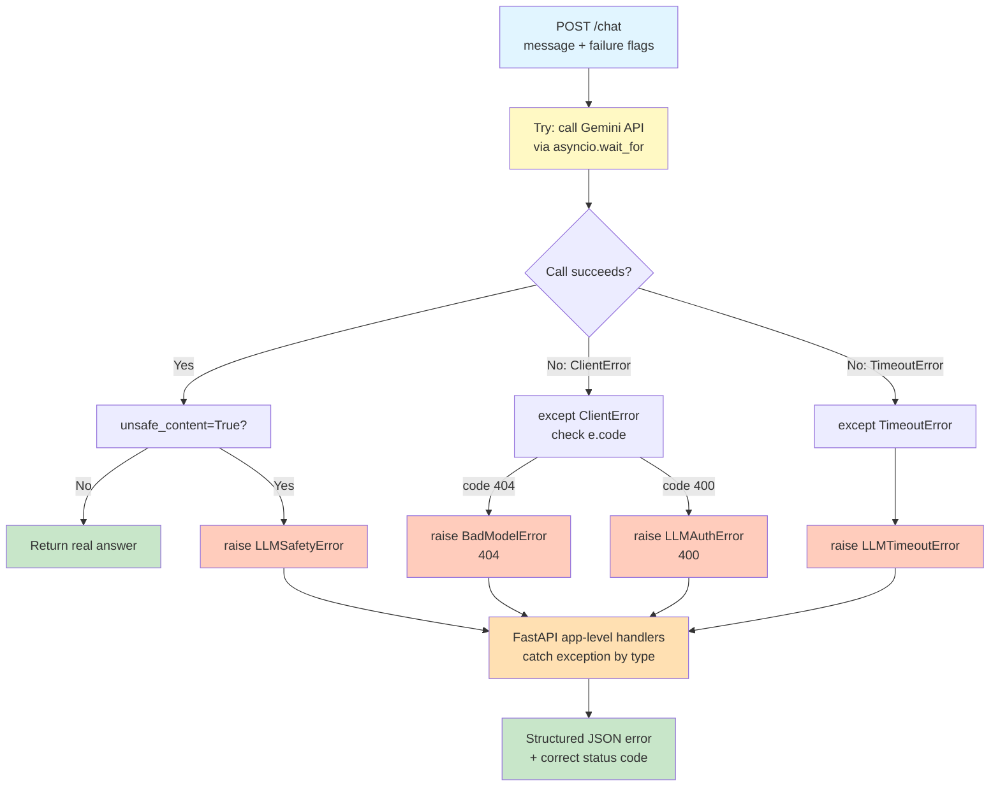

# Lab 3 — Exception Handling In FastAPI

Difficulty: Beginner | ~35-40 min

---

## 1. Lab Title

Exception Handling In FastAPI

---

## 2. Problem Statement / Use Case Overview

When your AI backend calls an external LLM provider like Google Gemini, the call can fail in ways that traditional REST APIs never have to plan for. A model name gets deprecated. The API key expires. The model takes too long to respond. And most distinctively — the API call technically succeeds but the provider's safety filters silently block the content, returning nothing usable. A production AI backend needs to catch all four of these upstream failures and return structured error responses instead of raw crashes. This lab teaches you how to build that using custom exception classes and FastAPI's `@app.exception_handler()` decorators.

---

## 3. Input Data

The input to this lab is a single user message sent to a `/chat` endpoint as a query parameter. No file uploads, databases, or external datasets are involved. The data flows through the Gemini API and back:

- **message**: A text string sent to the Gemini model (e.g., `"What is the capital of France?"`).
- **Failure flags**: Boolean query parameters (`deprecated_model`, `timeout_error`, `bad_key`, `unsafe_content`) that each trigger a different upstream failure mode for demonstration purposes.

This lab calls the real Gemini API using a free-tier API key. Cost per full run-through is approximately $0.00 (free tier).

---

## 4. Processing

The pipeline runs through a single `POST /chat` endpoint with the following logic:

1. **Parse flags**: Read the boolean query parameters to decide which model name, timeout, and API key to use.
2. **Create a fresh Gemini client**: A new `genai.Client` is created per request to avoid event-loop binding issues when using `TestClient` in a notebook.
3. **Try the Gemini call**: Call `generate_content` wrapped in `asyncio.wait_for` with either a normal (20s) or artificial (0.1s) timeout.
4. **Check for safety block**: If `unsafe_content=True`, directly raise `LLMSafetyError` (simulates a silent safety filter rejection).
5. **Return answer**: If the call succeeds and content is safe, return the model's answer.
6. **Catch upstream errors**: `ClientError` with code 404 → `BadModelError`; code 400 → `LLMAuthError`. `asyncio.TimeoutError` → `LLMTimeoutError`. Each custom exception is caught by its registered `@app.exception_handler()`, which returns a structured JSON error with the correct HTTP status code.

---

## 5. Output

The endpoint produces five distinct outputs depending on which flag is set:

1. **Success (no flags)**: HTTP `200 OK` with `{"answer": "Paris is the capital of France."}` (or similar real Gemini response).
2. **Bad model (`deprecated_model=True`)**: HTTP `404 Not Found` with `{"error": "Model Not found", "message": "Model name is not valid"}`.
3. **Timeout (`timeout_error=True`)**: HTTP `504 Gateway Timeout` with `{"error": "Request Timed Out", "message": "Gemini API timed out"}`.
4. **Unsafe content (`unsafe_content=True`)**: HTTP `502 Bad Gateway` with `{"error": "unsafe content", "message": "unusable content returned"}`.
5. **Bad key (`bad_key=True`)**: HTTP `401 Unauthorized` with `{"error": "authorization error", "message": "Unable to authenticate with Gemini API"}`.

---

## 6. Tech Stack

- `fastapi==0.112.2` — Web framework with built-in exception handling
- `pydantic==2.8.2` — Request/response validation (used by FastAPI internally)
- `httpx==0.28.1` — HTTP client (used by TestClient under the hood)
- `google-genai==1.29.0` — Google Gemini Python SDK
- `python-dotenv==1.2.3` — Loads API keys from `.env` files

---

## 7. Underlying Concepts

### Why AI Backends Need Special Exception Handling

Traditional REST APIs talk to databases or internal services where failures are well-understood: connection refused, timeout, 500. AI backends talk to external LLM providers where failures are **AI-specific**: a model name that was deprecated last week, a response that takes 30 seconds instead of 2, an expired API key — and most distinctively, a response where the API call technically succeeds (HTTP 200) but the provider's safety filters silently blocked the content, leaving you with nothing usable. Handling all four gracefully, with structured JSON error responses instead of raw crashes, is what separates a production AI backend from a demo.

### Custom Exception Classes

Each upstream failure gets its own exception class: `LLMAuthError`, `LLMSafetyError`, `LLMTimeoutError`, and `BadModelError`. These are plain Python exception subclasses with no special behavior — they exist so that FastAPI can catch each one **by type** and route it to the right handler. This is the same pattern you'd use for any domain-specific error taxonomy.

### `@app.exception_handler()` — Application-Level Exception Catching

FastAPI lets you register exception handlers directly on the app using the `@app.exception_handler(ExceptionType)` decorator. When any exception of that type is raised during a request — whether inside a `try/except` block or not — FastAPI intercepts it and calls your handler function, which returns a `JSONResponse` with the right status code and error body.

This is fundamentally different from a local `try/except`:
- A `try/except` only catches exceptions in the code **inside that block**.
- An `@app.exception_handler()` catches exceptions **anywhere during the request lifecycle** — including exceptions raised inside a `try/except` that don't match the local `except` clauses.

### The Critical Detail: LLMSafetyError Propagation

In the `/chat` endpoint, `LLMSafetyError` is raised **directly inside the `try` block** — but neither `except` clause catches it. That's fine. The `except errors.ClientError` only catches SDK client errors, and `except asyncio.TimeoutError` only catches timeouts. `LLMSafetyError` doesn't match either, so it propagates upward — and FastAPI's application-level handler catches it.

This is the single best illustration of why `@app.exception_handler()` is a distinct mechanism, not just a wrapper around `try/except`. Four completely different failure origins (a bad model name, a slow call, a bad key, and a manually-raised safety flag with no underlying SDK exception at all) all resolve through the same clean handler pattern.

### Failure Simulation Strategy

Each failure mode is triggered by a boolean query parameter on the same endpoint, rather than separate endpoints per failure. This mirrors production code, where one call site handles whatever comes back:

- `deprecated_model=True` → uses an invalid model name → real `ClientError` (code 404) from Gemini → `BadModelError`
- `timeout_error=True` → wraps the call in `asyncio.wait_for` with a 0.1s timeout → real `asyncio.TimeoutError` → `LLMTimeoutError`
- `bad_key=True` → creates a client with an invalid key → real `ClientError` (code 400) from Gemini → `LLMAuthError`
- `unsafe_content=True` → directly raises `LLMSafetyError()` with no SDK exception → simulates a safety block where the API succeeds but returns no usable content

All four are equally "real" as demonstrations — they trigger real exceptions from the SDK or raise real application-level exceptions, just engineered through deliberately bad input rather than left to chance.

### Full Exception Flow Diagram

Every failure mode ends up in the same place — a FastAPI exception handler registered by exception type — no matter where in the function it was raised. Here's the full path:



Notice that `LLMSafetyError` is raised directly, without going through either `except` block — it doesn't need to, because FastAPI's `@app.exception_handler()` catches exceptions at the application level, not just inside a local `try/except`. That's what lets four completely different failure origins (a bad model name, a slow call, a bad key, and a manually-raised safety flag) all resolve to the same clean, structured error pattern.

---

## 8. Prerequisites

- A free Google AI Studio API key
- Basic familiarity with Python exceptions (`try`/`except`)

---

## 9. Environment / Dependencies Setup

To run this lab locally, perform the following commands in your shell:

```bash
# Create a fresh virtual environment
python -m venv venv

# Activate the virtual environment (Windows)
.\venv\Scripts\activate

# Install the dependencies
pip install fastapi==0.112.2 pydantic==2.8.2 httpx==0.28.1 google-genai==1.29.0 python-dotenv==1.2.3
```

Create a `.env` file in your project root with your API key:

```
GOOGLE_API_KEY=your_api_key_here
```

---

## 10. Step-wise Development Instructions

### Cell 1: Dependency Installation

Installs all required packages with pinned versions in a single command.

```python
!pip install fastapi==0.112.2 pydantic==2.8.2 httpx==0.28.1 google-genai==1.29.0 python-dotenv==1.2.3
```

### Cell 2: Imports and API Key Setup

Load the modules, read the API key from `.env`, and create the FastAPI app. A fresh `genai.Client` is created inside the endpoint per request — this avoids event-loop binding issues when using `TestClient` in a notebook.

```python
from fastapi import FastAPI, status
from fastapi.responses import JSONResponse
from fastapi.requests import Request
from fastapi.testclient import TestClient
from dotenv import load_dotenv
from google import genai
from google.genai import errors
import asyncio
import os

load_dotenv()

api_key = os.getenv("GOOGLE_API_KEY")

if not api_key:
    api_key = input("Enter your Google API key: ")

app = FastAPI()
```

### Cell 3: Custom Exception Classes

Four exception types, one per upstream failure mode. Each has a docstring explaining what real-world failure it represents.

```python
class LLMAuthError(Exception):
    """Raised when the Gemini API rejects the API key (invalid credentials)."""
    pass

class LLMSafetyError(Exception):
    """Raised when the response is technically successful but contains no usable content (safety block)."""
    pass

class LLMTimeoutError(Exception):
    """Raised when the Gemini API does not respond within the allowed time."""
    pass

class BadModelError(Exception):
    """Raised when the requested model name is invalid or has been deprecated."""
    pass
```

### Cell 4: Auth Error Handler

Maps `LLMAuthError` to HTTP 401 Unauthorized. The API key was rejected by Gemini.

```python
@app.exception_handler(LLMAuthError)
async def auth_error_handler(request: Request, exc: LLMAuthError):
    return JSONResponse(
        status_code = status.HTTP_401_UNAUTHORIZED,
        content = {
            "error": "authorization error",
            "message": "Unable to authenticate with Gemini API"
        }
    )
```

### Cell 5: Timeout Handler

Maps `LLMTimeoutError` to HTTP 504 Gateway Timeout. The upstream LLM took too long.

```python
@app.exception_handler(LLMTimeoutError)
async def timeout_handler(request: Request, exc: LLMTimeoutError):
    return JSONResponse(
        status_code = status.HTTP_504_GATEWAY_TIMEOUT,
        content = {
            "error": "Request Timed Out",
            "message": "Gemini API timed out"
        }
    )
```

### Cell 6: Safety Error Handler

Maps `LLMSafetyError` to HTTP 502 Bad Gateway. The API call succeeded but the content is unusable.

```python
@app.exception_handler(LLMSafetyError)
async def safety_error(request: Request, exc: LLMSafetyError):
    return JSONResponse(
        status_code= status.HTTP_502_BAD_GATEWAY,
        content = {
            "error": "unsafe content",
            "message": "unusable content returned"
        }
    )
```

### Cell 7: Bad Model Handler

Maps `BadModelError` to HTTP 404 Not Found. The model name is invalid or deprecated.

```python
@app.exception_handler(BadModelError)
async def bad_model(request: Request, exc: BadModelError):
    return JSONResponse(
        status_code = status.HTTP_404_NOT_FOUND,
        content = {
            "error": "Model Not found",
            "message": "Model name is not valid"
        }
    )
```

### Cell 8: The `/chat` Endpoint

A single endpoint with one `try/except` block that handles all four failure paths.

```python
@app.post("/chat")
async def chat(
    message: str, 
    deprecated_model: bool = False, 
    timeout_error: bool = False,
    bad_key: bool = False,
    unsafe_content: bool= False):
    try:

        # bad_key=True uses a deliberately invalid key to simulate an auth failure
        active_client = genai.Client(api_key="Invalid_API_Key") if bad_key else genai.Client(api_key=api_key)

        # Pick model name and timeout based on failure flags
        model_name = "invalid_model_name" if deprecated_model else "gemini-2.5-flash" 
        timeout = 0.1 if timeout_error else 20

        # Call Gemini with a hard timeout
        response = await asyncio.wait_for(
            active_client.aio.models.generate_content(
                model= model_name,
                contents= message,
            ),
        timeout= timeout
        )


    except errors.ClientError as e:
        if e.code == 404:
            raise BadModelError()
        if e.code == 400:
            raise LLMAuthError()
        
        return JSONResponse(
            status_code=e.code,
            content={
                "details": e.details
        }
    ) #catches unhandled errors

    except asyncio.TimeoutError as e:
        raise LLMTimeoutError()
    
    # Simulate a safety block: raise directly (no SDK exception to catch)
    if unsafe_content:
        raise LLMSafetyError()

    return {"answer": response.text}
```

### Cell 9: TestClient Instantiation

Creates a test client to send requests to the FastAPI app directly in the notebook, without running a live server.

```python
test_client = TestClient(app)
```

### Cell 10: Success Case

A normal call with no failure flags. Confirms the happy path works and that exception handlers don't interfere.

```python
question = "What is the capital of France?"
res = test_client.post(
    "/chat",
    params={"message": question}
)
print(res.status_code)
print(res.json())
```

### Cell 11: Deprecated Model

Triggers a real `ClientError` (code 404) from Gemini by passing an invalid model name.

```python
question = "hello"
res = test_client.post(
    "/chat",
    params={
        "message": question,
        "deprecated_model": True
    }
)

print(res.status_code)
print(res.json())
```

### Cell 12: Timeout

Triggers a real `asyncio.TimeoutError` by setting an artificially short timeout.

```python
question = "hello"
res = test_client.post(
    "/chat",
    params={
        "message": question,
        "timeout_error": True
    }
)

print(res.status_code)
print(res.json())
```

### Cell 13: Unsafe Content

Simulates a safety block by directly raising `LLMSafetyError` with no underlying SDK exception.

```python
question = "hello"
res = test_client.post(
    "/chat",
    params={
        "message": question,
        "unsafe_content": True
    }
)

print(res.status_code)
print(res.json())
```

### Cell 14: Bad Key

Creates a client with a deliberately invalid API key, triggering a real `ClientError` (code 400) from Gemini.

```python
question = "hello"
res = test_client.post(
    "/chat",
    params={
        "message": question,
        "bad_key": True
    }
)

print(res.status_code)
print(res.json())
```

---

## 11. Optional Exercise

Add a new custom exception, `LLMEmptyMessageError`, and a matching `@app.exception_handler()` that returns a `400 Bad Request` status code with a clear message. Raise it inside the `chat()` function at the very start — before any Gemini call — if `message` is an empty string. Test it with a `TestClient` call passing `message=''`.

---

## 12. What We Learnt

- How `@app.exception_handler()` catches exceptions at the application level, independent of local `try/except` blocks — as demonstrated by `LLMSafetyError` propagating without being caught locally
- Why one endpoint with one `try/except` can still cleanly handle several distinct upstream failure shapes by branching on exception type and error code
- The difference between a "loud" failure (a raised exception, like a timeout or bad key) and a "silent" failure (a technically successful response with no usable content, like a safety block)
- Why AI backends need exception handling that goes beyond what a typical REST API needs, since the upstream dependency is a non-deterministic model, not just a database or a simple service
