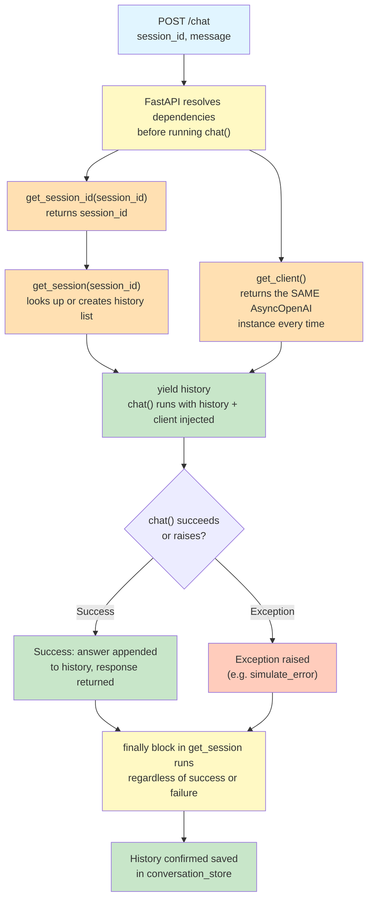

# Lab 4 — Dependency Injection for AI Session Management

Difficulty: Beginner | ~30-35 min | Requires Lab 1

---

## 2. Problem Statement / Use Case Overview

When building an AI chat backend, you need to manage conversation sessions — each user has their own history, and the LLM needs that history to maintain context across messages. You also need a shared API client to call the LLM, connection pools and auth setup that shouldn't be recreated on every request. FastAPI's `Depends()` solves both problems: it lets you inject shared resources and manage session lifecycle through dependency functions, with guaranteed cleanup even when requests fail. This lab demonstrates three distinct capabilities of `Depends()`: sharing one expensive object across requests, chaining dependencies so one depends on another, and using yield-dependencies to guarantee cleanup code runs after every request.

---

## 3. Input Data

The inputs to this lab are simple HTTP POST requests to a `/chat` endpoint:

- **message**: A text string sent to the LLM (e.g., `"Where is Paris?"`).
- **session_id**: A query parameter identifying the conversation session (e.g., `"abs123"`).
- **simulate_error**: An optional boolean that triggers a simulated upstream failure for demonstration purposes.

This lab calls the real OpenRouter API using a free-tier model. Cost per full run-through is approximately $0.

---

## 4. Processing

The pipeline runs through a single `POST /chat` endpoint with the following logic:

1. **Dependency Resolution**: FastAPI resolves the dependency chain before running `chat()`. It calls `get_session_id` to extract the session ID, then `get_session` to look up or create the conversation history, and `get_client` to provide the shared API client.
2. **Message Recording**: The user message is appended to history **before** calling the LLM, so it's recorded even if the LLM call fails.
3. **LLM Call**: The endpoint calls the LLM via the injected client, passing the full conversation history.
4. **Response Assembly**: The assistant's reply is appended to history, and both the answer and full history are returned.
5. **Cleanup**: After the endpoint finishes (success or failure), `get_session`'s `finally` block runs, logging that the request completed.

---

## 5. Output

The endpoint produces four distinct outputs based on the demonstration calls:

1. **First message (new session)**: Returns the LLM's answer about Paris with an empty initial history that now contains one user message and one assistant reply.
2. **Follow-up message (same session)**: Returns an answer about Paris's population, proving the LLM uses context from the previous message — the history carries real conversational context.
3. **Simulated error**: Raises a `ValueError` that propagates to the caller. The `finally` block still runs, and the user message is still recorded in history despite the failure.
4. **New session**: Returns an answer with its own separate history, proving sessions are isolated from each other.

Additionally, the `Client ID` printed by the endpoint is identical across all calls, proving the `AsyncOpenAI` client is shared.

---

## 6. Tech Stack

- `fastapi==0.112.2` — Web framework with dependency injection support
- `pydantic==2.8.2` — Data validation (used by FastAPI internally)
- `httpx==0.28.1` — HTTP client (used by TestClient under the hood)
- `openai==3.5.0` — OpenAI-compatible client for OpenRouter API
- `python-dotenv==1.2.3` — Loads API keys from `.env` files

---

## 7. Underlying Concepts

### What `Depends()` Actually Does

When you declare a parameter with `Depends(some_function)`, FastAPI resolves that function **before** running your endpoint and passes its return value in as the parameter. This is different from calling the function yourself inline. FastAPI manages the resolution, caches the result within one request (so if two parameters both depend on the same dependency, it's only called once), and can swap the dependency out during testing (relevant for the later labs in this series — mention briefly, do not elaborate).

### Dependency Chaining

`get_session` depends on `get_session_id` via `Depends(get_session_id)` in its own signature. FastAPI resolves `get_session_id` first, then passes its return value into `get_session` automatically. State plainly: dependencies can depend on other dependencies, and FastAPI resolves the whole chain in order, without the endpoint needing to know this chain exists.

### Shared Object via `Depends()`

`get_client()` returns the **same** `AsyncOpenAI` instance on every call — built once at module level, not recreated per-request. Contrast this directly with what would happen if `get_client()` built a new client inside the function each time — that would create a fresh, unshared object per request. State plainly why sharing matters for an AI backend: the client holds connection pools and auth setup that shouldn't be recreated on every single request.

### yield-Dependencies and Guaranteed Cleanup

`get_session` uses `try: yield history / finally:`. The code after `yield` runs **after** the endpoint finishes — success or failure, it doesn't matter, the `finally` block always executes. This is proven concretely in this lab's own demonstration cells (see below), not just claimed.

Before `chat()` ever runs, FastAPI resolves a small tree of dependencies — one depends on another, and one is shared across every request. Here's what that resolution looks like:



Notice `get_session` depends on `get_session_id` — FastAPI resolves that inner dependency first, then passes its result into `get_session` automatically. This is dependency chaining. Also notice the `finally` block runs whether `chat()` succeeds or raises — that's the guarantee `yield` gives you, and it's what makes the session history reliable even when the LLM call fails.

---

## 8. Prerequisites

- A free OpenRouter API key, set in a `.env` file as `OPEN_ROUTER_KEY`. Get one at https://openrouter.ai/keys.
- Basic Python and REST/JSON familiarity assumed.

---

## 9. Environment / Dependencies Setup

To run this lab locally, perform the following commands in your shell:

```bash
# Create a fresh virtual environment
python -m venv venv

# Activate the virtual environment (Windows)
.\venv\Scripts\activate

# Install the dependencies
pip install fastapi==0.112.2 pydantic==2.8.2 httpx==0.28.1 python-dotenv==1.2.3 openai==3.5.0
```

Create a `.env` file in your project root with:

```
OPEN_ROUTER_KEY=your_openrouter_api_key_here
```

---

## 10. Step-wise Development Instructions

### Cell 1: Dependency Installation

Installs the exact pinned versions of every library this lab needs. Run this cell first so everything is available for the rest of the notebook.

```python
!pip install fastapi==0.112.2 pydantic==2.8.2 httpx==0.28.1 python-dotenv==1.2.3 openai==3.5.0
```

### Cell 2: Imports and API Key Setup

Load the necessary modules and read the OpenRouter API key from the `.env` file. We use `load_dotenv()` to load environment variables, then `os.getenv()` to read the key. If the key is not found, we prompt for manual input as a fallback.

```python
from fastapi import FastAPI, Depends
from typing import Annotated
from fastapi.testclient import TestClient
from dotenv import load_dotenv
from openai import AsyncOpenAI
import os

# Load environment variables from .env file
load_dotenv()

# Read the OpenRouter API key from environment
api_key = os.getenv("OPEN_ROUTER_KEY")

# Fallback: prompt for key if not found in environment
if not api_key:
    api_key = input("Open Router API key: ")

# Module-level dictionary to store conversation histories per session
conversation_store = {}

# Create the FastAPI application instance
app = FastAPI()
```

### Cell 3: Shared Client Dependency

This creates a single `AsyncOpenAI` instance at module level — built once when the module loads, not recreated per request. The `get_client()` function returns this same instance every time FastAPI calls it. This is important because the client holds connection pools and authentication setup that shouldn't be recreated on every single request.

```python
# Module-level client: built once, shared across all requests
client = AsyncOpenAI(
    api_key=api_key,
    base_url="https://openrouter.ai/api/v1"
)

async def get_client():
    """Dependency that returns the shared AsyncOpenAI client."""
    return client
```

### Cell 4: Session ID Dependency

A simple pass-through dependency. FastAPI extracts the `session_id` query parameter and passes it through. This dependency exists so that `get_session` can depend on it — demonstrating dependency chaining.

```python
async def get_session_id(session_id: str):
    """Pass-through dependency: extracts session_id from query params."""
    return session_id
```

### Cell 5: Session Dependency (yield-dependency)

This is a **yield-dependency**. FastAPI runs the code before `yield` to set up the dependency, yields the value to the endpoint, and then runs the code after `yield` (in the `finally` block) after the endpoint finishes — whether the request succeeded or raised an exception. The `try: yield / finally:` structure guarantees the cleanup code always runs.

```python
async def get_session(
    session_id: Annotated[str, Depends(get_session_id)]
):
    """Yield-dependency: provides conversation history for a session.
    
    Depends on get_session_id — FastAPI resolves that first, then
    passes the result into this function automatically.
    
    The try/yield/finally structure guarantees the finally block
    runs after the endpoint completes, whether it succeeded or failed.
    """
    # Look up or create the session's history list
    if session_id not in conversation_store:
        conversation_store[session_id] = []
    
    history = conversation_store[session_id]

    try:
        # Yield the history list to the endpoint
        yield history
    finally:
        # This runs AFTER the endpoint finishes — success or failure
        print(f"[Session {session_id}] request finished.")
```

### Cell 6: Chat Endpoint

The `history` and `client` parameters are resolved by FastAPI **before** this function runs. `history` comes from `get_session` (which itself depends on `get_session_id`), and `client` comes from `get_client`. The user message is appended to history **before** the try block so it's recorded even if the LLM call fails.

```python
@app.post("/chat")
async def chat(
    message: str,
    history: Annotated[list, Depends(get_session)],
    client: Annotated[AsyncOpenAI, Depends(get_client)],
    simulate_error: bool = False
):
    # Append user message BEFORE calling LLM — recorded even on failure
    history.append({
        "role": "user",
        "content": message
    })

    # Prove the client is shared: print its id across multiple calls
    print(f"Client ID: {id(client)}")

    # If simulate_error is True, raise before calling the LLM
    if simulate_error:
        raise ValueError("Simulated Upstream")
    
    # Call the LLM via the injected client
    response = await client.chat.completions.create(
        model="openrouter/free",
        messages=history
    )

    # Extract the answer and append assistant reply to history
    answer = response.choices[0].message.content
    history.append({
        "role": "assistant",
        "content": answer
    })

    return {
        "answer": answer,
        "history": history
    }
```

### Cell 7: TestClient Instantiation

We create a `TestClient` to simulate HTTP requests against our FastAPI app directly in the notebook, without running a live server.

```python
test_client = TestClient(app)
```

### Cell 8: Demonstration 1 — First Message (New Session)

Send a message to a new session `abs123`. This proves a new session starts with empty history and gets a real answer from the LLM.

```python
message = "Hello. Where is Paris?"
ID = "abs123"
res = test_client.post(
    "/chat",
    params={
        "message": message,
        "session_id": ID
    })

print(f"\nAnswer: {res.json()['answer']}")

print("\nConversation history:")
for turn in conversation_store[ID]:
    print(f"{turn['role'].capitalize()}: {turn['content']}")
```

### Cell 9: Demonstration 2 — Follow-up Message (Context Proof)

Send a follow-up question that only makes sense with context from the first message. This proves the injected history actually carries context between requests — the LLM can answer "What is its Population?" because it sees the previous conversation about Paris.

```python
message = "What is its Population?"
ID = "abs123"
res = test_client.post(
    "/chat",
    params={
        "message": message,
        "session_id": ID
    })

print(f"\nAnswer: {res.json()['answer']}")

print("\nConversation history:")
for turn in conversation_store[ID]:
    print(f"{turn['role'].capitalize()}: {turn['content']}")
```

### Cell 10: Demonstration 3 — Error Handling (yield/finally Guarantee)

Call the endpoint with `simulate_error=True` to raise a `ValueError` **after** the user message is appended to history. The endpoint will crash, but `get_session`'s `finally` block still runs. We wrap the call in `try/except` in this cell (NOT in the endpoint) and print `conversation_store["abs123"]` to prove the user message was recorded despite the failure.

```python
message = "This causes error, but message is appended to history"
try:
    res = test_client.post(
        "/chat",
        params={"message": message, "session_id": ID, "simulate_error": True}
    )
    print(res.json())
except ValueError as e:
    print(f"Request failed as expected: {e}")

# Proof: the user message was still recorded despite the error
print("\nConversation history:")
for turn in conversation_store[ID]:
    print(f"{turn['role'].capitalize()}: {turn['content']}")
```

### Cell 11: Demonstration 4 — Session Isolation

Start a new session with a different `session_id`. This proves sessions are isolated — the new session has its own empty history, completely separate from `abs123`.

```python
message = "Hello! What model are you?"
ID = "NewID"
res = test_client.post(
    "/chat",
    params={
        "message": message,
        "session_id": ID
    })

print(f"\nAnswer: {res.json()['answer']}")

print("\nConversation history:")
for turn in conversation_store[ID]:
    print(f"{turn['role'].capitalize()}: {turn['content']}")
```

---

## 11. Optional Exercise

Add a third dependency, `get_turn_count(history: list = Depends(get_session))`, that simply returns `len(history)`. Inject it into `chat()` as an additional parameter and include its value in the response under a new key, `turn_count`. Test it by calling `/chat` twice on the same session and confirming `turn_count` increases.

---

## 12. What We Learnt

- **What `Depends()` does**: Resolves a function's return value and injects it as a parameter, before the endpoint runs — FastAPI manages the resolution, caching within one request, and swapping for tests
- **How dependency chaining works**: A dependency can itself depend on another dependency, and FastAPI resolves the full chain automatically without the endpoint knowing the chain exists
- **Why sharing one object via `Depends()` matters**: A shared API client (like `AsyncOpenAI`) holds connection pools and auth setup that shouldn't be recreated on every request — `get_client()` returns the same instance every time
- **What yield-dependencies guarantee**: Code after `yield` runs after the request completes, whether it succeeded or raised an exception — proven concretely by the `finally` block running even when `simulate_error=True`
