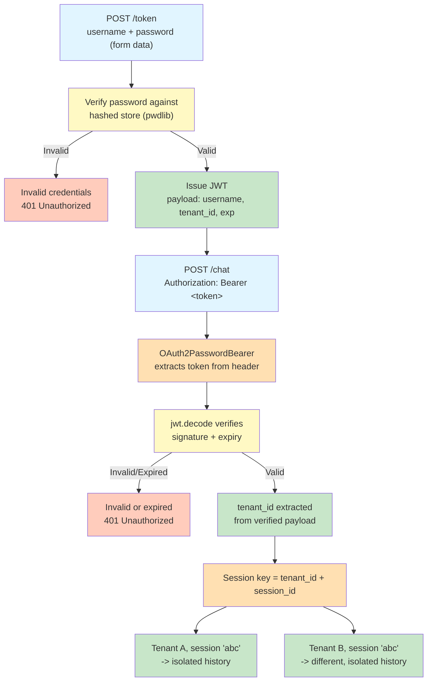

# 1. Lab Title — Security in FastAPI (OAuth2 + JWT for Multi-Tenant AI Access)

Difficulty: Advanced | ~45–60 min

---

## 2. Problem Statement / Use Case Overview

A bare session system lets any caller who knows a `session_id` reach that session's history — fine for a single-user notebook, untenable for a multi-tenant product. If a SaaS AI assistant serves many clients, each tenant's conversations must be invisible to every other tenant, even when they happen to collide on the same session identifiers. This lab replaces the trust-the-client model with real authentication: users log in through a standard OAuth2 password flow, receive a signed JWT, and every chat request must present that token. The tenant identity is read out of the **verified** token — not from anything the client claims — and each conversation history is keyed by a composite `(tenant_id, session_id)` pair. You will prove concretely that two tenants using the **identical** `session_id` string never see each other's conversation. This is the same isolation logic a multi-tenant AI backend needs in production, minus the real database.

---

## 3. Input Data

The lab takes three kinds of input, all sent via `TestClient`:

- **Login form data** — `username` and `password` sent to `POST /token` as `application/x-www-form-urlencoded` (the OAuth2 password flow). Two hardcoded users exist: `alice` / `alice-password` (tenant `tenant-a`) and `bob` / `bob-password` (tenant `tenant-b`). Passwords are stored only as argon2id hashes.
- **Chat query parameters** — `message` (the prompt text) and `session_id` (a client-chosen conversation key) sent to `POST /chat`.
- **Authorization header** — `Authorization: Bearer <token>` on every `/chat` call; the header is absent, malformed, valid, or expired in different demonstrations.

No dataset is loaded. The LLM (OpenRouter free tier) receives the tenant-scoped history as its message list. Cost per full run-through is approximately $0 — the free-tier model routes to an available free model.

---

## 4. Processing

Everything is a request pipeline with dependencies resolved by FastAPI before the endpoint body runs:

1. **Login** (`POST /token`): `OAuth2PasswordRequestForm` parses the form-encoded `username`/`password`; the stored argon2id hash is verified with pwdlib; a JWT is signed containing `sub`, `tenant_id`, and `exp`.
2. **Token extraction** (`OAuth2PasswordBearer`): on `/chat`, the dependency tree starts by pulling the bearer token out of the `Authorization` header.
3. **Token verification** (`get_current_tenant`): `jwt.decode()` verifies signature and expiry, collapsing any failure (`PyJWTError`) into a 401; success yields the `tenant_id` locked inside the token.
4. **Tenant-scoped history** (`get_session_history`): the conversation is looked up or created under the composite key `(tenant_id, session_id)`.
5. **Generation** (`/chat`): the user message is appended, the full history is sent to the OpenRouter client, and the assistant reply is appended and returned.

---

## 5. Output

The demonstrations produce these concrete results (captured from a real run of the notebook):

1. **Demo 1 (alice login)** — `POST /token` returns `200`; decoding the token shows `{'sub': 'alice', 'tenant_id': 'tenant-a', 'exp': <~30 min from now>}`.
2. **Demo 2 (alice first message)** — `POST /chat` returns `200` with a real LLM answer about Paris; the history key `('tenant-a', 'shared-abc')` is created.
3. **Demo 3 (alice follow-up)** — the follow-up "And what is its population?" is answered from context; `history length: 4`.
4. **Demo 4 (bob login)** — `200`, token claims `{'sub': 'bob', 'tenant_id': 'tenant-b', ...}`.
5. **Demo 5 (bob, same session_id — the isolation proof)** — bob's history length is `2` while alice's is `4`; the store prints `[('tenant-a', 'shared-abc'), ('tenant-b', 'shared-abc')]`. Identical `session_id`, two separate histories.
6. **Demo 6 (wrong password)** — `POST /token` returns `401` with `{'detail': 'Incorrect username or password'}`.
7. **Demo 7 (garbage token)** — `POST /chat` with `Bearer garbage.token.here` returns `401` with `{'detail': 'Invalid or expired token'}`.
8. **Demo 8 (expiry)** — a token minted with `expires_in_seconds=10` works (`200`), then after `time.sleep(10)` the same token returns `401`, and a direct `jwt.decode()` prints `ExpiredSignatureError - Signature has expired`.

LLM answer text itself is non-deterministic (live free model); the structural outputs above are deterministic and are what you should verify.

---

## 6. Tech Stack

- `fastapi==0.112.2` — web framework providing `Depends()`, `HTTPException`, and the security utilities
- `pydantic==2.8.2` — data validation (used by FastAPI internally)
- `httpx==0.28.1` — HTTP client (used by `TestClient` under the hood)
- `python-dotenv==1.2.3` — loads API keys from the existing `.env` file
- `openai==3.5.0` — OpenAI-compatible client for the OpenRouter API
- `PyJWT==2.12.0` — signs and verifies JWTs (`jwt.encode`, `jwt.decode`)
- `pwdlib[argon2]==0.3.1` — password hashing via the argon2id backend (`PasswordHash.recommended()`)
- `python-multipart==0.0.32` — required by FastAPI to parse OAuth2 form data

Compute: laptop CPU only; no GPU. Each full run makes ~4 small calls to the OpenRouter free tier (~$0).

---

## 7. Underlying Concepts

### What `OAuth2PasswordBearer` Actually Does

`OAuth2PasswordBearer(tokenUrl="/token")` is a FastAPI *security scheme*, not a verifier. Declared as a dependency, it does exactly three things:

- **Advertisement**: tells interactive clients (like FastAPI's `/docs`) that protected routes take a bearer token obtainable from `/token`.
- **Extraction**: when a request arrives, it locates the `Authorization: Bearer <token>` header and hands the dependency the raw token string.
- **Presence check**: shorthang a missing header with a 401 *before* your code runs.

It does **not** verify signature, expiry, or anything about the token — that is the job of the decode dependency (Step 5). Keeping extraction and verification separate is deliberate: the framework handles the plumbing, your dependency handles the trust decision.

### What `OAuth2PasswordRequestForm` Expects — and Why

`OAuth2PasswordRequestForm` parses the OAuth2 *password grant* body. Two details matter:

- The client must POST **form-encoded** fields (`application/x-www-form-urlencoded`), not JSON. This is why `python-multipart` is a dependency and why Login demo requests pass `data={"username": ...}` — in `httpx`, `data=` sends form fields while `json=` sends a JSON body.
- The standard field names **must** be `username` and `password` (with optional `scope`), because that is what the OAuth2 spec defines. FastAPI's form dependency is why `tokenUrl` could be set without knowing the endpoint's internals: standard clients already know to POST form data to the advertised path and expect `{"access_token": ..., "token_type": "bearer"}` back.

If a client sent JSON to `/token`, `OAuth2PasswordRequestForm` would fail validation with a 422 — the form parser is a contract, not a convenience.

### Why a JWT Is Stateless

A JWT is self-contained: the claims (here `sub`, `tenant_id`, `exp`) live inside the signed token and are readable by anyone who has the token. The signature allows the server to verify that the token was issued by us. The server does not need to look anything up to know who is asking — the token's signature proves it was issued by us and was not tampered with.

Contrast this with a plain server-side session store: there, knowing a caller's session required a server-side lookup into `conversation_store`. The store was the source of truth, and identity (a session key) was a client-supplied pointer into it. Here, identity travels with the request itself, signed. The tradeoff is the flip side of that convenience:

- **Nothing to look up** means logout and revocation are non-trivial — the token stays valid until `exp` (see Exercise 10).
- **The secret is everything** — anyone who leaks it can forge tokens for any tenant.

For this lab's multi-tenant isolation, statelessness is precisely what you want: the tenant is *baked into a value the client cannot alter without breaking the signature*.

### Why pyjwt's `decode()` Owning Expiry Is a Meaningful Convenience

If you checked expiry yourself, you would need to parse the payload, pull `exp`, compare against the current time, and return a 401 — plus decide what to do if `exp` is missing or non-numeric. pyjwt folds all of that into one call:

- `jwt.decode(token, secret, algorithms=["HS256"])` verifies the HMAC signature.
- It validates the standard `exp` claim and raises `ExpiredSignatureError` when it is past.
- Bad signatures, garbage strings, and missing claims raise `InvalidSignatureError` / `DecodeError` / `DecodeError`-family exceptions.

All of these subclass `PyJWTError`. So your dependency catches **one** parent type and turns every possible failure mode into the same 401. The codebase never contains `if time.time() > exp:` — the library owns the check, and your code owns the response. Fewer hand-rolled checks means fewer places to get expiry semantics wrong (missing claim, leap seconds, clock skew).

### The Full Request Path

A login produces a signed token; every later request must present that token, and the tenant identity locked inside it -- not anything the client claims -- decides which conversation history it can reach. Here's the full path, including what happens when the same session_id is used by two different tenants:



Notice tenant_id never comes from the request itself -- it's extracted from inside the verified token. This is what makes isolation real rather than optional: a client cannot simply claim a different tenant_id to see someone else's history, because the token's signature would no longer match.

---

## 8. Prerequisites

- **Python + Jupyter basics** (creating a venv, installing pinned packages, running cells) — all FastAPI patterns here are introduced from scratch in the notebook.
- An OpenRouter API key already present in the workspace `.env` as `OPEN_ROUTER_KEY` (no setup needed).
- Comfort with FastAPI dependencies, async endpoints, and HTTP status codes.
---

## 9. Environment / Dependencies Setup

To run this lab in a fresh environment:

```bash
# Create a fresh virtual environment
python -m venv venv

# Activate the virtual environment (Windows)
.\venv\Scripts\activate

# Install the pinned dependencies
pip install fastapi==0.112.2 pydantic==2.8.2 httpx==0.28.1 python-dotenv==1.2.3 openai==3.5.0 PyJWT==2.12.0 "pwdlib[argon2]==0.3.1" python-multipart==0.0.32
```

Then open `lab-security-in-fastapi.ipynb` in Jupyter (from the venv) and run the first cell once to confirm the pinned install, then the rest of the notebook top to bottom. The JWT signing secret defaults to a lab-only development value in code; in production `JWT_SECRET` must be supplied by an environment variable or secrets manager and never committed.

---

## 10. Step-wise Development Instructions

### Cell 1: Dependency Installation

One cell installs every pinned dependency. Two are new: `PyJWT` for signing and verifying tokens, and `pwdlib` (with the argon2 backend) for password hashing. `python-multipart` is required because OAuth2 login is sent as form data, not JSON.

```python
!pip install fastapi==0.112.2 pydantic==2.8.2 httpx==0.28.1 python-dotenv==1.2.3 openai==3.5.0 PyJWT==2.12.0 "pwdlib[argon2]==0.3.1" python-multipart==0.0.32
```

### Cell 2: Imports, API Key, and App Setup

`load_dotenv()` reads the existing `.env`; `os.getenv("OPEN_ROUTER_KEY")` gives the OpenRouter key. The one new environment-driven value is the JWT signing secret — read from env with a lab-only fallback. In production the secret must never appear in source code. `conversation_store` is a plain in-memory dict whose keys will be `(tenant_id, session_id)` tuples for tenant-scoped isolation.

```python
from fastapi import FastAPI, Depends, HTTPException
from fastapi.security import OAuth2PasswordBearer, OAuth2PasswordRequestForm
from fastapi.testclient import TestClient
from dotenv import load_dotenv
from openai import AsyncOpenAI
from typing import Annotated
import jwt
import os
import time

load_dotenv()

api_key = os.getenv("OPEN_ROUTER_KEY")
if not api_key:
    api_key = input("Open Router API key: ")

# Production rule: JWT secret from env/secrets manager, NEVER hardcoded.
# The default is a lab-only convenience so the notebook runs as-is.
JWT_SECRET = os.getenv("JWT_SECRET", "lab5-dev-only-secret-not-for-production")

conversation_store = {}   # keys are (tenant_id, session_id) tuples
app = FastAPI()
```

### Cell 3: Password Hashing and the User Store

`PasswordHash.recommended()` bundles **argon2id** — a deliberately slow, memory-hard key-derivation function built exactly for password storage. Hashing happens at startup, so the store holds hash only, never plaintext. alice and bob are hardcoded stand-ins for what would be a database lookup in production; the shape — username → hashed password → `tenant_id` — is what matters.

```python
from pwdlib import PasswordHash

password_hash = PasswordHash.recommended()

users = {
    "alice": {
        "password_hash": password_hash.hash("alice-password"),
        "tenant_id": "tenant-a",
    },
    "bob": {
        "password_hash": password_hash.hash("bob-password"),
        "tenant_id": "tenant-b",
    },
}

print("alice password_hash:", users["alice"]["password_hash"])
```

You should see a `$argon2id$v=19$m=65536,t=3,p=4$...` string — evidence the store keeps a hash, not the plaintext.

### Cell 4: The Token Scheme and Token-Issuing Function

`OAuth2PasswordBearer(tokenUrl="/token")` marks endpoints as protected: it advertises that a bearer token is obtained from `/token`, and as a dependency it parses `Authorization: Bearer <token>` and hands you the raw token string. It does **not** verify the token — that is Step 5's job. `create_access_token()` signs a three-claim payload with HS256: `sub` (username), `tenant_id`, and `exp`. The `expires_in_seconds` default of 1800 lets the same function mint the short-lived tokens the expiry demo needs later, without duplicating code.

```python
oauth2_scheme = OAuth2PasswordBearer(tokenUrl="/token")

def create_access_token(username, tenant_id, expires_in_seconds=1800):
    payload = {
        "sub": username,
        "tenant_id": tenant_id,
        "exp": time.time() + expires_in_seconds,
    }
    return jwt.encode(payload, JWT_SECRET, algorithm="HS256")
```

### Cell 5: The `/token` Login Endpoint

`OAuth2PasswordRequestForm` is FastAPI's parser for the OAuth2 password flow — the client sends `username` and `password` as **form-encoded** body (hence `python-multipart`), not JSON. The check is one combined condition: the username must exist **and** `password_hash.verify()` must accept the supplied password against the stored hash. The timing guard means an argon2 verify runs even when the username is unknown, so an attacker cannot measure response time to learn which accounts exist. Fail either side → 401. Success → a signed token for the user's real tenant.

```python
@app.post("/token")
async def login(form_data: Annotated[OAuth2PasswordRequestForm, Depends()]):
    stored = users.get(form_data.username)
    # Timing guard: ALWAYS run one argon2 verify, even for unknown usernames,
    # so response time cannot reveal which accounts exist.
    target = stored["password_hash"] if stored else users["alice"]["password_hash"]
    valid_password = password_hash.verify(form_data.password, target)

    if not stored or not valid_password:
        raise HTTPException(status_code=401, detail="Incorrect username or password")
        
    token = create_access_token(form_data.username, stored["tenant_id"])
    return {"access_token": token, "token_type": "bearer"}
```

### Cell 6: The Token-Verification Dependency

Here the token becomes an identity. `get_current_tenant` depends on `oauth2_scheme` (extracts the bearer token), then lets `jwt.decode()` do the honesty check: it verifies the signature **and** the `exp` claim, raising its own exceptions on failure. We catch the common parent `jwt.PyJWTError` and collapse every failure into a 401. There is no hand-rolled expiry comparison anywhere in this notebook. If the header is missing entirely, `oauth2_scheme` raises a 401 before `decode()` is reached.

```python
async def get_current_tenant(token: Annotated[str, Depends(oauth2_scheme)]):
    try:
        payload = jwt.decode(token, JWT_SECRET, algorithms=["HS256"])
    except jwt.PyJWTError:
        raise HTTPException(status_code=401, detail="Invalid or expired token")
    return payload["tenant_id"]
```

### Cell 7: Tenant-Scoped Session History

If history were keyed by `session_id` alone, anyone who owned that string would own the conversation. This dependency builds a **composite key** `(tenant_id, session_id)` — `tenant_id` from the verified token, `session_id` a client-chosen query parameter. Two tenants submitting the same `session_id` land on different keys, and therefore different, isolated histories.

```python
async def get_session_history(
    tenant_id: Annotated[str, Depends(get_current_tenant)],
    session_id: str,
):
    key = (tenant_id, session_id)
    if key not in conversation_store:
        conversation_store[key] = []
    return conversation_store[key]
```

### Cell 8: Shared Client and the Protected `/chat` Endpoint

The client dependency is one shared `AsyncOpenAI` instance holding the connection pool and auth. The `/chat` endpoint appends the user message, calls the LLM, stores the reply, and returns it — but `history` no longer comes from a freely-chosen session key, and every request must carry a valid bearer token or the whole chain dies in `get_session_history` before `chat()` runs.

```python
client = AsyncOpenAI(
    api_key=api_key,
    base_url="https://openrouter.ai/api/v1"
)

async def get_client():
    return client

@app.post("/chat")
async def chat(
    message: str,
    session_id: str,
    history: Annotated[list, Depends(get_session_history)],
    client: Annotated[AsyncOpenAI, Depends(get_client)],
):
    history.append({"role": "user", "content": message})

    response = await client.chat.completions.create(
        model="openrouter/free",
        messages=history,
    )

    answer = response.choices[0].message.content
    history.append({"role": "assistant", "content": answer})

    return {"answer": answer, "history": history}
```

### Cell 9: TestClient

A single test client drives every demo. One quirk worth knowing: because `/chat` awaits an external async client, running `TestClient` repeatedly in a single notebook session can occasionally raise an "Event loop is closed" error. There is no clean one-line fix worth adding here — if it appears, simply re-run that cell; a fresh event loop is created on retry.

```python
test_client = TestClient(app)
```

### Cell 10: Demo 1 — Login as alice → a real token

POST `/token` with alice's credentials as form data (`data=` in httpx = form body). Decoding the returned token with the same secret shows its claims: `sub=alice`, `tenant_id=tenant-a`, and a numeric `exp` about 30 minutes out.

```python
res = test_client.post(
    "/token",
    data={"username": "alice", "password": "alice-password"},
)

print("status:", res.status_code)
alice_token = res.json()["access_token"]
print("token:", alice_token[:35] + "...")
print("claims:", jwt.decode(alice_token, JWT_SECRET, algorithms=["HS256"]))
```

### Cell 11: Demo 2 — alice chats on session "shared-abc"

alice sends the first message of a conversation; history is created under `("tenant-a", "shared-abc")` and she gets a real LLM answer.

```python
res = test_client.post(
    "/chat",
    params={"message": "Hello. Where is Paris?", "session_id": "shared-abc"},
    headers={"Authorization": f"Bearer {alice_token}"},
)

print("status:", res.status_code)
print("answer:", res.json()["answer"])
```

### Cell 12: Demo 3 — Follow-up question on the same session

Same token, same `session_id`. The endpoint passes the full prior history into the LLM, so "And what is its population?" resolves against the Paris context. History length grows to 4 (2 user + 2 assistant). This is the proof that context really carries across calls — now inside one tenant.

```python
res = test_client.post(
    "/chat",
    params={"message": "And what is its population?", "session_id": "shared-abc"},
    headers={"Authorization": f"Bearer {alice_token}"},
)

print("answer:", res.json()["answer"])
print("history length:", len(res.json()["history"]))
```

### Cell 13: Demo 4 — Login as bob → a different tenant

bob logs in and receives his own token showing `tenant_id=tenant-b`. Next he reuses alice's exact `session_id` string — which is where the isolation promise gets tested.

```python
res = test_client.post(
    "/token",
    data={"username": "bob", "password": "bob-password"},
)

print("status:", res.status_code)
bob_token = res.json()["access_token"]
print("claims:", jwt.decode(bob_token, JWT_SECRET, algorithms=["HS256"]))
```

### Cell 14: Demo 5 — bob, the SAME session_id → isolated history (the core proof)

bob submits the identical `session_id` string alice used. Yet his history starts empty: his conversation is keyed under `("tenant-b", "shared-abc")`, a different key. After bob's single message his history has 2 entries; alice's still has 4. The printed store keys make the composite-key design visible — both tenants have a "shared-abc" session, and neither can reach the other's.

```python
res = test_client.post(
    "/chat",
    params={"message": "Hello. Do you know Paris?", "session_id": "shared-abc"},
    headers={"Authorization": f"Bearer {bob_token}"},
)

print("answer:", res.json()["answer"])
print("bob's history length:", len(res.json()["history"]))
print("alice's history length:", len(conversation_store[("tenant-a", "shared-abc")]))
print("store keys:", list(conversation_store.keys()))
```

### Cell 15: Demo 6 — Wrong password → 401

Verification always runs against the stored argon2id hash, so a wrong guess fails. `/token` returns 401 and no token. This is also why `verify()` exists instead of plaintext comparison: an attacker who grabs the database still cannot log in.

```python
res = test_client.post(
    "/token",
    data={"username": "alice", "password": "wrong-password"},
)

print("status:", res.status_code)
print("body:", res.json())
```

### Cell 16: Demo 7 — Garbage bearer token → 401

`oauth2_scheme` extracts `garbage.token.here` fine, but `jwt.decode()` immediately raises `DecodeError` (a `PyJWTError` subclass), our dependency converts it to 401, and the request never reaches `chat()`. No manual string inspection — pyjwt's own validation did the rejecting.

```python
res = test_client.post(
    "/chat",
    params={"message": "do not answer", "session_id": "shared-abc"},
    headers={"Authorization": "Bearer garbage.token.here"},
)

print("status:", res.status_code)
print("body:", res.json())
```

### Cell 17: Demo 8 — Expiry: pyjwt enforces `exp`, not us

One cell covers the whole lifecycle: mint a token with `expires_in_seconds=10`, use it successfully, `time.sleep(10)` past its expiry, then use the **exact same token** again. It now fails with 401 — because `jwt.decode()` checks `exp` itself and raises `ExpiredSignatureError` (a `PyJWTError` subclass), caught by the same single `except`. The final decode call shows the exception class pyjwt raised. There is no `if time.time() > exp:` anywhere in this notebook.

```python
short_token = create_access_token("alice", "tenant-a", expires_in_seconds=10)

res_before = test_client.post(
    "/chat",
    params={"message": "I am still valid", "session_id": "expiry-demo"},
    headers={"Authorization": f"Bearer {short_token}"},
)
print("before expiry - status:", res_before.status_code)

time.sleep(10)

res_after = test_client.post(
    "/chat",
    params={"message": "Still valid?", "session_id": "expiry-demo"},
    headers={"Authorization": f"Bearer {short_token}"},
)
print("after expiry  - status:", res_after.status_code)
print("after expiry  - body:", res_after.json())

try:
    jwt.decode(short_token, JWT_SECRET, algorithms=["HS256"])
except jwt.PyJWTError as e:
    print("jwt.decode raised:", type(e).__name__, "-", e)
```

---

## 11. Optional Exercise

Add a `role` claim to the JWT and protect a third endpoint: (1) add `"role": "admin"` to alice and `"role": "member"` to bob in the `users` store, (2) include the role in the `create_access_token` payload, (3) write a `get_current_role` dependency that reuses the same decode block and raises `HTTPException(status_code=403, detail="Admin access required")` when the role claim is not `"admin"`, and (4) add `GET /admin` that depends on it and returns `{"message": "admin access granted"}`. Test it: alice's token → 200, bob's token → 403, and no token → 401 (rejected by `oauth2_scheme` before the role is even checked).

---

## 12. What We Learnt

- **Real OAuth2 password flow**: `OAuth2PasswordRequestForm` parses form-encoded `username`/`password` at `POST /token`; credentials are verified against argon2id hashes, never plaintext
- **JWT issuance**: `jwt.encode` signs claims (`sub`, `tenant_id`, `exp`) with HS256; the `expires_in_seconds` parameter makes token lifetime a caller-supplied decision
- **Bearer extraction vs verification**: `OAuth2PasswordBearer` only pulls the token from the header (and rejects a missing one); trust decisions live in the decode dependency
- **Why keep a JWT stateless**: tenant identity travels inside the signed token, so no server-side lookup is needed to know who is asking — unlike a plain server-side store pointer
- **pyjwt owns expiry and signature checks**: `jwt.decode()` raises `ExpiredSignatureError` / `DecodeError` (both `PyJWTError` subclasses); catching the single parent maps every failure to one 401
- **Multi-tenant isolation is keyed, not enforced** inside the handler: `(tenant_id, session_id)` composite keys mean two tenants with the identical `session_id` get fully separate histories — proven concretely in Demo 5
- **Secrets discipline**: the signing secret comes from an environment variable with a lab-only fallback; hardcoding a secret is never acceptable outside a lab context