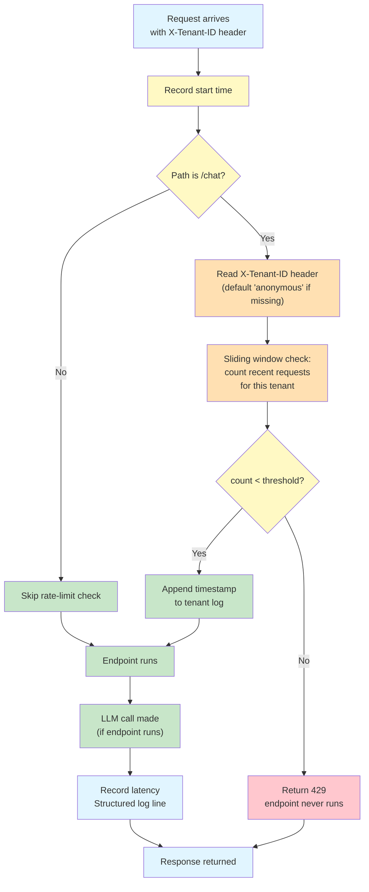

# Lab 6 — Rate-Limiting & Observability Middleware

**Difficulty: Intermediate | ~40 min | Requires Lab 4**

---

## 2. Problem Statement

Every allowed request to an AI backend potentially costs real money — an LLM call with per-token pricing. Unlike a traditional web API where rejecting a request after it runs is acceptable, an AI backend needs to decide *before* the endpoint executes whether a request is allowed, so the LLM call simply never happens. This lab adds a single middleware function to a tenant-scoped chatbot that does two things: it throttles `/chat` requests per tenant using a sliding-window rate limiter (cost control), and it logs every request with latency and token-usage details (observability) — without touching individual endpoint code for either concern.

---

## 3. Input Data

No external data files. The lab operates on in-memory request/response data passing through the FastAPI middleware pipeline. Tenant identity is read from a simple request header (`X-Tenant-ID`) rather than an authentication system.

---

## 4. Processing

- A middleware function wraps every incoming request
- On every request: record start time
- For `/chat` routes only: read the `X-Tenant-ID` header to identify the tenant for rate-limit counting (defaults to `"anonymous"` if missing)
- Sliding-window check: maintain per-tenant timestamp logs, reject with 429 if threshold exceeded
- After the endpoint returns: compute latency and print a structured log line
- The `/chat` endpoint passes LLM token-usage data back to the middleware via `request.state`

---

## 5. Output

- A normal `/chat` call succeeds with a structured log line showing tenant ID, latency in ms, and real token counts from OpenRouter
- Rapid repeated `/chat` calls from the same tenant produce a 429 response *before* the endpoint runs; the 429 log lines carry no usage fields because the LLM was never called
- A second tenant, called while the first tenant is still rate-limited, succeeds — proof the limit is scoped per tenant
- After the sliding window expires, calls succeed again
- Example of a successful log line from a real run:

```
{"tenant_id": "tenant-a", "path": "/chat", "status_code": 200, "latency_ms": 8922.33, "prompt_tokens": 170, "completion_tokens": 9, "total_tokens": 179}
```

- Example of a rejected log line — status 429, latency ~0 ms, no usage fields:

```
{"tenant_id": "tenant-a", "path": "/chat", "status_code": 429, "latency_ms": 0.0}
```

---

## 6. Tech Stack

- **fastapi==0.112.2** — web framework
- **pydantic==2.8.2** — data validation
- **httpx==0.28.1** — HTTP client (transitive)
- **python-dotenv==1.2.3** — .env loading
- **openai==3.5.0** — OpenRouter client (OpenAI-compatible)
- **Standard library:** `time`, `collections.deque`, `json` — no new external dependencies for the rate limiter or logging

---

## 7. Underlying Concepts

### What a Middleware Function Is

FastAPI (via Starlette) lets you register a single async function with `@app.middleware("http")` that wraps the entire request/response cycle. Unlike `Depends()`, which only runs within a single endpoint's own resolution, a middleware intercepts *every* request to *every* route — including routes that never mention the middleware. This makes it the right tool for concerns that must apply universally (like logging) or must run before any endpoint code (like rate limiting).

A middleware function takes two arguments: the incoming `Request` and a `call_next` coroutine that invokes the rest of the pipeline (downstream middleware, then the endpoint). Anything you do before `await call_next(request)` runs before the endpoint; anything after runs after it returns. This lab uses the simpler `@app.middleware("http")` decorator form — a single function rather than a `BaseHTTPMiddleware` subclass with a `dispatch` method — because the logic is compact enough that a plain function is clearer than a class.

The key difference from `Depends()`: a dependency is scoped to one endpoint. If you put rate-limiting logic in a dependency, you have to attach it to every route manually, and a new route added later might forget it. A middleware applies to all routes automatically.

### Tenant Identification via Request Header (Deliberate Simplification)

This lab identifies a tenant from a plain `X-Tenant-ID` request header rather than from an authenticated identity. This is a **deliberate simplification** so the focus stays on what middleware itself does. A real production system would derive tenant identity from a verified source — such as the JWT-based authentication built in Lab 5 — because a header can be trivially spoofed by any client and provides no security.

Here the header is only used for *accounting*: which tenant's request budget does this call count against? If the header is missing, the request is scoped to the default `"anonymous"` tenant rather than rejected — there is no authentication check in this lab, only an identification fallback. This is different from a rejection: it lets rate-limit counting still work for callers who provide no identity, without pretending the header is a security boundary.

### Why Rate Limiting Must Happen Before the Endpoint

In a generic web API, rejecting a request after the handler runs is fine — the worst case is wasted CPU cycles. In an AI backend, the handler *makes an LLM call* — a network request to an external API that costs money per token. If the rate-limit check happens after the endpoint runs, the LLM call has already been made and billed. The middleware's job is to reject *before* the endpoint is ever invoked, so the LLM call simply never happens.

### The Sliding Window Log Algorithm

The rate limiter stores a list of timestamps for each tenant. On each request:

1. Drop all timestamps older than the window (e.g., the last 45 seconds)
2. Count the remaining timestamps
3. If count >= threshold → reject with 429
4. If count < threshold → append the current timestamp and let the request through

This is called a "sliding window log" because it logs every request timestamp and looks backward over a rolling window. The alternative — a fixed-window counter — has a boundary-burst flaw: a burst of requests right at a clock boundary can effectively double the intended limit (e.g., 3 requests at 11:59:59 + 3 at 12:00:01 = 6 in 2 seconds, even if the limit is "3 per 45 seconds"). The sliding window can't be gamed this way because there is no clock boundary to straddle.

**Important caveat:** The values used here (3 requests per 45 seconds) are chosen so the lab's demos run quickly, not for production realism. In particular, the window is set larger than a single LLM call's latency — a series of real `openrouter/free` calls each take a few seconds, so several can still land inside one 45-second window and the burst demo reliably triggers a 429. A production system would tune the window and threshold to its actual cost model.

**Simplification note:** This lab's rate-limiter storage is a single-process, in-memory dict. It resets on server restart and is not shared across multiple worker processes or replicas. Production systems handling this at scale would typically use a shared external store like Redis.

### The Request Path Through the Middleware

Every `/chat` request passes through the middleware first. The middleware reads the tenant ID from each request and counts it against that tenant's sliding window. Here's the full path:



There is no login or token-issuing step: a request arrives carrying its `X-Tenant-ID` header and goes straight into the rate-limit-then-log flow. The middleware never decides who is or isn't authenticated — it only reads an identity header for accounting, so the endpoint can focus entirely on its job.

---

## 8. Prerequisites

- **Lab 4** — Familiarity with Depends() is assumed.

- An OpenRouter API key (set in the `.env` file as `OPEN_ROUTER_KEY`)

**Compute & cost:** Runs entirely on a laptop CPU — no GPU needed. It calls OpenRouter's `openrouter/free` model, which is free; the rate-limiter and middleware logic use only the standard library. One full run-through issues roughly 5 small LLM calls (only a few hundred tokens each), so even a paid tier would cost a negligible amount.

---

## 9. Environment / Dependencies Setup

```bash
pip install fastapi==0.112.2 pydantic==2.8.2 httpx==0.28.1 python-dotenv==1.2.3 openai==3.5.0
```

Ensure a `.env` file exists in the project root containing:
```
OPEN_ROUTER_KEY=your-openrouter-api-key-here
```

---

## 10. Step-wise Development Instructions

### Cell 0: Dependency Installation

One cell installs every pinned dependency. Notably, none of them are new: the rate limiter and the logging both rely only on the standard library (`time`, `collections.deque`, `json`).

```python
!pip install fastapi==0.112.2 pydantic==2.8.2 httpx==0.28.1 python-dotenv==1.2.3 openai==3.5.0
```

### Cell 1: Imports, API Key, and App Setup

`load_dotenv()` reads the existing `.env`; `os.getenv("OPEN_ROUTER_KEY")` gives the OpenRouter key with a prompt fallback. The three imports that matter most for this lab are `Header` (used to read the `X-Tenant-ID` request header in Step 2), `Request` (the endpoint parameter we attach usage data to), and `deque` (an efficient append/pop-from-front list that becomes the timestamp log for rate limiting).

```python
from fastapi import FastAPI, Depends, Header, Request
from fastapi.responses import JSONResponse
from fastapi.testclient import TestClient
from dotenv import load_dotenv
from openai import AsyncOpenAI
from collections import deque
from typing import Annotated
import os, time, json

load_dotenv()

api_key = os.getenv("OPEN_ROUTER_KEY")
if not api_key:
    api_key = input("Open Router API key: ")

conversation_store = {}
app = FastAPI()
```

### Cell 2: Tenant Identification via Request Header

`get_tenant_id` is a dependency that reads the `X-Tenant-ID` header using FastAPI's `Header` utility. The `default="anonymous"` matters: if the header is absent, the request is scoped to the `"anonymous"` tenant instead of failing. This keeps unlabeled callers inside the rate limiter (so they still consume *a* budget) while making the one clear simplification of the whole lab — a header is **not** authentication. Any client can set any header, so this is only for counting which bucket a request bills against, never for trusting who a caller is.

```python
def get_tenant_id(x_tenant_id: str = Header(default="anonymous")):
    return x_tenant_id
```

### Cell 3: Tenant-Scoped Session History

`get_session_history` builds the composite key `(tenant_id, session_id)` that every conversation lives under in `conversation_store`. The tenant half comes from `get_tenant_id` (a dependency resolving before the body runs); `session_id` is a plain query parameter the caller supplies. Without the tenant half, two tenants who happened to pick the same `session_id` string would silently share one conversation history — the composite key keeps every tenant's history separate from everyone else's, the same isolation principle covered in Lab 5 but now keyed by a header-derived identity.

```python
async def get_session_history(
    tenant_id: Annotated[str, Depends(get_tenant_id)],
    session_id: str,
):
    key = (tenant_id, session_id)
    if key not in conversation_store:
        conversation_store[key] = []
    return conversation_store[key]
```

### Cell 4: The `/chat` Endpoint with LLM Usage Passback

The endpoint is deliberately ordinary — append the user message, call OpenRouter, store the reply, return both. The one line that matters for this lab's *observability* goal is the `request.state.usage = {...}` block. A middleware runs outside the endpoint and has no return value from it, so the endpoint needs a way to hand its LLM usage numbers back for logging. `request.state` is a plain attribute bag attached to the request that both sides can read and write: the endpoint writes `usage` here, and the middleware reads it in Cell 5. `request` is injected simply by declaring it as a parameter, exactly like a dependency.

```python
client = AsyncOpenAI(
    api_key=api_key,
    base_url="https://openrouter.ai/api/v1"
)

async def get_client():
    return client

@app.post("/chat")
async def chat(
    message: str,
    session_id: str,
    history: Annotated[list, Depends(get_session_history)],
    client_dep: Annotated[AsyncOpenAI, Depends(get_client)],
    request: Request,
):
    history.append({"role": "user", "content": message})

    response = await client_dep.chat.completions.create(
        model="openrouter/free",
        messages=history,
    )

    answer = response.choices[0].message.content
    history.append({"role": "assistant", "content": answer})

    # Pass usage data back to middleware via request.state
    if response.usage:
        request.state.usage = {
            "prompt_tokens": response.usage.prompt_tokens,
            "completion_tokens": response.usage.completion_tokens,
            "total_tokens": response.usage.total_tokens,
        }

    return {"answer": answer, "history": history}
```

### Cell 5: The Rate Limiter and Middleware

This is the heart of the lab. Two constants, `RATE_LIMIT_WINDOW = 45` and `RATE_LIMIT_THRESHOLD = 3`, define "3 requests per 45 seconds per tenant." `rate_limit_store` maps each tenant_id to a `deque` of request timestamps — a sliding-window log.

The `_log` helper computes latency from the recorded start time (in milliseconds), pulls `usage` off `request.state` with `getattr(..., None)` so it's safe even when the field was never set, and prints a single JSON line. It includes usage fields **only** if the `request.state.usage` exists — that conditional is what makes a rejected 429 line visibly carry no token counts.

The middleware itself, registered with `@app.middleware("http")`, takes the `Request` and a `call_next` coroutine. Breaking it down:

- **Before `call_next` runs, the code is pre-endpoint.** It records the start time, and only for `/chat` it reads the tenant header, creates the tenant's deque on first sight, and drops every timestamp older than 45 seconds (the `while window and window[0] <= now - RATE_LIMIT_WINDOW` loop).
- **The rate-limit decision.** If the log still holds `>= RATE_LIMIT_THRESHOLD` timestamps, the tenant is over budget: it builds a `JSONResponse` with status 429, logs it (no usage fields — the endpoint never ran), and returns it early. The whole pipeline short-circuits and `call_next` is never awaited, so no LLM call happens.
- **Otherwise** it appends `now` to the window (reserving this request's slot), awaits `call_next(request)` to run the endpoint, and then — now post-endpoint — logs the real response with any usage the endpoint recorded.

The key contrast with `Depends()`: this wraps *every* request to *every* route automatically. The `/chat` endpoint never mentions rate limiting, so a future route added to the app can't forget to opt in. And because the check runs before the endpoint, a throttled tenant costs nothing — the billed LLM call simply never happens.

```python
RATE_LIMIT_WINDOW = 45   # seconds
RATE_LIMIT_THRESHOLD = 3  # max requests per tenant in window

rate_limit_store = {}  # tenant_id -> deque of timestamps

def _log(response, tenant_id, request, start_time):
    latency_ms = round((time.time() - start_time) * 1000, 2)
    usage = getattr(request.state, "usage", None)
    log_line = {
        "tenant_id": tenant_id,
        "path": request.url.path,
        "status_code": response.status_code,
        "latency_ms": latency_ms,
    }
    if usage:
        log_line["prompt_tokens"] = usage["prompt_tokens"]
        log_line["completion_tokens"] = usage["completion_tokens"]
        log_line["total_tokens"] = usage["total_tokens"]

    print(json.dumps(log_line))

@app.middleware("http")
async def observability_middleware(request: Request, call_next):
    start_time = time.time()
    tenant_id = None

    # Only rate-limit /chat — the only route that triggers LLM costs
    if request.url.path == "/chat":
        tenant_id = request.headers.get("x-tenant-id", "anonymous")

        now = time.time()
        if tenant_id not in rate_limit_store:
            rate_limit_store[tenant_id] = deque()

        # Drop timestamps outside the window
        window = rate_limit_store[tenant_id]
        while window and window[0] <= now - RATE_LIMIT_WINDOW:
            window.popleft()

        if len(window) >= RATE_LIMIT_THRESHOLD:
            rejected = JSONResponse(
                status_code=429,
                content={
                    "detail": f"Rate limit exceeded for {tenant_id}. "
                    f"Max {RATE_LIMIT_THRESHOLD} requests per "
                    f"{RATE_LIMIT_WINDOW}s window."
                },
            )
            _log(rejected, tenant_id, request, start_time)
            return rejected
        window.append(now)

    # Let the endpoint handle the request
    response = await call_next(request)

    # Post-request: latency, usage, structured log
    _log(response, tenant_id, request, start_time)
    return response
```

### Cell 6: TestClient

A single test client drives every demo. One quirk worth knowing: because `/chat` awaits an external async client, running `TestClient` repeatedly in a single notebook session can occasionally raise an "Event loop is closed" error. There is no clean one-line fix worth adding here — if it appears, simply re-run that cell; a fresh event loop is created on retry.

```python
test_client = TestClient(app)
```

### Demo 1: Normal `/chat` call — under the limit

`test_client.post` sends the request exactly as a client would, passing `params` for the query string and `headers` for the `X-Tenant-ID`. This is the happy path: one request, far under the limit, so the middleware lets it through, the endpoint makes a real LLM call, and afterward the middleware prints the structured log line. You can read the whole story off that one line — tenant-a, 200, 8.9 s latency, 179 real tokens that the endpoint handed over via `request.state`.

```python
res = test_client.post(
    "/chat",
    params={"message": "What is the capital of France?", "session_id": "demo-session"},
    headers={"X-Tenant-ID": "tenant-a"},
)

print("status:", res.status_code)
print("answer:", res.json()["answer"][:80] + "...")
```

You should see a `200` status plus a log line like this:

```
{"tenant_id": "tenant-a", "path": "/chat", "status_code": 200, "latency_ms": 8922.33, "prompt_tokens": 170, "completion_tokens": 9, "total_tokens": 179}
```

### Demo 2: Rapid `/chat` calls — exceeding the limit

This loop fires four more messages for the same tenant back to back. Each real call takes a few seconds, so they all land inside the same 45-second window; combined with Demo 1's request, tenant-a now hits its limit of 3. Two things matter here:

- The 429s return **before** the endpoint ever runs — they come back almost instantly (latency `0.0`).
- The 429 log lines carry no usage fields — that absence is the concrete evidence the LLM was never called, which is precisely why the check lives in middleware.

```python
for i, msg in enumerate(["Second call", "Third call", "Fourth call", "Fifth call"]):
    res = test_client.post(
        "/chat",
        params={"message": msg, "session_id": "demo-session"},
        headers={"X-Tenant-ID": "tenant-a"},
    )
    print(f"call {i+1}: status={res.status_code}", end="")
    if res.status_code == 429:
        print(f"  -> {res.json()['detail']}")
    else:
        print()
```

You should see the first two calls succeed (`200`) and the last two be rejected (`429` with `latency_ms: 0.0` and no usage fields in the log).

### Demo 3: Second tenant — per-tenant isolation

Without sleeping, the code calls `/chat` with a different header value, `tenant-b`. tenant-a's burst from Demo 2 is still inside its 45-second window, so tenant-a is over budget — yet tenant-b succeeds immediately. The reason is that `rate_limit_store` is keyed per tenant, so each tenant gets its own independent sliding window. One tenant exhausting its quota can never block another; this is the isolation proof that gives the whole "multi-tenant" framing meaning.

```python
# tenant-b has a completely separate rate-limit store from tenant-a.
res = test_client.post(
    "/chat",
    params={"message": "Hello from tenant-b — I should not be rate-limited", "session_id": "bob-session"},
    headers={"X-Tenant-ID": "tenant-b"},
)

print("tenant-b status:", res.status_code)
print("tenant-b answer:", res.json()["answer"][:60] + "...")
```

You should see `tenant-b status: 200` and a real LLM answer, with a log line naming `tenant-b`.

### Demo 4: Window recovery — the limit resets

The final demo sleeps for the full `RATE_LIMIT_WINDOW`, letting tenant-a's timestamps age out of the 45-second window. On the next call the middleware's drop-old-timestamps loop empties the stale deque, sees fewer than the threshold, and lets the request through again. This proves the limiter is a *rolling* window that recovers — not a permanent lockout. It uses the constant `RATE_LIMIT_WINDOW` rather than a hardcoded 45, so the sleep stays in sync if the window constant ever changes.

```python
print(f"Sleeping {RATE_LIMIT_WINDOW}s for the window to reset...")
time.sleep(RATE_LIMIT_WINDOW)

res = test_client.post(
    "/chat",
    params={"message": "Window reset — I should work again", "session_id": "demo-session"},
    headers={"X-Tenant-ID": "tenant-a"},
)

print("status:", res.status_code)
print("answer:", res.json()["answer"][:80] + "...")
```

You should see `status: 200` again after the 45-second sleep — tenant-a's window has recovered.

---

## 11. Optional Exercise

Replace the sliding-window log rate limiter with a token-bucket rate limiter: give each tenant a bucket that holds up to 3 tokens and refills at 1 token per 45 seconds (matching the 45-second window, so the recovery demo still recovers). On each request, refill the bucket from the elapsed time, then require one token — if one is available, consume it and let the request through; if not, return 429. Keep the demos as they are; with these parameters the burst in Demo 2 still drains the bucket and ends in a 429. You will now throttle by *sustainable rate with burst tolerance* instead of *max requests per window*.

---

## 12. What We Learnt

- **Middleware functions** (`@app.middleware("http")`) wrap every request across all routes, unlike `Depends()` which is scoped to a single endpoint
- **Pre-endpoint rate limiting** prevents LLM calls from being made when a tenant exceeds their limit — the endpoint never runs
- **Sliding window log** rate limiting avoids the boundary-burst flaw of fixed-window counters
- **Per-tenant isolation** — each tenant is counted against its own window, so one tenant exhausting its budget never blocks another
- **Header-based tenant identification** is simple and effective for accounting but is a deliberate simplification — a real system would derive identity from a verified source like a JWT
- **Structured logging** captures tenant_id, path, status_code, latency_ms, and token usage in one log line
- **request.state** allows endpoints to pass data (like LLM usage stats) back to the middleware after returning
