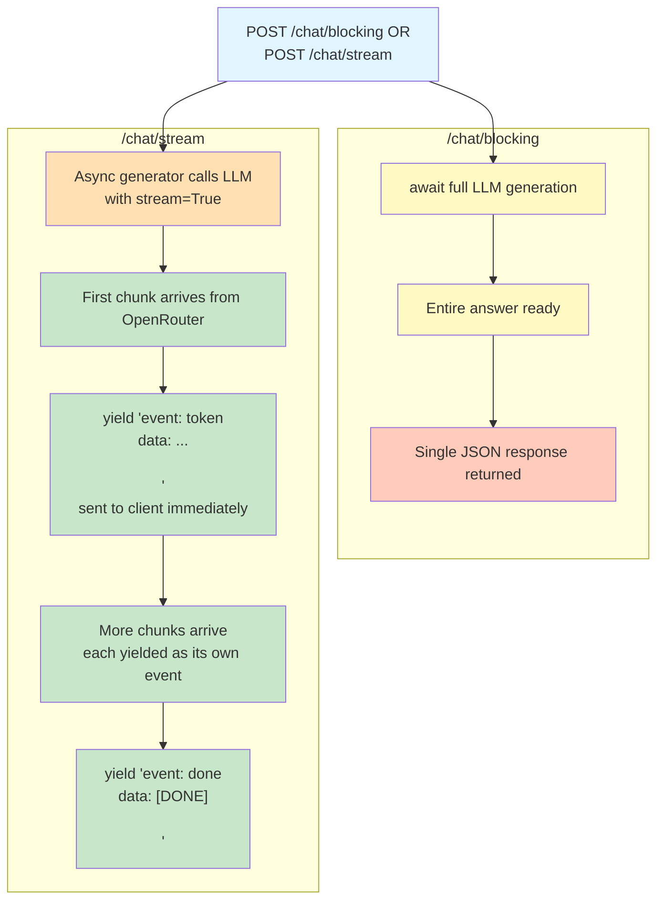

# Lab 7 — Streaming Responses with SSE for AI Chat

**Difficulty: Intermediate | ~40 min | Requires Lab 2 (Async/Await)**

---

## 2. Problem Statement

When a user sends a message to an LLM-powered chat endpoint, a blocking response forces them to stare at a blank screen until the entire answer is generated — even though the first few words could be displayed almost immediately. Streaming solves this perceived-latency problem by sending each piece of output to the client the moment the LLM produces it. This lab builds two endpoints that call the same LLM — one blocking, one streaming — and uses a side-by-side timing comparison to prove that streaming does not make generation faster, only the *first output* dramatically sooner. It also demonstrates that a stream already in progress can fail partway through and be handled gracefully rather than crashing.

---

## 3. Input Data

No external data files. The lab operates on a single user-provided text message passed as a JSON request body to each endpoint. The message is forwarded to OpenRouter's LLM, and the response — whether complete or streamed — is the only output. The lab uses a deliberately long prompt ("Explain how rainbows form… in about 100 words") because a short answer finishes so fast that the timing difference the lab measures becomes too small to see.

---

## 4. Processing

- **Blocking path** (`/chat/blocking`): receive message, call LLM with `stream=False`, await the full completion, return the complete answer as JSON
- **Streaming path** (`/chat/stream`): receive message, call LLM with `stream=True`, iterate over chunks as they arrive from OpenRouter, yield each text chunk as an SSE event (`event: token\ndata: <text>\n\n`), yield a final `event: done\ndata: [DONE]\n\n` when complete
- **Error simulation** (`simulate_error=True`): yield 2 real chunks, then stop consuming chunks and yield `event: error\ndata: <message>\n\n`, closing the upstream stream and the generator cleanly
- **Timing comparison**: measure `time.perf_counter()` from request sent to first output received for each path, print side by side

---

## 5. Output

- **Demo 1 (Blocking):** Full JSON response printed after the LLM finishes, with the total elapsed time shown
- **Demo 2 (Streaming):** The first few SSE events printed as they arrive (so the incremental sequence is visible), then the stitched-together answer and the time to the first output
- **Demo 3 (Timing comparison):** Two lines printed side by side
- **Demo 4 (Error simulation):** A few real chunks printed, then the error event, then confirmation that the stream ended cleanly — no crash, no hang

Measured on an actual run of the notebook on the pinned stack it produced (exact values vary run to run — `openrouter/free` routes to different models with different latencies; watch the relationship, not the precise numbers):

```
Blocking response (4.9s):
A rainbow forms when sunlight enters a raindrop, refracting (bending) as it passes from air into water. ...
(time to full response = 4.9s — the client saw nothing until this moment)

SSE events as they arrived:
  event #1: A
  event #2:  rainbow forms
  event #3:  when sunlight enters
  event #4:  a rain
  event #5: drop, refracts
  ... and 77 more events

Stitched answer: A rainbow forms when sunlight enters a raindrop, refracts (bends) as it passes from air into water, ...
Time to first output: 2.7s

Blocking: first output at 4.9s (full response arrives then)
Streaming: first output at 2.7s (then more chunks keep arriving)
```

In that run the first output arrived after **2.7s** over streaming versus **4.9s** over blocking. The complete streamed answer finished at roughly the same moment the blocking call did — streaming moved the first output much earlier without making generation any faster.

---

## 6. Tech Stack

- **fastapi==0.112.2** — web framework, `StreamingResponse` for incremental output
- **pydantic==2.8.2** — request model validation
- **httpx==0.28.1** — real HTTP client for consuming the SSE stream over the network
- **python-dotenv==1.2.3** — `.env` loading
- **openai==3.5.0** — OpenRouter client (OpenAI-compatible), async streaming support
- **uvicorn==0.30.6** — ASGI server (serves the app for the demos; the one new dependency over earlier labs — see Section 7 for why it is required)
- **Standard library:** `time` — `perf_counter()` for high-resolution timing; `threading` — run the server in a background thread

---

## 7. Underlying Concepts

### What `StreamingResponse` Does Differently

In a normal FastAPI endpoint, you `return` a finished value — a dict, a Pydantic model, a string — and FastAPI serialises it into a complete response body before sending anything to the client. `StreamingResponse` changes this: instead of a finished value, you pass it an **async generator** — a function that `yield`s pieces of data one at a time. FastAPI sends each yielded piece to the client as soon as it is produced, rather than waiting for the entire response to exist.

This is the mechanical difference that makes streaming possible: the HTTP connection stays open, and each chunk is flushed to the client as it arrives. The generator function runs incrementally inside FastAPI's event loop, yielding one SSE event per LLM chunk.

### The SSE Format (Server-Sent Events)

SSE is a real protocol convention, not an arbitrary string format. Each event is a small text block with typed fields separated by line breaks:

- `event:` — labels the event type (e.g. `token`, `done`, `error`)
- `data:` — carries the payload (the chunk text, a sentinel, or an error message)
- An empty line — signals the end of one event and the start of the next

The format looks like this on the wire:

```
event: token
data: Hello

event: token
data:  world

event: done
data: [DONE]
```

The empty blank line between events is not decorative — it is what the SSE specification requires as an event delimiter. Browsers using the `EventSource` API and server-side parsers both rely on this blank line to know where one event ends and the next begins.

### Why Streaming Reduces Perceived Latency — Not Total Time

The LLM generates text at roughly the same speed regardless of whether the connection is streaming or blocking. What changes is **when the client sees the first piece of output**. In a blocking endpoint, the client receives nothing until the entire answer is ready — if the LLM takes 4 seconds, the client waits 4 seconds seeing a blank screen. In a streaming endpoint, the client sees the first chunk within moments of generation starting, even though the remaining chunks take just as long to arrive. The measured timing comparison in the demos makes this concrete: total generation time is similar, but the first output time is dramatically different.

### Why the Demos Run a Real Server (and Why `TestClient` Is Not Enough)

A plain `http_client.post()` call reads the entire response body into memory before returning. That would silently defeat the timing measurement — the code would only see the response *after* the full stream finished, making the "time to first output" meaningless.

One might expect FastAPI's `TestClient` to help here, but it cannot expose incremental timing either. Its transport (`starlette._TestClientTransport`) runs the entire ASGI app to completion through a thread portal and only hands the response back afterwards — so even `test_client.stream()` with `iter_lines()` delivers every line at once, all with the same timestamp.

The fix the lab uses is a **real uvicorn server in a background thread** plus a **real `httpx.Client`**. Over a real HTTP connection each SSE chunk reaches the client the moment the server yields it — the only way to capture an honest first-output timing. This is also how production code consumes SSE: a real HTTP client over a real socket. So the lab's approach is both more correct for the measurement and closer to how you would actually write a chat frontend.

### Why Mid-Stream Errors Must Be Handled Inside the Generator

Once a `StreamingResponse` starts sending chunks to the client, the HTTP response headers have already been sent — including a 200 status code. You cannot retroactively swap that for a 400 or 500 error response the way an earlier lab's exception handler might. If the LLM stream fails partway through, the only option is to handle it *inside the generator itself*: yield a clean error event, then end the generator. The client receives a partial stream followed by an explicit error signal, and the connection closes normally. A `try/except` around the endpoint would be too late — the response has already started.

This is not a hypothetical scenario — LLM streams can and do fail partway through generation in production, exactly the case `simulate_error=True` demonstrates.

Both endpoints call the same LLM and take roughly the same total time to finish generating — the difference is entirely in when the client sees the first piece of output. Here's the two paths side by side:



In `/chat/blocking`, nothing reaches the client until the entire answer exists. In `/chat/stream`, the first chunk OpenRouter sends is forwarded to the client immediately, before the rest of the answer has even been generated. Total generation time is roughly the same either way — what changes is how long the client waits before seeing anything at all.

---

## 8. Prerequisites

- **Lab 2 (Async/Await)** — Familiarity with async generators and `async for` is assumed

- An OpenRouter API key (set in the `.env` file as `OPEN_ROUTER_KEY`)

**Compute & cost:** Runs entirely on a laptop CPU — no GPU needed. It calls OpenRouter's `openrouter/free` model, which is free. One full run-through issues roughly 3 LLM calls (a blocking call, a streaming call, and a streaming call with error simulation), so even a paid tier would cost a negligible amount. The streaming error-simulation call is cut off early (2 chunks), so it costs far less than a full generation.

---

## 9. Environment / Dependencies Setup

```bash
pip install fastapi==0.112.2 pydantic==2.8.2 httpx==0.28.1 python-dotenv==1.2.3 openai==3.5.0 uvicorn==0.30.6
```

Ensure a `.env` file exists in the project root containing:
```
OPEN_ROUTER_KEY=your-openrouter-api-key-here
```

---

## 10. Step-wise Development Instructions

### Cell 0: Dependency Installation

One cell installs every pinned dependency. Streaming is a built-in feature of both FastAPI (`StreamingResponse`) and the OpenAI client (`stream=True`). `uvicorn` runs the app for the timing demos.

```python
!pip install fastapi==0.112.2 pydantic==2.8.2 httpx==0.28.1 python-dotenv==1.2.3 openai==3.5.0 uvicorn==0.30.6
```

### Cell 1: Imports, API Key, and App Setup

`StreamingResponse` is the FastAPI response class that accepts an async generator and streams its output incrementally. `AsyncOpenAI` provides the async client with OpenRouter's base URL. `uvicorn` serves the app, `httpx` consumes the stream over a real HTTP connection, and `threading`/`time.perf_counter()` run the server in the background and give high-resolution wall-clock timing.

```python
from fastapi import FastAPI
from fastapi.responses import StreamingResponse
from pydantic import BaseModel
from dotenv import load_dotenv
from openai import AsyncOpenAI
import httpx, uvicorn
import os, time, threading

load_dotenv()

api_key = os.getenv("OPEN_ROUTER_KEY")
if not api_key:
    api_key = input("Open Router API key: ")

client = AsyncOpenAI(
    api_key=api_key,
    base_url="https://openrouter.ai/api/v1"
)

app = FastAPI()
```

### Cell 2: Request Model

A shared Pydantic model for both endpoints. `simulate_error` defaults to `False` — it only affects the streaming endpoint.

```python
class ChatMessage(BaseModel):
    message: str
    simulate_error: bool = False
```

### Cell 3: The `/chat/blocking` Endpoint

A standard non-streaming endpoint. `await client.chat.completions.create(...)` blocks until OpenRouter returns the full completion. The client sees nothing until the entire answer exists.

```python
@app.post("/chat/blocking")
async def chat_blocking(msg: ChatMessage):
    response = await client.chat.completions.create(
        model="openrouter/free",
        messages=[{"role": "user", "content": msg.message}],
    )
    return {"answer": response.choices[0].message.content}
```

### Cell 4: The Streaming Generator and `/chat/stream` Endpoint

`stream_tokens` is an async generator — the `yield` keyword makes it one. It calls the LLM with `stream=True`, which returns an async iterator of chunks. For each chunk, the generator extracts `delta.content` (the next piece of text the LLM just produced — typically a word or small phrase) and yields it as a formatted SSE event.

OpenRouter's stream occasionally includes non-content chunks (keep-alive comments or empty deltas). The `if delta.content:` check skips these silently — they are not real output and must not be forwarded as `event: token` data.

When `simulate_error=True`, after 2 real chunks the generator yields an error event and returns. The upstream stream is closed by the `try/finally` wrapper — the LLM connection is always released, whether the stream completes normally, is interrupted by the simulated error, or fails on its own. The endpoint wraps the generator in `StreamingResponse` with `media_type="text/event-stream"`, which sets the correct HTTP `Content-Type` header and tells FastAPI to stream the body incrementally.

```python
async def stream_tokens(message: str, simulate_error: bool = False):
    stream = await client.chat.completions.create(
        model="openrouter/free",
        messages=[{"role": "user", "content": message}],
        stream=True,
    )
    event_count = 0
    try:
        async for chunk in stream:
            delta = chunk.choices[0].delta
            if delta.content:
                if simulate_error and event_count >= 2:
                    yield "event: error\ndata: Stream interrupted after partial response\n\n"
                    return
                yield f"event: token\ndata: {delta.content}\n\n"
                event_count += 1
    finally:
        await stream.close()
    yield "event: done\ndata: [DONE]\n\n"

@app.post("/chat/stream")
async def chat_stream(msg: ChatMessage):
    return StreamingResponse(
        stream_tokens(msg.message, msg.simulate_error),
        media_type="text/event-stream",
    )
```

### Cell 5: Serve the App on a Real Server

The lab's demos measure *when* the first piece of output arrives. Instead we start a real uvicorn server in a background daemon thread and create a real `httpx.Client` with a generous timeout. `/` has no route, so the `404` status code printed simply confirms the server is up and responding.

If you ever see an "event loop is closed" warning appear, simply re-run the cell — the server thread recovers on retry.

```python
PORT = 8777


def run_server():
    uvicorn.run(app, host="127.0.0.1", port=PORT, log_level="warning")


server_thread = threading.Thread(target=run_server, daemon=True)
server_thread.start()
time.sleep(2)

http_client = httpx.Client(timeout=180)
print("Server up:", http_client.get(f"http://127.0.0.1:{PORT}/").status_code)  # 404 expected — no root route
```

### Demo 1: Blocking `/chat/blocking` — the baseline

This call measures the full round-trip time: from the moment the request is sent to the moment the complete JSON response is received. The client sees nothing during this entire period.

```python
start = time.perf_counter()
res = http_client.post(
    f"http://127.0.0.1:{PORT}/chat/blocking",
    json={"message": "Explain how rainbows form. Cover refraction, reflection, dispersion, and why each observer sees their own rainbow, in about 100 words."},
)
blocking_elapsed = time.perf_counter() - start

print(f"Blocking response ({blocking_elapsed:.1f}s):")
print(res.json()["answer"])
```

### Demo 2: Streaming `/chat/stream` — output arrives incrementally

A plain `http_client.post()` would download the entire response body into memory before our code saw a single line, which would make a "time to first output" measurement meaningless. `http_client.stream()` is a context manager that exposes each body chunk as it arrives over the network. Inside the `with` block, `response.iter_lines()` yields each line of the SSE stream as it is produced. The demo records the moment the first `data:` chunk appears, collects the chunks, prints the first few as they arrived, and prints the stitched answer.

```python
start = time.perf_counter()
first_output_time = None
chunks_received = []

with http_client.stream(
    "POST",
    f"http://127.0.0.1:{PORT}/chat/stream",
    json={"message": 'Explain how rainbows form. Cover refraction, reflection, dispersion, and why each observer sees their own rainbow, in about 100 words.'},
) as response:
    for line in response.iter_lines():
        if line.startswith("data: ") and not line.startswith("data: [DONE]"):
            elapsed = time.perf_counter() - start
            if first_output_time is None:
                first_output_time = elapsed
                
            chunk = line[6:]
            chunks_received.append(chunk)

            if len(chunks_received) <= 5:
                print(f"  +{elapsed:.3f}s  {chunk!r}", flush=True)

print("\n")
print(f"Time to first output: {first_output_time:.3f}s")
print(f"Received {len(chunks_received)} chunks")
print(f"Stitched answer: {''.join(chunks_received)}")
```

### Demo 3: Side-by-side timing comparison

The total time to finish generating the full answer is roughly similar between the two approaches. What changes dramatically is when the client sees the first piece of output — and that is the difference between a user staring at a blank screen and a user immediately seeing a response begin to appear.

```python
print(f"Blocking: first output at {blocking_elapsed:.1f}s (full response arrives then)")
print(f"Streaming: first output at {first_output_time:.1f}s (then more chunks keep arriving)")
print()
print("Total generation time is roughly similar — streaming does not make the LLM finish faster.")
print("What streaming changes is how long the user waits before seeing anything at all.")
```

### Demo 4: Mid-stream error simulation

To understand why this demo exists, first notice what has already reached the client the moment a streaming response begins: the HTTP status line, including status code 200. That status is committed before the LLM has generated anything, so if the stream fails partway through — and LLM streams do fail partway in production — it is far too late to send a different status code like 502. The failure therefore has to travel inside the stream itself, and the only tool left is the SSE format: yield an `event: error` line carrying a `data:` message, then stop. That is exactly what this demo teaches.

When `simulate_error=True`, the generator yields 2 real chunks from the LLM response, then yields `event: error` with the message `Stream interrupted after partial response` and ends. The client sees the partial answer, then a clear error signal, then a clean end — no crash, no hanging connection, no corrupted state.

```python
print("Simulating mid-stream error (2 real chunks then interruption):")
print("-" * 50)

with http_client.stream(
    "POST",
    f"http://127.0.0.1:{PORT}/chat/stream",
    json={"message": "Explain how rainbows form. Cover refraction, reflection, dispersion, and why each observer sees their own rainbow, in about 100 words.", "simulate_error": True},
) as response:
    for line in response.iter_lines():
        if line.startswith("event:") or line.startswith("data:"):
            print(f"  {line}")

print("-" * 50)
print("Stream ended cleanly — no crash, no hang.")
```

---

## 11. Optional Exercise

Experiment with the interruption threshold in `simulate_error and event_count >= 2` inside `stream_tokens`, re-running Demo 4 after each change:

1. **Set the threshold to 0.** The error event now fires on the very first content chunk — re-run Demo 4 and confirm you see zero `event: token` lines before `event: error`.
2. **Set the threshold very large (e.g. 999).** The error branch is never reached, so the stream runs to completion and ends with `event: done` instead — confirming that the error only fires when the stream is still producing chunks past the threshold.
3. **Set it to a small number like 5.** Watch what happens: if the model emits at least 5 chunks you see 5 `event: token` lines then the error; if `openrouter/free` delivers fewer, larger chunks the loop ends first and you see `event: done` instead. Either sequence is valid — you are observing how the interruption condition interacts with however many chunks the provider actually sends.

---

## 12. What We Learnt

- **`StreamingResponse`** accepts an async generator and sends each yielded piece to the client incrementally, instead of buffering the full response before sending
- **Server-Sent Events (SSE)** is a real protocol with `event:`, `data:`, and blank-line delimiters — not an arbitrary format invented for this lab
- **Streaming does not reduce total generation time** — it reduces perceived latency by delivering the first chunk to the client much sooner
- **A real client `.stream()` matters**: a plain `.post()` downloads the whole body into memory before returning, which erases any first-output timing
- **`TestClient` cannot time incremental delivery** — its transport buffers the entire app run, so this lab serves the app on a real uvicorn server and consumes it over a real HTTP socket, which is also how production chat frontends actually work
- **Non-content chunks** from OpenRouter (keep-alive comments, empty deltas) must be detected and skipped, not forwarded as token data
- **Mid-stream errors** must be handled inside the generator itself — once `StreamingResponse` has started sending chunks, the HTTP status code is already committed and cannot be changed retroactively
- **`event: done`** sentinels signal to the client that the full response has arrived, letting it close the connection cleanly
- **`async for`** is the Python construct for iterating over an async iterator like an OpenAI streaming response — each iteration yields one chunk as it arrives