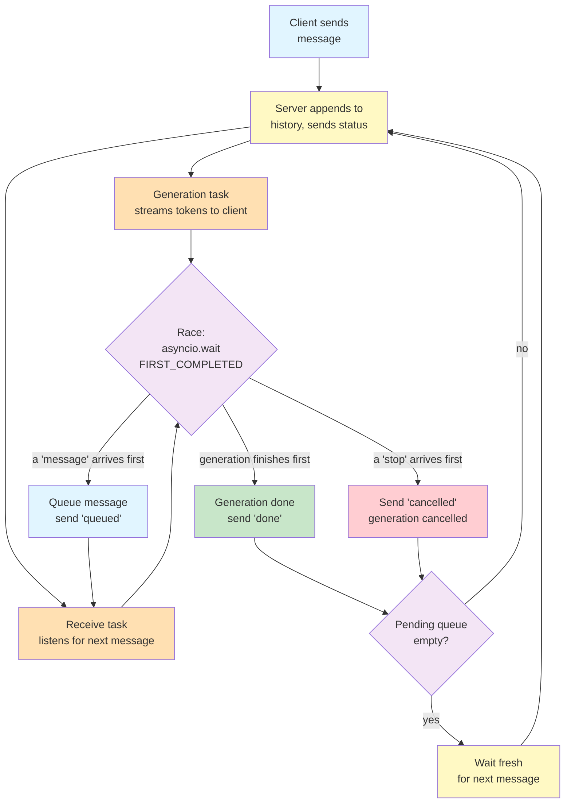

# Lab 8 — Bidirectional Chat with WebSockets

**Difficulty: Intermediate | ~40 min | Requires Lab 2 (Async/Await) and Lab 7 (Streaming Responses with SSE)**

---

## 2. Problem Statement

In Lab 7, an SSE stream sends tokens from the server to the client — but once that stream starts, the client cannot send anything back on the same connection. It is a one-way pipe. A real chat product needs the opposite: while the server is mid-generation, the user should be able to hit "Stop," type a follow-up, or even queue a second message — all on the same open connection. WebSockets make this possible because both sides can send data at any time, independently, over one persistent link. This lab builds a WebSocket chat server that handles three things structurally impossible over HTTP or SSE: receiving a new message while generation is in progress, distinguishing between a queued message and an explicit stop signal, and cleaning up gracefully if the client disconnects mid-generation.

---

## 3. Input Data

No external data files. Every interaction is a JSON message sent by the client over the WebSocket connection, and every response is a JSON message sent back by the server. The lab uses two message types for client-to-server communication (`message` and `stop`) and four for server-to-client (`status`, `token`, `queued`, `done`, and `cancelled`).

---

## 4. Processing

- **Connection accepted** → conversation history and a pending-message queue are initialized as local variables inside the handler
- **Outer loop** → either pop a queued message from the pending queue or wait for the next fresh incoming message
- **Append user message to history**, send a `status: generating` event
- **Start two concurrent tasks**: one streams LLM tokens and forwards each as a `token` event; one listens for the next incoming client message
- **Race the two tasks** with `asyncio.wait(FIRST_COMPLETED)`:
  - Generation finishes → append answer to history, send `done`, cancel the receive task
  - A `stop` message arrives → cancel generation, send `cancelled`, no history update
  - A `message` arrives mid-generation → queue it, send `queued`, generation continues uninterrupted
- **Loop back** to the outer loop, which automatically picks up anything in the pending queue before waiting fresh
- **On disconnect** → cancel any in-flight generation task

---

## 5. Output

The demos use FastAPI's `TestClient` WebSocket transport, so each event is received incrementally (one `receive_json()` call per message). Four demonstration cells show:

- **Demo 1 (Normal turn):** send a message, see `status` → `token` events → `done` with the full answer; a second message on the same connection produces an answer aware of the first turn
- **Demo 2 (Queued message):** send a message, wait for 2 tokens, send a second message → see `queued` immediately, generation finishes with `done`, then the queued message is automatically answered next
- **Demo 3 (Stop):** send a message, wait for 2 tokens, send `stop` → see `cancelled`, no `done`, no partial answer saved to history
- **Demo 4 (Disconnect):** send a message, wait for the first token, exit the context manager → no unhandled error, cleanup runs

Example output for Demo 1 (the exact answer text varies run to run — watch for the second answer referencing the first turn, which proves history persisted):

```
=== Demo 1: Normal turn + history ===

Answer 1: Got it! Your favorite color is teal. I've noted that for our conversation right...
Answer 2: Your favorite color is **teal**! You mentioned that at the very start of our con...
```

Example output for Demo 3 (the `cancelled` event arrives and no `done` follows):

```
=== Demo 3: Stop signal ===

token recieved: **
token recieved: The
Events after stop: ['token', 'cancelled']
'cancelled' received: True
'done' received: False
```

---

## 6. Tech Stack

- **fastapi==0.112.2** — web framework, WebSocket support via `@app.websocket()`
- **pydantic==2.8.2** — request model validation
- **httpx==0.28.1** — HTTP client (used internally by Starlette's WebSocket test client)
- **python-dotenv==1.2.3** — `.env` loading
- **openai==3.5.0** — OpenRouter client (OpenAI-compatible), async streaming support
- **uvicorn==0.30.6** — ASGI server (required by the TestClient to serve WebSocket routes)
- **Standard library:** `asyncio` — task racing with `asyncio.wait`; `collections.deque` — bounded pending-message queue

---

## 7. Underlying Concepts

### Why WebSockets Enable Bidirectional Communication

An HTTP request is one-directional by design: the client sends, the server responds, the connection is done. SSE (Lab 7) keeps the connection open so the server can keep sending — but the client still cannot send anything back on that same response. WebSockets break this model entirely. Once the initial handshake upgrades the connection from HTTP to WebSocket, both sides hold an open channel they can write to at any time. The server can send tokens, and the client can send a stop signal, *simultaneously*, without waiting for anyone to finish.

### Why the Protocol Uses Explicit Message Types

Rather than treating any incoming text as an implicit interrupt — which would make it impossible to tell whether the user wants to *continue chatting* or *stop generation* — the client sends two distinct message types: `{"type": "message", "content": "..."}` for a new turn, and `{"type": "stop"}` to cancel generation. This is the same design a real chat product uses: an explicit "Stop" button, not a guess about user intent. The server checks the `type` field and responds differently to each.

### Why a Plain Local Variable Is Enough State

In Lab 4, conversation history had to be stored in an external session dictionary because each HTTP request is an independent, short-lived function call — once it returns, all local variables are gone. A WebSocket handler is different: it is one long-lived function call that stays alive for the entire conversation. A plain local variable (`history`, `pending_messages`) persists across every turn within that handler without needing any external store, because the function never returns until the connection closes.

### How `asyncio.wait` Makes the Race Possible

When the server starts generating a response, it genuinely does not know what will happen next: will the LLM finish first, or will the client send a new message first? `asyncio.wait` with `return_when=asyncio.FIRST_COMPLETED` lets you run two tasks concurrently and act on whichever one finishes first — exactly the uncertainty the server faces.

A "message" arriving mid-generation does **not** stop the race: the message is queued, a `queued` acknowledgment is sent immediately, and generation continues uninterrupted. A "stop" message **does** stop the race: the generation task is cancelled and a `cancelled` event is sent. These are deliberately different outcomes for two different signals, not the same handling applied twice — the distinction is what makes the protocol expressive.

### Why Cleanup on Disconnect Matters

A single HTTP request/response cycle finishes or it does not — there is no "client vanished mid-generation" scenario to handle. A WebSocket connection is different: the client can disconnect at any moment, including while the server is in the middle of streaming an answer. If the server does not detect that disconnect and cancel the in-flight generation task, it will keep producing tokens into a void, wasting compute and holding resources. The `except WebSocketDisconnect` block catches this and cleans up, which is a required pattern for any long-lived connection.

Once a message starts generating, the server does two things at the same time — forwarding tokens as they arrive, and listening for whatever the client sends next. What happens depends on which one finishes first, and what kind of message arrives.



The purple race node is the heart of the lab: the server cannot know in advance whether the LLM will finish first or the client will message first, so it lets both run and reacts to whichever resolves first. The orange nodes are the two tasks started at once — generation streaming tokens, and a listener for the next message. Three outcomes branch off the race: green means generation finished (send `done`); red means a `stop` arrived first (send `cancelled`, no history update); blue means a new `message` arrived first (send `queued`, then keep racing — generation continues uninterrupted). At the bottom, before waiting for a fresh message, the server checks the pending queue so any queued messages are answered first.

The one part of the handler this diagram does not fold into the race is the disconnect path: if the client disconnects mid-generation, the `except WebSocketDisconnect` block cancels any in-flight generation task. For a long-lived connection, that cleanup must be treated as an ongoing possibility — the client can vanish at any instant, unlike a single request/response which either completes or does not.

---

## 8. Prerequisites

- **Lab 2 (Async/Await)** — familiarity with `async`/`await`, async generators, and `asyncio` basics is assumed
- **Lab 7 (Streaming Responses with SSE)** — the streaming LLM pattern (OpenRouter client, `stream=True`, token forwarding) is reused directly
- An OpenRouter API key

**Compute & cost:** Runs entirely on a laptop CPU — no GPU needed. It calls OpenRouter's `openrouter/free` model, which is free. One full run-through issues roughly 6–8 LLM streaming calls (demos 1–3 plus the optional exercise), so even a paid tier would cost a negligible amount.

---

## 9. Environment / Dependencies Setup

```bash
pip install fastapi==0.112.2 pydantic==2.8.2 httpx==0.28.1 python-dotenv==1.2.3 openai==3.5.0 uvicorn==0.30.6
```

Ensure a `.env` file exists in the project root containing:
```
OPEN_ROUTER_KEY=your-openrouter-api-key-here
```

---

## 10. Step-wise Development Instructions

### Cell 0: Install Dependencies

Every pinned dependency the lab needs in one line. `uvicorn` is required to serve the FastAPI app so the TestClient's WebSocket transport works.

```python
!pip install fastapi==0.112.2 pydantic==2.8.2 httpx==0.28.1 python-dotenv==1.2.3 openai==3.5.0 uvicorn==0.30.6
```

### Cell 1: Imports, API Key, and App Setup

The API key is loaded from `.env` with an input fallback. `TestClient` from `starlette` is FastAPI's recommended way to test WebSocket endpoints without running a full server. `collections.deque` provides a bounded FIFO queue for pending messages.

```python
from fastapi import FastAPI, WebSocket, WebSocketDisconnect
from fastapi.testclient import TestClient
from dotenv import load_dotenv
from openai import AsyncOpenAI
from collections import deque
import asyncio, os

load_dotenv()

api_key = os.getenv("OPEN_ROUTER_KEY")
if not api_key:
    api_key = input("Open Router API key: ")

client = AsyncOpenAI(
    api_key=api_key,
    base_url="https://openrouter.ai/api/v1"
)

app = FastAPI()
```

### Cell 2: The `generate()` Coroutine

`generate()` takes the open WebSocket and the conversation history, opens a streaming completion against OpenRouter, forwards each `delta.content` token to the client as a `token` event, and accumulates the full answer. The `try/finally` guarantees the upstream stream is always closed — even if the task is cancelled mid-stream by a `stop` signal. It returns the full assembled answer, which the orchestrator (Cell 5) saves into history.

`client` is a module-level global defined in Cell 1, so the function can reference it directly. Note it does **not** mutate `history` itself — it only reads it for context and returns the new text, keeping each function's responsibility narrow.

```python
async def generate(websocket, history):
    stream = await client.chat.completions.create(
        model="openrouter/free",
        messages=history,
        stream=True,
    )
    full_answer = ""
    try:
        async for chunk in stream:
            delta = chunk.choices[0].delta
            if delta.content:
                full_answer += delta.content
                await websocket.send_json({"type": "token", "content": delta.content})
    finally:
        await stream.close()
    return full_answer
```

### Cell 3: The `handle_message()` Coroutine

When a second message arrives while generation is already running, the server must not interrupt the answer. `handle_message()` appends that message to the pending queue and immediately acknowledges it to the client with a `queued` event. It does not touch `history` and it does not cancel anything — generation continues uninterrupted.

```python
async def handle_message(websocket, data, pending_messages):
    pending_messages.append(data)
    await websocket.send_json({"type": "queued", "content": data["content"]})
```

### Cell 4: The `handle_stop()` Coroutine

A `stop` signal is the opposite of a queued message: it cancels the in-flight generation task and tells the client with a `cancelled` event. Because `generate()` wraps its stream in `try/finally`, cancelling the task also closes the upstream HTTP connection. `handle_stop()` deliberately does not save any partial answer to history.

```python
async def handle_stop(websocket, gen_task):
    gen_task.cancel()
    await websocket.send_json({"type": "cancelled"})
```

### Cell 5: The `websocket_chat()` Orchestrator

The orchestrator is the route handler. It stays alive for the entire conversation, so `history` and `pending_messages` are plain local variables that persist across every turn without any external store, because the function never returns until the connection closes. FastAPI requires the parameter to be annotated with the `WebSocket` type — without it, FastAPI cannot recognize the argument as the WebSocket connection and rejects the upgrade.

**Outer loop:** either pop a queued message from `pending_messages` or wait for the next incoming message from `websocket.receive_json()`. Queued messages are processed before the handler waits for fresh input — that is how a `queued` message becomes the next turn automatically.

**Generation + receive race:** when a `message` arrives, the orchestrator starts two concurrent tasks: `generate()` to stream tokens, and a receive task awaiting the next client message. `asyncio.wait` with `return_when=asyncio.FIRST_COMPLETED` returns as soon as *either* finishes. If generation finishes first, the receive task is cancelled, the answer is saved to history, and a `done` event is sent. If a client message arrives first, its `type` decides: `stop` defers to `handle_stop()` and ends the turn; anything else defers to `handle_message()` and the race restarts with a fresh receive task.

Notice `gen_task = None` is initialized before the loop. The `except WebSocketDisconnect` block references it to cancel any in-flight generation — but the client could disconnect before the first message ever starts generating, so the variable must already exist.

```python
@app.websocket("/ws/chat")
async def websocket_chat(websocket: WebSocket):
    await websocket.accept()
    history = []
    pending_messages = deque()
    gen_task = None

    try:
        while True:
            if pending_messages:
                data = pending_messages.popleft()
            else:
                data = await websocket.receive_json()

            if data["type"] == "message":
                history.append({"role": "user", "content": data["content"]})
                await websocket.send_json({"type": "status", "content": "generating"})

                gen_task = asyncio.create_task(generate(websocket, history))
                recv_task = asyncio.create_task(websocket.receive_json())

                while True:
                    done, _ = await asyncio.wait(
                        {gen_task, recv_task},
                        return_when=asyncio.FIRST_COMPLETED,
                    )

                    if gen_task in done:
                        recv_task.cancel()
                        full_answer = gen_task.result()
                        history.append({"role": "assistant", "content": full_answer})
                        await websocket.send_json({"type": "done", "content": full_answer})
                        break

                    result = recv_task.result()
                    if result["type"] == "stop":
                        await handle_stop(websocket, gen_task)
                        break
                    else:
                        await handle_message(websocket, result, pending_messages)
                        recv_task = asyncio.create_task(websocket.receive_json())

    except WebSocketDisconnect:
        if gen_task and not gen_task.done():
            gen_task.cancel()
```

### Cell 6: Set Up TestClient

`TestClient` wraps the app so we can open a WebSocket connection without running a real uvicorn server. It is created once here and reused by every demo below. Each demo opens a fresh connection with `test_client.websocket_connect("/ws/chat")`.

```python
test_client = TestClient(app)
```

### Cell 7: Run the Demos

Four demos exercise the protocol end to end. Each opens a fresh connection and drives send/receive with `receive_json()`.

#### Demo 1: Normal Single Turn + History Persistence

Open one connection, send two messages in sequence, and confirm the second answer is aware of the first — proving history persisted across turns on the same WebSocket connection.

```python
print("=== Demo 1: Normal turn + history ===\n")

with test_client.websocket_connect("/ws/chat") as ws:
    ws.send_json({"type": "message", "content": "My favorite color is teal. Remember that."})
    while True:
        msg = ws.receive_json()
        if msg["type"] == "done":
            print(f"Answer 1: {msg['content'][:80]}...")
            break

    ws.send_json({"type": "message", "content": "What is my favorite color?"})
    while True:
        msg = ws.receive_json()
        if msg["type"] == "done":
            print(f"Answer 2: {msg['content'][:80]}...")
            break
```

#### Demo 2: Queued Message

Open a fresh connection, send a message, wait for exactly 2 token events (confirming generation has genuinely started), then send a second message. The server queues it and sends a `queued` acknowledgment immediately. Generation continues and finishes with `done`. Without sending anything further, the queued message is automatically picked up as the next turn.

```python
print("\n=== Demo 2: Queued message ===\n")

with test_client.websocket_connect("/ws/chat") as ws:
    ws.send_json({"type": "message", "content": "List three planets in our solar system."})
    token_count = 0
    while True:
        msg = ws.receive_json()
        if msg["type"] == "token":
            token_count += 1
            if token_count == 2:
                break
        if msg["type"] in ("done", "status"):
            continue

    ws.send_json({"type": "message", "content": "Now list three moons."})
    events = []
    while True:
        msg = ws.receive_json()
        events.append(msg)
        if msg["type"] == "queued":
            print(f"Queued ack: {msg['content']!r}")
            break

    while True:
        msg = ws.receive_json()
        events.append(msg)
        if msg["type"] == "done":
            print(f"Turn 1 done: {msg['content'][:60]}...")
            break

    while True:
        msg = ws.receive_json()
        events.append(msg)
        if msg["type"] == "done":
            print(f"Turn 2 (queued) done: {msg['content'][:60]}...")
            break
```

#### Demo 3: Stop Signal

Open a fresh connection, send a message, wait for 2 token events, then send `{"type": "stop"}`. The server cancels generation and sends `cancelled`. No `done` event follows, and the partial answer is never saved to history.

```python
print("\n=== Demo 3: Stop signal ===\n")

with test_client.websocket_connect("/ws/chat") as ws:
    ws.send_json({"type": "message", "content": "Write a very long essay about clouds."})
    token_count = 0
    while True:
        msg = ws.receive_json()
        if msg["type"] == "token":
            token_count += 1
            print(f"token recieved: {msg['content']}")
            if token_count == 2:
                break
        if msg["type"] in ("done", "status"):
            continue

    ws.send_json({"type": "stop"})
    events = []
    while True:
        msg = ws.receive_json()
        events.append(msg)
        if msg["type"] in ("cancelled", "done"):
            break

    types_seen = [e["type"] for e in events]
    print(f"Events after stop: {types_seen}")
    print(f"'cancelled' received: {'cancelled' in types_seen}")
    print(f"'done' received: {'done' in types_seen}")
```

#### Demo 4: Disconnect Cleanup

Open a connection, send a message, wait for the first token to confirm generation has started, then exit the context manager immediately — simulating the client disconnecting mid-generation. This confirms no unhandled error is raised and cleanup runs cleanly.

```python
print("\n=== Demo 4: Disconnect cleanup ===\n")

try:
    with test_client.websocket_connect("/ws/chat") as ws:
        ws.send_json({"type": "message", "content": "Tell me a very long story."})
        while True:
            msg = ws.receive_json()
            if msg["type"] == "token":
                print("First token received — disconnecting now.")
                break
    print("Context manager exited cleanly — no unhandled error.")
except Exception as e:
    print(f"Unexpected error: {e}")
```

---

## 11. Optional Exercise

Extend the queued-message behavior: allow **multiple** messages to be queued during a single generation (send 3 messages in rapid succession after the first 2 tokens), then confirm all three are processed in order once the current turn resolves. Verify the order is preserved and each gets its own `queued` acknowledgment before any `done` event for the queued turns.

---

## 12. What We Learnt

- **WebSockets are full-duplex**: both client and server can send data at any time on the same open connection — unlike HTTP (request/response) or SSE (server-to-client only)
- **Explicit message types** (`message` vs `stop`) avoid ambiguity about user intent — the same design pattern real chat products use with an explicit Stop button
- **`asyncio.wait` with `FIRST_COMPLETED`** lets the server race two concurrent tasks and act on whichever resolves first, which is exactly the right mechanism when the server doesn't know whether generation or a client message will arrive first
- **A queued message does not interrupt generation** — it is acknowledged immediately and picked up automatically after the current turn resolves, preserving conversational flow
- **A stop signal does interrupt generation** — the generation task is cancelled and no partial answer is saved, giving the user clean control
- **Local variables persist across turns** in a WebSocket handler because it is one long-lived function call — unlike HTTP endpoints where each request starts fresh
- **Disconnect cleanup** is a required pattern for long-lived connections: the server must detect when the client vanishes mid-generation and cancel any in-flight work
- **`collections.deque`** provides a clean, bounded FIFO queue for pending messages without needing an external data structure
- **`TestClient.websocket_connect()`** delivers messages incrementally via `receive_json()`, making it suitable for testing WebSocket behavior without running a full server