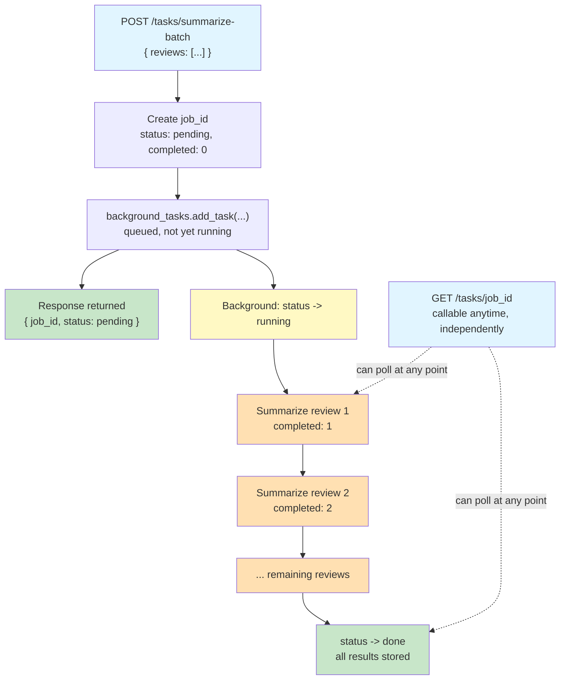

# Lab 9 — Background Tasks for Batch AI Processing

**Difficulty: Beginner | ~30 min | Requires Lab 2 (Async/Await)**

---

## 2. Problem Statement

When a client submits a batch of items to an API for processing, the conventional approach is to keep the HTTP connection open until every item has been processed — the client waits, the server works, and nobody moves until it is all done. For short tasks this is fine, but when the work involves multiple sequential LLM calls that could each take several seconds, holding the connection open for the entire duration becomes impractical. The client times out, the user stares at a spinner, and the server ties up resources for one request that might take far longer than a reasonable timeout.

FastAPI's `BackgroundTasks` solves this by letting the endpoint return a response **before** the real work has even started. The client gets back a job ID in milliseconds, and the actual processing happens entirely after the response has been sent. The client can then poll a separate endpoint whenever it wants to check progress or retrieve results, instead of holding a connection open for the entire job.

---

## 3. Input Data

No external data files. The lab operates on a list of short text strings (customer reviews) passed as a JSON request body. Each review is a sentence or two of plain text. The lab uses a small batch of three reviews in the demos to keep LLM calls fast while still showing meaningful progress updates across multiple items.

---

## 4. Processing

- **POST /tasks/summarize-batch**: accepts a list of review strings and an optional `simulate_failure` flag. Creates a job entry in the shared `job_store` dictionary with status `pending`, generates a unique job ID, and schedules `run_batch_summary` as a FastAPI `BackgroundTask`. Returns the job ID, status, and total immediately.
- **Background task (`run_batch_summary`)**: sets the job status to `running`, loops through each review sequentially, makes one LLM call per review to summarize it, appends the result, and increments the completed counter after each item. On success, sets status to `done`. On exception, sets status to `failed` with an error message, leaving already-completed items intact.
- **GET /tasks/{job_id}**: looks up the job by ID in `job_store` and returns its current state — status, total, completed count, results list, and error message. No blocking, no waiting.

---

## 5. Output

- **Demo 1 (Timing Proof):** The POST response prints with an elapsed time of a small fraction of a second. The response shows `status: pending` and the job ID. No LLM call has happened yet.
- **Demo 2 (Polling Over Time):** Several polls print the job state at intervals. `completed` visibly increases across polls (0 → 1 → 2 → 3), ending with `status: done` and the full results list containing a short summary for each review.
- **Demo 3 (Two Independent Jobs):** Two batches are submitted with different review content. Both are polled to completion. Each job's results correspond to its own input reviews and are visibly labeled by job ID.
- **Demo 4 (Controlled Failure):** A batch with `simulate_failure=True` is submitted. The status changes from `pending` to `running` to `failed`. `completed` is 1 (only the first review finished), and `error` contains a clear failure message. The remaining reviews were never processed.

Sample output structure (exact summaries vary per run since `openrouter/free` routes to different models):

```
Elapsed: 0.0312s
Response: {'job_id': 'a1b2c3d4...', 'status': 'pending', 'total': 3}
No LLM call has happened yet — the response returned before any work started.

Poll 1: status=running, completed=1/3
Poll 2: status=running, completed=2/3
Poll 3: status=done, completed=3/3

Results:
  1. The reviewer was very pleased with the product's build quality and fast delivery.
  2. The item broke after two weeks, making it not worth the price paid.
  3. A basic product that meets expectations without standing out.
```

---

## 6. Tech Stack

- **fastapi==0.112.2** — web framework, `BackgroundTasks` for offloading work
- **pydantic==2.8.2** — request model validation
- **httpx==0.28.1** — real HTTP client for the demos
- **python-dotenv==1.2.3** — `.env` loading
- **openai==3.5.0** — OpenRouter client (OpenAI-compatible), async LLM calls
- **uvicorn==0.30.6** — ASGI server (serves the app for the demos)
- **Standard library:** `uuid` — unique job ID generation; `time` — timing and polling delays; `threading` — run the server in a background thread

---

## 7. Underlying Concepts

### Why BackgroundTasks Lets the Response Return Before Work Finishes

The key reason BackgroundTasks matters for this lab is that it breaks the link between "the endpoint returned" and "the work is done." In a normal FastAPI endpoint, when you `return` a value, the work is already finished — the response body contains the completed result. With BackgroundTasks, you return a response *and* hand a function to FastAPI's background task runner. FastAPI sends the response to the client first, then runs the function afterward, independently. The client gets its answer (the job ID) in milliseconds, even though the real work — multiple sequential LLM calls — might take many seconds.

This matters because LLM calls are slow. If you hold the HTTP connection open while three or four reviews are summarized one by one, the client might time out after 30 seconds, or the user might close the browser tab. BackgroundTasks eliminates that problem: the client is free to do whatever it wants after the initial response, and the server does the work on its own schedule.

### Why the Job's State Lives in a Shared Dictionary

The POST endpoint and the background function are two separate pieces of code that run at different times. The POST endpoint creates the job and returns; the background function runs afterward and updates the results. They need a shared place to read and write the job's state — that is `job_store`. Both the endpoint and the background function can access it because it is a module-level variable, visible to all code in the same file.

This is similar in spirit to how earlier labs needed shared state reachable from multiple places. In those labs, the shared state was between two request handlers (like two concurrent clients). Here, the shared state is between a request handler and a background function — but the principle is the same: when two pieces of code need to coordinate, they need somewhere to put the data they both can see.

### Why Polling Is the Natural Fit Here

In earlier labs, the client held a connection open for the entire duration of the work — streaming responses sent each chunk as it arrived, and WebSockets kept the connection alive for the full exchange. Those approaches work when the work is short and the client wants real-time updates. But when the work involves multiple sequential LLM calls that could take many seconds total, holding a connection open the whole time is wasteful and risky: the client might time out, the connection might drop, or the server might tie up resources unnecessarily.

Polling is the natural alternative: the client sends a short GET request whenever it wants, gets back the current state, and disconnects. It can poll every few seconds, or every minute, or not at all until it decides to check. The client is in control of when it checks in, instead of the server being in control of when it pushes updates. This is simpler to implement and more resilient to connection issues than holding a connection open for a long-running task.

### Limitations: In-Process Tasks, No Persistence

BackgroundTasks runs the background function **in the same process** as the web server. This has an important limitation: if the server restarts while a job is running, that job's progress is lost entirely. There is no persistence, no retry logic, and no way to recover. The `job_store` dictionary lives in memory — it disappears when the process stops.

In production, a system that cannot tolerate losing in-progress jobs would typically use a dedicated task queue with a separate worker process. Tools like Celery or RQ provide persistence (jobs survive server restarts), retry logic (failed jobs can be re-attempted), and worker isolation (a crashing worker does not take down the web server). BackgroundTasks is useful for learning and for tasks where losing progress is acceptable, but it is not the right choice for critical production workloads.

---

The response and the background work starting are two separate events, not one — the client already has its answer before the first review has even been summarized. Here's the full timeline:



Notice GET /tasks/{job_id} can be called at any point on the right-hand timeline — it always returns whatever the current state is, without waiting for anything. That's what makes polling work: the client checks in whenever it wants, instead of holding a connection open for the whole job.

---

## 8. Prerequisites

- **Lab 2 (Async/Await)** — Familiarity with async functions and `await` is assumed
- An OpenRouter API key (set in the `.env` file as `OPEN_ROUTER_KEY`)

**Compute & cost:** Runs entirely on a laptop CPU — no GPU needed. It calls OpenRouter's `openrouter/free` model, which is free. One full run-through issues roughly 8 LLM calls (3 in Demo 1, 3 in Demo 2, 4 in Demo 3, 1 in Demo 4), so even a paid tier would cost a negligible amount.

---

## 9. Environment / Dependencies Setup

```bash
pip install fastapi==0.112.2 pydantic==2.8.2 httpx==0.28.1 python-dotenv==1.2.3 openai==3.5.0 uvicorn==0.30.6
```

Ensure a `.env` file exists in the project root containing:
```
OPEN_ROUTER_KEY=your-openrouter-api-key-here
```

---

## 10. Step-wise Development Instructions

### Cell 0: Dependency Installation

One cell installs every pinned dependency. `uvicorn` runs the app for the timing demos.

```python
!pip install fastapi==0.112.2 pydantic==2.8.2 httpx==0.28.1 python-dotenv==1.2.3 openai==3.5.0 uvicorn==0.30.6
```

### Cell 1: Imports, API Key, and App Setup

`BackgroundTasks` is the FastAPI class that lets an endpoint schedule work to run after the response is sent. `AsyncOpenAI` provides the async client with OpenRouter's base URL. The API key is loaded from `.env` the same way as in earlier labs.

```python
from fastapi import FastAPI, BackgroundTasks
from pydantic import BaseModel
from dotenv import load_dotenv
from openai import AsyncOpenAI
import httpx, uvicorn, os, time, uuid, threading

load_dotenv()
api_key = os.getenv("OPEN_ROUTER_KEY") or input("Open Router API key: ")
client = AsyncOpenAI(api_key=api_key, base_url="https://openrouter.ai/api/v1")
app = FastAPI()
```

### Cell 2: Job Store and ID Generator

A module-level dictionary acts as shared state between the POST endpoint and the background function. The `generate_job_id` helper uses `uuid4` to produce a short, collision-free hex string for each job.

```python
job_store: dict[str, dict] = {}

def generate_job_id():
    return uuid.uuid4().hex
```

### Cell 3: Summarize a Single Review

This helper makes one LLM call to summarize a single review in one or two sentences. It is called once per review inside the batch loop.

```python
async def summarize_single_review(review_text):
    response = await client.chat.completions.create(
        model="openrouter/free",
        messages=[{"role": "user", "content": f"Summarize this customer review in one or two sentences: {review_text}"}],
    )
    return response.choices[0].message.content
```

### Cell 4: The Background Task

This function runs after the POST response has already been returned. It marks the job as `running`, loops through each review, makes an LLM call for each one, and after each summary finishes it updates `job_store` — appending the result and incrementing `completed`. This per-item update is what makes mid-run polls show partial progress.

When `simulate_failure` is True, the function raises an exception on the second review. The try/except catches it, marks the job as `failed`, and stores the error message. Already-completed items are left in place — no rollback happens.

```python
async def run_batch_summary(job_id, reviews, simulate_failure=False):
    job_store[job_id]["status"] = "running"
    try:
        for index, review in enumerate(reviews):
            if simulate_failure and index == 1:
                raise RuntimeError("Simulated failure on review 2")
            summary = await summarize_single_review(review)
            job_store[job_id]["results"].append(summary)
            job_store[job_id]["completed"] += 1
        job_store[job_id]["status"] = "done"
        
    except Exception as exc:
        job_store[job_id]["status"] = "failed"
        job_store[job_id]["error"] = str(exc)
```

### Cell 5: The POST and GET Endpoints

The POST endpoint creates a job entry, schedules `run_batch_summary` as a background task, and returns immediately. The GET endpoint looks up the job by ID and returns its current state — no waiting, no blocking.

```python
class BatchRequest(BaseModel):
    reviews: list[str]
    simulate_failure: bool = False

@app.post("/tasks/summarize-batch")
async def summarize_batch(req: BatchRequest, background_tasks: BackgroundTasks):
    job_id = generate_job_id()
    job_store[job_id] = {"status": "pending", "total": len(req.reviews), "completed": 0, "results": [], "error": None}
    background_tasks.add_task(run_batch_summary, job_id, req.reviews, req.simulate_failure)
    return {"job_id": job_id, "status": "pending", "total": len(req.reviews)}

@app.get("/tasks/{job_id}")
async def get_task(job_id: str):
    return job_store.get(job_id, {"error": f"Job {job_id} not found"})
```

### Cell 6: Serve the App on a Real Server

The demos need real HTTP endpoints, so we run uvicorn in a background daemon thread and create a real `httpx.Client`.

```python
PORT = 8778
def run_server():
    uvicorn.run(app, host="127.0.0.1", port=PORT, log_level="warning")
    
threading.Thread(target=run_server, daemon=True).start()
time.sleep(2)
http_client = httpx.Client(timeout=180)
print("Server up:", http_client.get(f"http://127.0.0.1:{PORT}/").status_code)
```

### Demo 1: Timing Proof

The POST response returns in a fraction of a second. No LLM call has happened yet — the response was constructed and sent before the background task even started running.

```python
reviews_batch = [
    "This product exceeded my expectations. The build quality is fantastic and it arrived quickly.",
    "Not worth the money. The item broke after just two weeks of regular use.",
    "Decent product for the price. Does what it says, nothing more.",
]

start = time.perf_counter()
res = http_client.post(f"http://127.0.0.1:{PORT}/tasks/summarize-batch", json={"reviews": reviews_batch})
elapsed = time.perf_counter() - start

response_data = res.json()
demo1_job_id = response_data["job_id"]

print(f"Elapsed: {elapsed:.4f}s")
print(f"Response: {response_data}")
print("No LLM call has happened yet — the response returned before any work started.")
```

### Demo 2: Polling Over Time

We poll the GET endpoint a few times with short waits between polls. Each poll prints the current state — you should see `completed` increase as reviews finish being summarized, eventually reaching `done` with all results.

```python
for poll in range(6):
    state = http_client.get(f"http://127.0.0.1:{PORT}/tasks/{demo1_job_id}").json()
    print(f"Poll {poll + 1}: status={state['status']}, completed={state['completed']}/{state['total']}")

    if state["status"] == "done":
        break
    time.sleep(4)

print("\nResults:")
for i, summary in enumerate(state["results"], 1):
    print(f"  {i}. {summary}")
```

### Demo 3: Two Independent Jobs

Two batches are submitted with different review content. Both are polled to completion. Each job's results correspond to its own input reviews and are never mixed up.

```python
batch_a = ["Amazing customer service experience.", "Delivery was late but product is fine."]
batch_b = ["Terrible quality, completely unusable.", "Perfect fit, highly recommend to others."]

job_a = http_client.post(f"http://127.0.0.1:{PORT}/tasks/summarize-batch", json={"reviews": batch_a}).json()["job_id"]
job_b = http_client.post(f"http://127.0.0.1:{PORT}/tasks/summarize-batch", json={"reviews": batch_b}).json()["job_id"]

print(f"Job A: {job_a}\nJob B: {job_b}")

while True:
    state_a = http_client.get(f"http://127.0.0.1:{PORT}/tasks/{job_a}").json()
    state_b = http_client.get(f"http://127.0.0.1:{PORT}/tasks/{job_b}").json()

    if state_a["status"] == "done" and state_b["status"] == "done":
        break
    time.sleep(4)

print("\nJob A (customer service / delivery reviews):")
for i, s in enumerate(state_a["results"], 1): print(f"  {i}. {s}")
print("\nJob B (quality / recommendation reviews):")
for i, s in enumerate(state_b["results"], 1): print(f"  {i}. {s}")
print("\nEach job's results match its own input — no mixing.")
```

### Demo 4: Controlled Failure

A batch with `simulate_failure=True` is submitted. The background task processes the first review successfully, then raises an exception on the second. We poll until the status becomes `failed` and inspect the final state: completed reflects only the items that finished before the failure, and error contains a clear message.

```python
fail_batch = ["Great product, works as expected.", "This one should fail.", "This one never gets processed."]
res = http_client.post(f"http://127.0.0.1:{PORT}/tasks/summarize-batch", json={"reviews": fail_batch, "simulate_failure": True})
fail_job_id = res.json()["job_id"]

while True:
    state = http_client.get(f"http://127.0.0.1:{PORT}/tasks/{fail_job_id}").json()
    if state["status"] in ("done", "failed"): break
    time.sleep(2)

print(f"Final state: status={state['status']}, completed={state['completed']}/{state['total']}")
print(f"Results ({len(state['results'])} items):")
for i, s in enumerate(state["results"], 1): print(f"  {i}. {s}")
print(f"Error: {state['error']}")
print("Only 1 review completed before the failure. The process stopped at index 1.")
```

---

## 11. Optional Exercise

Add a `DELETE /tasks/{job_id}` endpoint that removes a job from `job_store` and returns a confirmation message. Then confirm that a subsequent `GET /tasks/{job_id}` on the same ID correctly returns the "not found" error message. Submit a new batch, wait for it to complete, delete it, then GET it and verify the 404-style response.

---

## 12. What We Learnt

- **`BackgroundTasks`** lets an endpoint return a response before the real work has finished — the background function runs after the response is sent, not before
- **`job_store`** as a module-level dictionary serves as shared state between the request handler and the background function, since they run at different times
- **Per-item progress updates** (appending results and incrementing `completed` after each review) let a mid-run poll show genuine partial progress, not just a final jump
- **Polling** is the natural client-side pattern for long-running background tasks — the client checks in whenever it wants, instead of holding a connection open
- **`simulate_failure`** demonstrates that exceptions in a background task are caught and stored without crashing the server or rolling back already-completed work
- **BackgroundTasks runs in-process** — if the server restarts, in-progress jobs are lost. Production systems typically use dedicated task queues (Celery, RQ) with persistence and retry logic
- **`uuid.uuid4().hex`** generates short, unique, collision-free identifiers for jobs without requiring a database sequence
- **The GET endpoint returns current state at the moment of the call** — it does not wait for the job to finish, which is what makes polling work

---

## Answer Key

### Answer 1

When `run_batch_summary` starts executing, it immediately sets `job_store[job_id]["status"] = "running"`. This happens after the POST response has already been sent to the client. The client's initial response contained `status: pending` — the status has not changed yet at that point. The background task begins running only after FastAPI finishes sending the response.

### Answer 2

`job_store` must be a module-level variable (not a local variable inside an endpoint function) because the POST endpoint and the background function are separate pieces of code that need to access the same data. The POST endpoint creates the job entry; the background function updates it later. If `job_store` were local to the endpoint, the background function would have no way to find or modify it. A module-level variable is visible to all code in the same file, making it the simplest shared state between the two.

### Answer 3

If `job_store[job_id]["completed"] += 1` were moved outside the loop to after it, a poll made during execution would always show `completed: 0` until the entire batch finished, at which point it would jump to the full count. The per-item update is what makes partial progress visible — each time one review is summarized, completed increments by one, so a poll mid-run shows exactly how many reviews have been processed so far.

### Answer 4

If the loop did not use try/except and an exception occurred (like the simulated failure), the exception would propagate up through the background task runner and the job's status would remain `running` forever — there would be no code to set it to `failed`. The client polling the GET endpoint would see the job stuck in `running` with `completed` stuck at the count before the failure. The try/except catches the exception and explicitly sets the status to `failed` with an error message, so the client knows the job did not complete successfully.

### Answer 5

After deletion, `GET /tasks/{job_id}` would return `{"error": "Job <id> not found"}` — the same response as for a job ID that never existed. The `job_store.get()` call returns the default value (the error dict) when the key is not present. This is correct behavior: from the client's perspective, a deleted job and a nonexistent job look the same, which is the expected REST convention.
