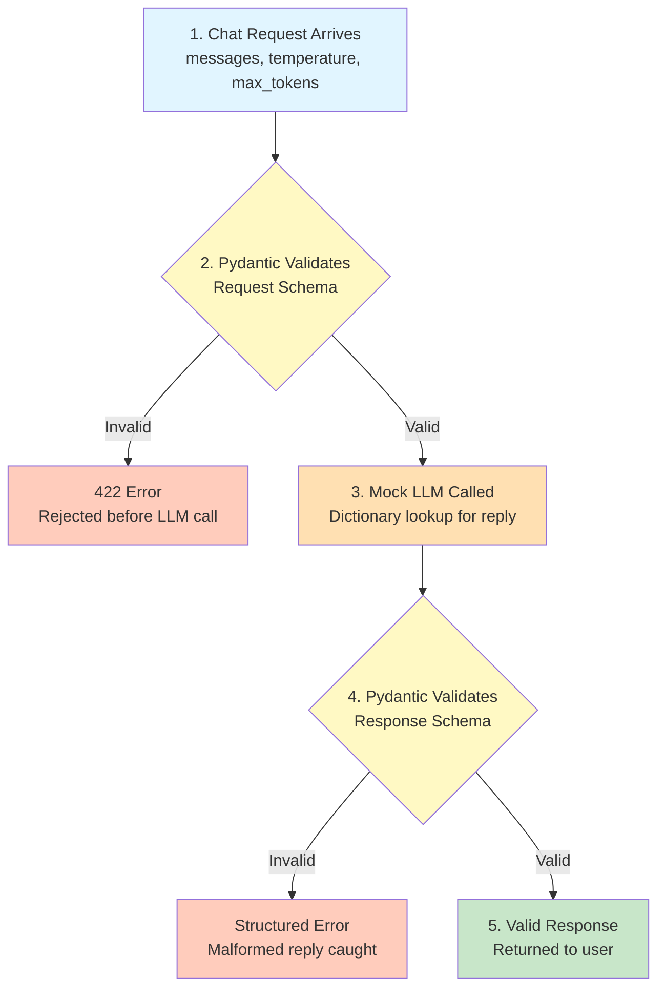

# Lab 1 — Pydantic Validation for AI Request/Response Contracts

Difficulty: Beginner | ~30-35 min | No prerequisites

---

## 2. Problem Statement / Use Case Overview

When building production-ready AI applications, we deal with highly unpredictable boundaries. User inputs (prompts, model parameters, chat history) are fed into external, slow, and expensive LLM APIs. If a client sends a malformed request, we want to fail fast and reject the payload before calling the LLM, thereby preventing wasted financial spend and compute cycles. 

Equally important is the outbound boundary: LLMs are non-deterministic and do not guarantee a stable schema structure. A model may occasionally return empty responses or violate structural rules. Validating the LLM's response against a strict Pydantic model before returning it to the user guarantees that downstream systems do not ingest corrupt data. This lab teaches you how to implement validation at both of these boundaries.

---

## 3. Input Data

The inputs to our service consist of the following:
*   **messages**: A single object representing the message, containing a `role` (must be `"user"` or `"assistant"`) and `content` (the text prompt, which must have a minimum length of 1 character).
*   **temperature**: A floating-point number parameter to control the creativity of the model (must be between 0.0 and 1.0).
*   **max_tokens**: An integer parameter specifying the maximum number of tokens to generate.

---

## 4. Processing

The pipeline executes the following sequence:
1.  **Request Parsing**: The client sends a JSON request to the `/chat` endpoint.
2.  **Request Validation**: FastAPI automatically validates the request against our `ChatRequest` schema using Pydantic. If validation fails, an HTTP 422 error is returned.
3.  **Mock LLM Call**: If the request is valid, the endpoint queries `mock_llm_reply` using a local dictionary lookup.
4.  **Response Validation**: The returned dictionary is parsed and validated against the `ChatResponse` schema, enforcing a minimum response length of 10 characters.
5.  **Output Routing**: If the response is valid, it is returned to the client (HTTP 200). If validation fails (e.g. empty output string), it raises an HTTP 500 error and returns a clean, structured JSON payload showing the validation detail.

---

## 5. Output

The service produces four distinct outputs based on the payload sent:
1.  **Case 1 (Valid request and response)**: Returns HTTP `200 OK` with the LLM's response schema (e.g., `{"role": "assistant", "content": "The capital of France is Paris."}`).
2.  **Case 2 (Invalid request - bad temperature)**: Returns HTTP `422 Unprocessable Entity` with a details object pointing out that temperature must be less than or equal to 1.0.
3.  **Case 3 (Invalid request - missing messages)**: Returns HTTP `422 Unprocessable Entity` stating that the `messages` field is required.
4.  **Case 4 (Malformed LLM reply)**: Returns HTTP `500 Internal Server Error` with a custom structure showing response validation failure due to empty content: `{"error": "response_validation_failed", "detail": "String should have at least 10 characters"}`.

---

## 6. Tech Stack

The lab uses the following dependencies:
*   `fastapi` — High-performance web framework for APIs.
*   `pydantic` — Data validation and schema enforcement.
*   *Note: No external API keys are required for this lab. The LLM is simulated locally using mock replies.*

---

## 7. Underlying Concepts

### What is Pydantic?
Pydantic is Python's most widely used data validation and settings management library. Unlike traditional validation tools that require you to write complex conditional statements, Pydantic leverages standard Python **type hints** (like `str`, `int`, `float`) to enforce how data is structured. 

Key features of Pydantic include:
*   **Runtime Validation & Type Coercion**: Pydantic doesn't just check types; it actively tries to coerce inputs to the expected type. For example, if you declare a field as an `int`, Pydantic will successfully parse the string `"42"` or the float `42.0` into the integer `42`. If it cannot safely convert the value (like `"forty-two"`), it raises a `ValidationError`.
*   **Data Contracts**: In AI applications, Pydantic acts as a "contract" between different layers. We define the exact shape of data we expect using schemas.
*   **Informative Errors**: When validation fails, Pydantic returns a structured list of failures (indicating what field failed, where it is located, and why), which can be converted directly to JSON for client responses.

### What is FastAPI?
FastAPI is a modern, high-performance web framework for building APIs with Python. It is designed to be developer-friendly, fast to write, and extremely performant because it runs asynchronously under the hood.

Why FastAPI is ideal for AI services:
*   **Native Pydantic Integration**: FastAPI is built directly on top of Pydantic. When you declare a request body schema in a route handler, FastAPI automatically parses the incoming JSON request, runs it through Pydantic's validator, and hands your function a fully instantiated Pydantic object. If the JSON is invalid, FastAPI halts execution immediately and returns a standardized `422 Unprocessable Entity` HTTP status code to the client—without you writing a single line of error-handling code.
*   **Automatic OpenAPI/Swagger Generation**: Because FastAPI inspects your Pydantic schemas, it automatically generates interactive API documentation (interactive UI at `/docs` or `/redoc`) describing the exact request and response shapes, validation rules, and error responses.

### Input vs. Output Validation Boundaries
In classical web development, validation is primarily applied to incoming user requests. However, in AI systems, we must treat LLMs as untrusted third-party data providers. We cannot assume their raw output will always map perfectly to our business schemas. Enforcing outbound validation prevents front-ends and databases from breaking.

### TestClient inside a Notebook
We utilize FastAPI's `TestClient` class to mock API requests directly inside our Jupyter notebook. It uses HTTPX under the hood to invoke FastAPI's routing system without spinning up a live, async server on localhost. Note: TestClient is used here as an interactive scratchpad tool for learning, not as part of an automated unit test suite.

The lab validates data at two symmetric points in the pipeline — once when the request comes in, and once when the mock LLM's reply comes back. Here's the full flow:



Notice the same tool — a Pydantic model — guards both directions of the conversation. A bad request never reaches the mock LLM, and a malformed reply never reaches the user. Validation isn't a one-time gate; it's applied at every boundary where you can't fully trust the data.

---

## 8. Prerequisites

*   None — first lab in the series. Basic Python and REST/JSON familiarity assumed.

---

## 9. Environment / Dependencies Setup

To run this lab locally, perform the following commands in your shell:

```bash
# Create a fresh virtual environment
python -m venv venv

# Activate the virtual environment (Windows)
.\venv\Scripts\activate

# Install the dependencies
pip install fastapi pydantic httpx
```

---

## 10. Step-wise Development Instructions

### Cell 1: Dependency Installation
Installs the FastAPI, Pydantic and httpx.
```python
!pip install fastapi pydantic httpx
```

### Cell 2: Imports
Load the necessary modules. We use standard typing utilities alongside FastAPI and Pydantic.
```python
# Import standard typing and FastAPI helpers.
from typing import Literal
from fastapi import FastAPI
from fastapi.responses import JSONResponse
from fastapi.testclient import TestClient
from pydantic import BaseModel, Field, ValidationError
```

### Cell 3: Mock Replies Dictionary
Define a dictionary containing mock responses for validation testing. The reply for Germany has empty content, which will fail our output length validation.
```python
# Define pre-written replies for our mock LLM.
MOCK_REPLIES = {
    "What's the capital of France?": {
        "role": "assistant",
        "content": "The capital of France is Paris."
    },
    "What's the capital of Germany?": {
        "role": "assistant",
        "content": ""
    }
}
```

### Cell 4: Mock LLM Lookup Helper
We define a helper function `mock_llm_reply` to simulate querying an LLM by querying our database dictionary.
```python
# Mock function called multiple times to simulate LLM replies.
def mock_llm_reply(user_message):
    """Simulates an LLM response by querying a local dictionary lookup."""

    reply = MOCK_REPLIES.get(user_message)

    return reply
```

### Cell 5: Message Schema
We define the structure of a single conversation item. To do this, we use Pydantic's **`BaseModel`** as our base class and apply **`Field`** constraints:
*   **`BaseModel`**: By inheriting from `BaseModel`, we declare that `Message` is a Pydantic schema. This gives the class automated validation, parsing, and serialization capabilities.
*   **`Literal`**: Constrains the `role` field to only allow the exact strings `"assistant"` or `"user"`. Any other role will trigger a validation error.
*   **`Field(min_length=1)`**: The `Field` function is used to declare metadata and runtime validation constraints on individual attributes. Here, `min_length=1` ensures the client cannot send empty chat messages.
```python
# Define the message schema containing role and content.
class Message(BaseModel):
    role: Literal["assistant", "user"]
    content: str = Field(min_length= 1)
```

### Cell 6: ChatRequest Schema
We define the schema for incoming user requests. The `ChatRequest` class validates the client's parameters:
*   **Nested Model (`messages: Message`)**: Pydantic models can nest other models. Here, the `messages` field must conform to the `Message` schema defined in Cell 5.
*   **`Field(ge=0.0, le=1.0)`**: Constrains the `temperature` float to be **greater than or equal to 0.0** (`ge`) and **less than or equal to 1.0** (`le`). These are standard bounds for LLM creativity.
*   **`Field(gt=0)`**: Constrains `max_tokens` to be an integer **greater than 0** (`gt`).
```python
# Define incoming request schema with validation bounds.
class ChatRequest(BaseModel):
    messages: Message
    temperature: float = Field(ge=0.0, le=1.0)
    max_tokens: int = Field(gt=0)
```

### Cell 7: ChatResponse Schema
We define the contract for the output returned to the user. This schema performs the outbound validation on the LLM's response:
*   **`role`**: Declares that the response must include a role string.
*   **`Field(min_length=10)`**: Enforces that the returned text must contain at least 10 characters. This guards against empty or severely truncated model generations. If the LLM generates a response shorter than 10 characters, validation fails.
```python
# Define outgoing response schema.
class ChatResponse(BaseModel):
    role: str
    content: str = Field(min_length=10)
```

### Cell 8: FastAPI Endpoint with Symmetrical Validation
We initialize our FastAPI application and define a POST route. This endpoint implements symmetrical validation—guarding the incoming request and verifying the outgoing response:
*   **Request Parsing & Auto-Validation**: In `def chat_endpoint(request: ChatRequest)`, declaring `request` with the type hint `ChatRequest` tells FastAPI to automatically parse the incoming JSON request body and validate it against the schema. If validation fails, FastAPI immediately returns an HTTP 422 error without running any route code.
*   **Manual Output Validation**: We fetch the reply dictionary from our mock LLM and validate it using `ChatResponse(**reply)`. By unpacking the dictionary with `**`, we instantiate the model and run Pydantic validations.
*   **Error Handling**: If the mock LLM violates our output contract (e.g., germany's empty response), Pydantic raises a **`ValidationError`**. We catch this exception and return a standard HTTP 500 error showing the first error message using `e.errors()[0]['msg']`.
```python
# Initialize FastAPI application and POST chat endpoint.
app = FastAPI()

@app.post("/chat")
def chat_endpoint(request: ChatRequest):

    user_message = request.messages.content
    
    # Get raw dictionary response from mock LLM.
    reply = mock_llm_reply(user_message)

    try:
        # Validate reply dict against output schema.
        return ChatResponse(**reply)
    except ValidationError as e:
        # Return standard 500 error structure on validation failure.
        return JSONResponse(
            status_code = 500,
            content = {"error": "response_validation_failed", "detail": e.errors()[0]['msg']}
        )
```

### Cell 9: Instantiate TestClient
Create client wrapper to simulate REST interaction.
```python
# Instantiating TestClient to run local API requests.
client = TestClient(app)
```

### Cell 10: Case 1 - Valid Request and Response
Sends a correct request payload and receives a fully valid reply.
```python
# Case 1: Valid request, valid response (expecting 200 OK).
payload_1 = {
    "messages":
        {"role": "user", "content": "What's the capital of France?"},
    "temperature": 0.7, "max_tokens": 150
}
response_1 = client.post("/chat", json=payload_1)
print("Status Code:", response_1.status_code)
print("Response JSON:", response_1.json())
```

### Cell 11: Case 2 - Invalid Request (Bad Temperature)
Triggers request schema validation on high temperature (exceeding 1.0).
```python
# Case 2: Invalid request (temperature out of bounds, expecting 422).
payload_2 = {
    "messages": {"role": "user", "content": "What's the capital of France?"},
    "temperature": 5.0, "max_tokens": 150
}
response_2 = client.post("/chat", json=payload_2)
print("Status Code:", response_2.status_code)
print("Response JSON:", response_2.json())
```

### Cell 12: Case 3 - Invalid Request (Missing Messages Field)
Triggers validation failure when missing mandatory parameters.
```python
# Case 3: Invalid request (missing required messages field, expecting 422).
payload_3 = {"temperature": 0.7, "max_tokens": 150}
response_3 = client.post("/chat", json=payload_3)
print("Status Code:", response_3.status_code)
print("Response JSON:", response_3.json())
```

### Cell 13: Case 4 - Valid Request, Malformed Response
A valid request that returns a response with empty content. Enforces response length validation inside the endpoint.
```python
# Case 4: Valid request, malformed response (expecting 500).
payload_4 = {
    "messages": {"role": "user", "content": "What's the capital of Germany?"},
    "temperature": 0.7, "max_tokens": 150
}
response_4 = client.post("/chat", json=payload_4)
print("Status Code:", response_4.status_code)
print("Response JSON:", response_4.json())
```

---

## 11. Optional Exercise

Add a new field `top_p: float` to `ChatRequest`, bounded between 0 and 1 using Pydantic's `Field(ge=0, le=1)`. Send a request with `top_p=1.5` through the existing `/chat` endpoint via `TestClient` and confirm it returns a 422 with a clear validation error.

---

## 12. What We Learnt

*   How Pydantic validates FastAPI request bodies automatically before your endpoint code runs
*   Why AI backends validate input before calling a costly, slow LLM
*   Why an LLM's output can't be fully trusted either, and how to validate a reply before it reaches the user
*   How the same Pydantic model pattern applies symmetrically to both directions of a request/response cycle
*   How to call a FastAPI app directly in a notebook using TestClient, without running a server
