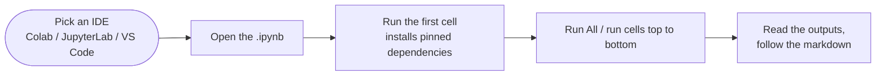
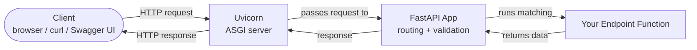
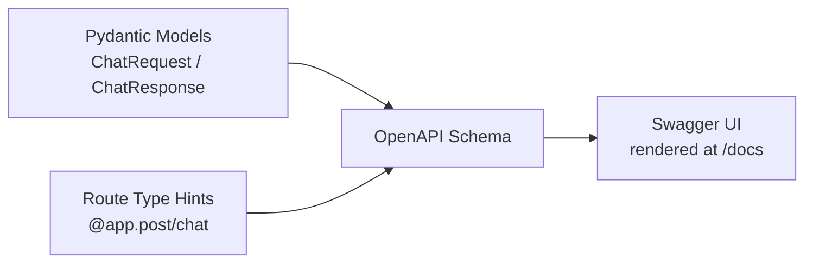
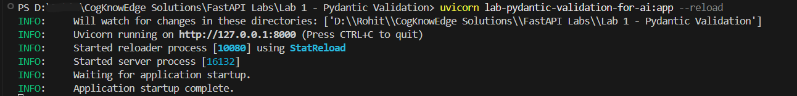
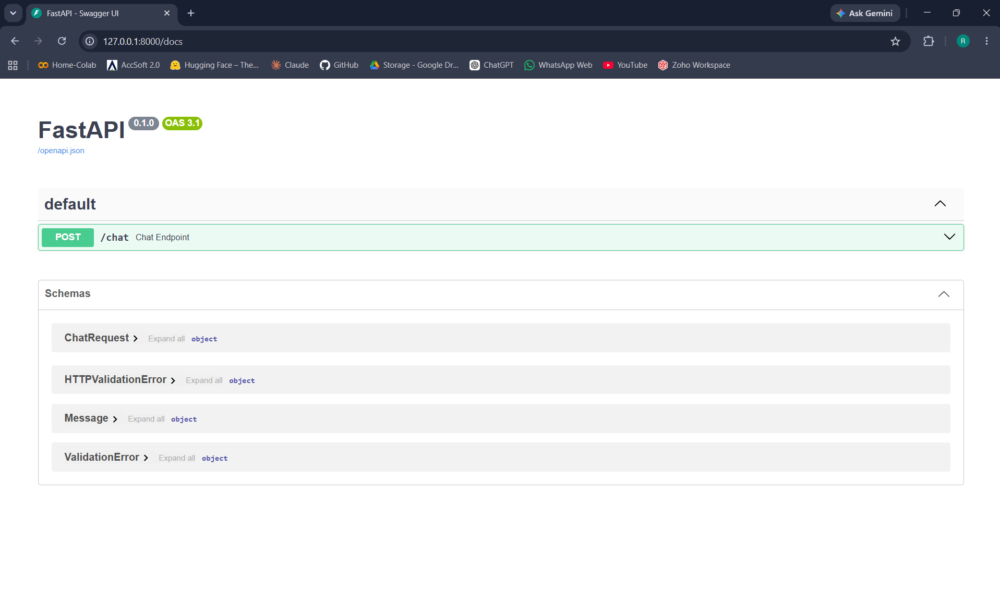
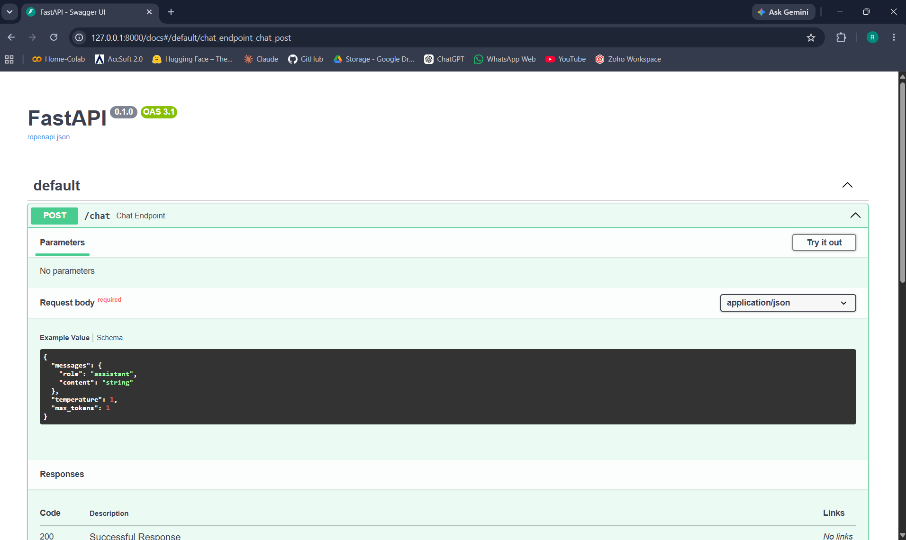
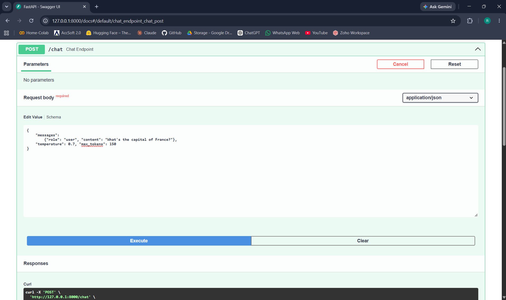
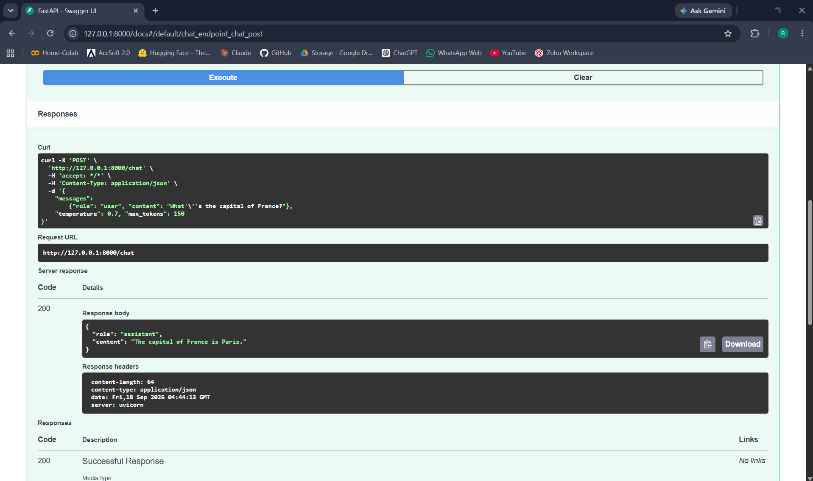
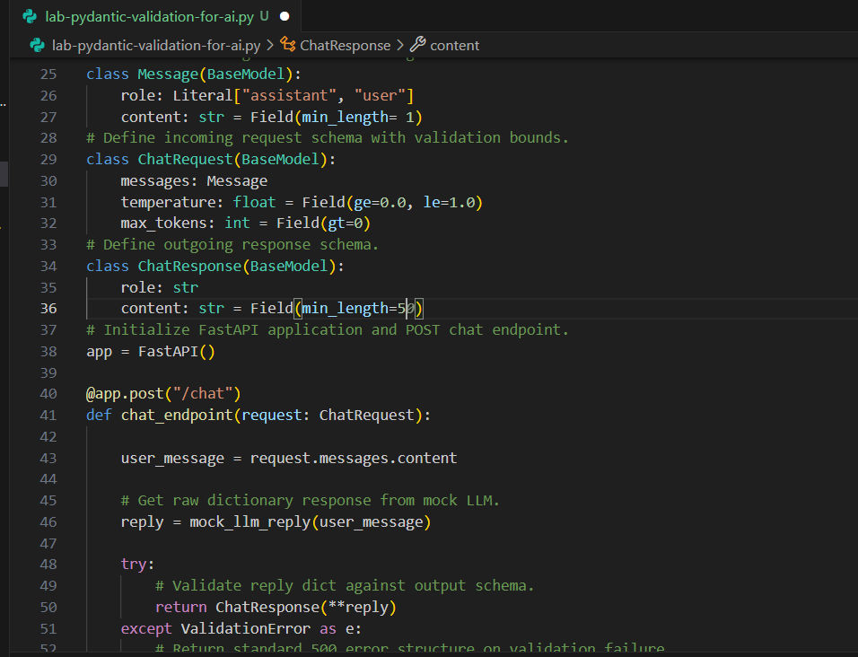
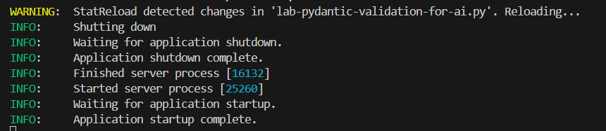

# Reference — Running FastAPI Labs: Notebook or Real Server

A standalone reference doc to guide in the series.

Here's how the rest of this doc is organized. **Section 1** is the everyday default: every lab ships as a notebook, and it shows you how to run that notebook in Colab, JupyterLab, or VS Code — no server involved. **Sections 2–6** cover the optional, production-flavored route: running the lab's `.py` file as a real server with Uvicorn.

Every lab in this series ships as a single `.ipynb`, tested entirely through `TestClient` — that stays the default, and it's not going anywhere. But `TestClient` quietly skips a real step: your app never actually gets served over a network. This doc shows what that step looks like, using Lab 1 as the example. Once you've done it once, the exact same process works on most labs in the series, if you ever want to run one for real instead of through `TestClient`.

**One exception:** Lab 10 (Testing) is built specifically around `TestClient` — that's the whole subject of the lab, not incidental to it. Don't try to convert it to a `.py` file and run it with Uvicorn; it won't work, since the lab's content depends on `TestClient` itself, not on the app it's testing.

---

## 1. The Everyday Way — Running the Lab as a Notebook

Every lab ships its single `.ipynb` notebook, and running it IS the default path — it's how every lab in the series is built and tested. It's also the easiest route: the notebook is fully self-contained. The very first cell is a single `!pip install` line with pinned versions, so installing everything the lab needs is just running the first cell. Everything after that is ordinary Python cells, and the labs run through `TestClient`, which exercises the app inside the notebook — no server to start, no separate terminal, no network to configure.

Anywhere that can run a Jupyter notebook will do. The overall shape is always the same, whichever one you pick:



### Google Colab

- Runs entirely in your browser — nothing to install on your machine. A good choice if you don't have Python set up locally.
- **Open the notebook:** go to `colab.research.google.com`, then **File → Upload notebook** and pick the `.ipynb` file (or open it from Google Drive / GitHub).
- **Run it:** **Runtime → Run all** (`Ctrl/Cmd+F9`) runs the whole notebook top to bottom. To follow along as you read, run cells one at a time with the play button beside each cell (or `Shift+Enter`).
- Colab sessions are temporary — if you come back later and the kernel's gone, re-run the first cell to restore the libraries.

### Jupyter / JupyterLab

- Requires Python and Jupyter on your machine. From a terminal in the folder containing the lab:
  ```bash
  pip install jupyter
  jupyter lab
  ```
- A browser window opens with a file browser — double-click the `.ipynb` to open it. (You can also use `jupyter notebook` instead of `jupyter lab`; the notebook itself is identical either way.)
- **Run it:** **Kernel → Restart & Run All** runs everything from a clean state. To step through at your own pace, click a cell and press `Shift+Enter` — that runs the cell and moves to the next.
- Ignore any `.py` download/export options you see in the menus for now — the `.py` file that ships with each lab is meant for the Uvicorn route (Sections 2–6), not for this one.

### VS Code

- Requires VS Code with the **Python** and **Jupyter** extensions installed (both free, from the extensions panel).
- **Open the notebook:** **File → Open Folder** to open the lab's folder first, then click the `.ipynb` file.
- The first time, VS Code asks you to pick a kernel — select your Python interpreter (it'll offer to install `ipykernel` if that's missing).
- **Run it:** the **Run All** button at the top of the notebook, or the per-cell play buttons.
- Same notebook, same outputs as the other two — it's all Jupyter underneath.

A few things that hold in every environment:

- Start with the first cell and wait for the install to finish — every later cell assumes those libraries exist.
- The markdown cells between the code cells explain what each piece does, so run top to bottom the first time through.
- Some labs need an API key for the LLM. The ones that call a real LLM will stop and ask you for a key via `input()` — that works fine inside a notebook. If you're running the `.py` as a server instead, a running process can't wait on `input()`, so Section 6 shows you the `.env` alternative.
- A cell that errors is almost always environment-related — a library missing or a version mismatch from skipping the first cell — not a bug in the lab. Re-run the first cell, then the rest.

---

## 2. What Is Uvicorn & Why You Need It

FastAPI is a **framework** — it defines routes, validates request/response data, and figures out what your app should do with an incoming request. What it *isn't* is something that can, by itself, listen on a network port and accept traffic from the outside world. That job belongs to an **ASGI server** — and Uvicorn is the one this series uses.

When you call `TestClient(app)` inside a notebook, you're not going over a network at all — `TestClient` calls your app's code directly, in-process, and hands you back the result. It's fast and convenient for testing, but it means you never see the part where a real client sends an HTTP request over a socket, a server receives it, and routes it to your app. Uvicorn is what fills in that missing piece.



Uvicorn's job is narrow but essential: accept the raw HTTP connection, translate it into something FastAPI understands, hand it off, and ship the response back out. Without it, `app = FastAPI()` is just an object sitting in memory with nothing listening for requests.

---

## 3. Swagger Docs — What They Are & How They're Built

The `/docs` page you get for free with every FastAPI app is a **Swagger UI** — an interactive page where you can see every route, expand it, fill in a form, and fire off a real request, all from the browser. No Postman, no curl commands, nothing to install.

What makes this "free" is that FastAPI already has everything it needs to build it. Your Pydantic models and your route's type hints *are* the documentation — FastAPI reads them, generates an OpenAPI schema (a structured JSON description of your whole API), and Swagger UI renders that schema as the interactive page you see.



You don't write any of this by hand, and you don't turn it on — it's just there the moment your app is running. Once the server's up, it's sitting at `http://127.0.0.1:8000/docs`.

---

## 4. Step-by-Step Walkthrough

### Step 1 — Convert the Notebook to a Script

**Heads up: each lab already ships with its own `.py` file alongside the `.ipynb`.** In practice, you won't need to do this conversion yourself — it's already done for you. This step is still worth reading through, though, since it's the clearest way to see exactly what changes between a notebook and a script, and it's useful to understand in case you ever want to convert a lab that doesn't have one included, or convert your own notebook-based project down the line.

If you were doing it yourself, you'd have a few equivalent ways to go about it — pick whichever fits your setup:

- **VS Code** (with the Jupyter extension) — open the notebook, use the **Export** option in the notebook toolbar, and choose **Python Script**.
- **Jupyter / JupyterLab** — **File → Download as → Python (.py)**.
- **Google Colab** — **File → Download → Download .py**.
- **Terminal, via `nbconvert`** (what all three options above use under the hood anyway):
  ```bash
  jupyter nbconvert --to script lab-pydantic-validation-for-ai.ipynb
  ```

Whichever route you take, the output needs two edits before it'll actually run as a script — this isn't purely "delete the test cells and you're done":

1. **Remove the `!pip install ...` line.** The `!` prefix is Jupyter-only shell syntax — it isn't valid Python outside a notebook kernel, so it'll break the script if left in. (If you exported via `nbconvert`, this line gets auto-converted into `get_ipython().system(...)` instead of being removed — that's not valid outside a notebook either, and will throw a `NameError` the moment the script runs. Either way, delete it.) Dependencies get installed separately via a normal terminal command instead — see Step 2.
2. **Remove the `TestClient` import, the `client = TestClient(app)` line, and all four demonstration blocks** (the `payload_1` through `payload_4` cells and their `print()` calls). These are what `/docs` replaces — you'll trigger the exact same four cases by hand in Step 4.

Everything else — the typing imports, `MOCK_REPLIES`, `mock_llm_reply`, the `Message`/`ChatRequest`/`ChatResponse` schemas, `app = FastAPI()`, and the `/chat` route itself — carries over completely unchanged. No `if __name__ == "__main__":` block is needed either; Uvicorn invokes `app` from outside the script, in Step 3.

One cosmetic note: if you exported through `nbconvert` (directly, or indirectly via VS Code/Jupyter/Colab), you'll see auto-inserted `# In[ ]:` comments and markdown cells turned into `# ` comment blocks scattered through the file. Harmless — doesn't affect anything running — just don't mistake it for something you did wrong.

Your resulting `lab1.py` should look like this:

```python
from typing import Literal
from fastapi import FastAPI
from fastapi.responses import JSONResponse
from pydantic import BaseModel, Field, ValidationError

MOCK_REPLIES = {
    "What's the capital of France?": {
        "role": "assistant",
        "content": "The capital of France is Paris."
    },
    "What's the capital of Germany?": {
        "role": "assistant",
        "content": ""
    }
}

def mock_llm_reply(user_message):
    """Simulates an LLM response by querying a local dictionary lookup."""
    reply = MOCK_REPLIES.get(user_message)
    return reply

class Message(BaseModel):
    role: Literal["assistant", "user"]
    content: str = Field(min_length=1)

class ChatRequest(BaseModel):
    messages: Message
    temperature: float = Field(ge=0.0, le=1.0)
    max_tokens: int = Field(gt=0)

class ChatResponse(BaseModel):
    role: str
    content: str = Field(min_length=10)

app = FastAPI()

@app.post("/chat")
def chat_endpoint(request: ChatRequest):
    user_message = request.messages.content
    reply = mock_llm_reply(user_message)
    try:
        return ChatResponse(**reply)
    except ValidationError as e:
        return JSONResponse(
            status_code=500,
            content={"error": "response_validation_failed", "detail": e.errors()[0]['msg']}
        )
```

### Step 2 — Install Dependencies

Same libraries as the notebook, just installed in your terminal instead of a notebook cell:

```bash
pip install fastapi==0.112.2 pydantic==2.8.2 uvicorn==0.30.6
```

(`httpx` isn't needed anymore — it was only there to power `TestClient`.)

### Step 3 — Start the Server

From the same folder as `lab1.py`, run:

```bash
uvicorn lab1:app --reload
```

Breaking that down:
- **`lab1`** — the filename without `.py`, i.e. the Python module Uvicorn should import.
- **`:app`** — the name of the FastAPI instance *inside* that module (`app = FastAPI()`). If you'd named it something else, this would change to match.
- **`--reload`** — tells Uvicorn to watch your files and automatically restart the server whenever you save a change. Genuinely useful during development, since you're not stopping and restarting by hand every time you edit something — but it comes at a small performance cost, which is exactly why it's opt-in rather than the default. You'd drop it for anything resembling production use.

By default, Uvicorn serves on `127.0.0.1:8000` (i.e. `http://127.0.0.1:8000`). If you need a different port or want it reachable from other devices on your network, you can override both explicitly:

```bash
uvicorn lab1:app --reload --host 0.0.0.0 --port 8080
```

Once it's running, your terminal will sit there showing Uvicorn's startup log and stay open — that's expected, it's your server actively listening.



### Step 4 — Test It Through `/docs`

Open `http://127.0.0.1:8000/docs` in your browser. You'll see the `POST /chat` route listed — expand it, click **Try it out**, and you can now run the exact same four cases from the notebook, this time as real HTTP requests instead of in-process `TestClient` calls:



1. **Valid request, valid response** — France question, `temperature: 0.7`, `max_tokens: 150` → expect `200 OK`.
2. **Invalid request, bad temperature** — same as above but `temperature: 5.0` → expect `422 Unprocessable Entity`.
3. **Invalid request, missing field** — omit `messages` entirely → expect `422 Unprocessable Entity`.
4. **Valid request, malformed response** — Germany question → expect `500` with the structured error body.

Here is how you will peform the demos:

- Expand the endpoint.



- Click on "Try it out" and enter the payload for demo 1. 



- Fill in the values for the demo.

- Click on "Execute" and scroll down to find the response.



- Observe the response.

Same outcomes as the notebook, every time — the validation logic hasn't changed, only how you're reaching it.

### Step 5 — Prove `--reload` Is Real

With the server still running, make one small live edit to `lab1.py` — for example, change `ChatResponse`'s `min_length=10` to `min_length=5` — and save the file. Watch your terminal: Uvicorn should detect the change and restart on its own, with no manual stop/start on your end.

- In the file lab1.py change the min_length=10 to min_length=5 for ChatResponse.



- Uvicorn reloads



That's `--reload` doing its job — the whole point of using it during development.

---

## 5. Which Labs This Approach Doesn't Suit

Not every lab plays nicely with `/docs`. A few are better left as `.ipynb` + `TestClient`, even though the conversion steps above would technically still run:

- **Streaming (SSE) labs** — the response renders as one blob once the request finishes, instead of showing the incremental delivery that's the actual point of the lab.
- **WebSocket labs** — Swagger UI has no interface for a persistent connection, so these routes can't be tested through `/docs` at all.
- **Background Tasks labs** — the request/response cycle works fine through `/docs`, but the task's result is invisible in the response body, so you won't see what it actually did without also watching your terminal logs.

For any lab built around one of these three, stick with the notebook version — it's built to actually show you what that lab is meant to demonstrate.

Here's the recommendation lab by lab. `.ipynb` is the more convenient default across the board — this table only flags where the choice is more than personal preference:

| Lab | Recommended Format | Why |
|---|---|---|
| 1 — Pydantic Validation | Either | Straightforward request/response validation either way |
| 2 — Exception Handling | Either | |
| 3 — Dependency Injection | Either | |
| 4 — Async/Await + File Upload | Either (docs is arguably nicer) | Swagger UI's built-in file-upload widget makes real uploads easy to test |
| 5 — Security (OAuth2/JWT) | Either | Swagger UI's "Authorize" button handles token auth cleanly |
| 6 — Middleware (Rate-Limiting/Observability) | Either | |
| 7 — Streaming (SSE) | `.ipynb` | `/docs` doesn't show incremental delivery |
| 8 — WebSockets | `.ipynb` | Swagger UI can't test WS routes at all |
| 9 — Background Tasks | `.ipynb` | Result isn't visible in the response body via `/docs` |
| 10 — Testing | `.ipynb` only | Built around `TestClient` itself — won't run via Uvicorn |
| 11 — APIRouter | Either | |
| 12 — Lifespan Events | Either (docs arguably nicer) | Startup/shutdown hooks are more visible in a real terminal log |
| 13 — Tiered Rate-Limited Capstone | `.ipynb` | Built around WebSockets throughout |

---

## 6. Additional Resource — Setting Your API Key via `.env`

Later labs that call a real LLM let you type your API key in through `input()` when running inside a notebook. That works fine in a notebook — it doesn't work at all on a real server, since there's no interactive prompt for a running process to pause and wait on. Here's the two-step swap:

**Step 1 — Create a `.env` file** in your project folder, next to your `.py` file:

```
OPEN_ROUTER_KEY=your-actual-key-here
```

**Step 2 — Load it in your code** with `python-dotenv`, the exact same pattern later labs already use:

```python
from dotenv import load_dotenv
import os

load_dotenv()
api_key = os.getenv("OPEN_ROUTER_KEY")
```

That's it — `load_dotenv()` reads the `.env` file into your environment, and `os.getenv(...)` retrieves it, same as it would from any other environment variable. Nothing about how later labs use the key changes; only *where* the value comes from does. Ensure the `.env` file is in the same folder as the `lab.py` file.

---

A last note: nothing about this doc is specific to Lab 1 beyond it being the example. Every lab in the series stays notebook-first, `TestClient`-tested, by default — Section 1 covers running the notebook itself. And since each one already comes with its own `.py` file, running most of them as a real server is just Steps 2–5 above: install dependencies, run it with `uvicorn <lab>:app --reload`, test it through `/docs`. Check Section 5 first for which labs are better left as-is.
